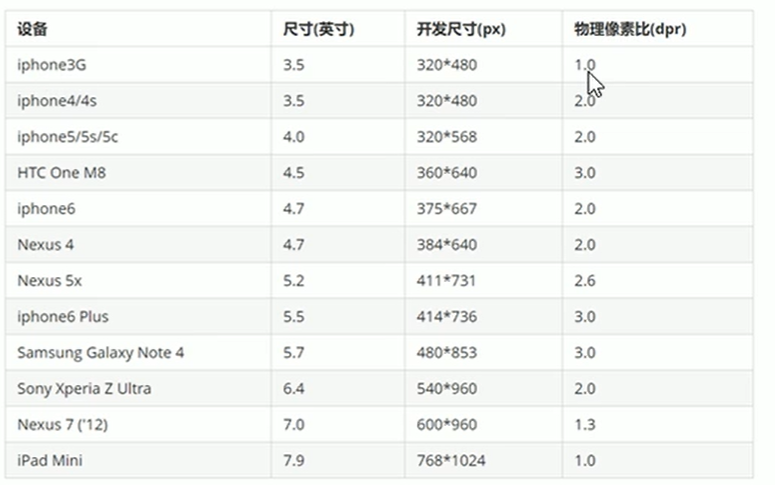

# 移动端开发


# 1. 基础知识

* 浏览器版本
* 屏幕尺寸比较多


## 1.1 视口


> 布局视口-了解


> 视觉视口-了解


> 理想视口-理解

手机上最理想的尺寸。

* 为了使网站在移动端有最理想的浏览和阅读宽度而设定
* 理想视口,对设备来讲,是最理想的视口尺寸
* 需要手动添写**meta**视口标签通知浏览器操作
* meta视口标签的主要目的:布局视口的宽度应该与理想视口的宽度-致,简单理解就是设备有多宽,我
  们布局的视口就多宽


## 1.2 meta标签


> 标准的viewport设置

- 视口宽度和设备保持 一致
- 视口的默认缩放比例1.0
- 不允许用户自行缩放
- 最大允许的缩放比例1.0
- 最小允许的缩放比例1.0


```html
<meta name="viewport" content="width=device-width, initial-scale=1.0, maximum-scale=1.0, user-scalable=0">
```

所有网站都是这么来写的。


## 1.3 物理像素&物理分辨率

> 物理像素

iPhone8: 1334*750 像素 ， 一行可以放750个像素点。


> 物理分辨率

iPhone8： 将一个div的width设置成375就充满屏幕了。


>  总结

* 物理像素点指的是屏幕显示的最小颗粒,是物理真实存在的。
  * 这是厂商在出厂时就设置好了,比如苹果6\7\8是750* 1334
* 我们开发时候的1px不是一定等于1个物理像素的
  * PC端页面，1个px等于1个物理像素的,
  * 但是移动端就不尽相同(**例如：1px=2个物理像素**)
    * -一个px能显示的物理像素点的个数,称为：物理像素比或屏幕像素比





## 1.4 两倍图

由于分辨率的问题，移动端的图片需要比实际的尺寸变大，不然会变灰。

解决方案是：切图的时候切的大一点，在CSS中缩小图片尺寸。


### ① 普通图片

手工指定图片的大小，比实际尺寸小一倍就可以了。


### ② 背景图片

手工改变背景图片大小。css3对可以改变背景图片的尺寸

* backgroud-size
  * 指定尺寸
  * cover完全覆盖父盒子
    * 图片显示不全
  * contain，高度宽度等比拉伸，如果宽度或高度到了，就不拉伸了。
    * 有部分空白


### ③ 如何切图呢？

在cutterman中选择切图的倍数


## 1.5 移动端开发选择

* 单独选择（主流）
  * 例如京东、淘宝
* 自适应（兼容性的问题）
  * 三星


## 1.6 移动端开发注意事项


* 放心使用H5与CSS3

* 样式初始化

  * 推荐使用：[normalize.css](http://necolas.github.io/normalize.css/) 

* CSS3的盒子模型

  * `box-size:border-box;`  把`padding border` 都算做盒子数值。

* 特殊样式-取消原有的样式

  * 点击高亮
  * 按钮和输入框自定义样式
  * 弹出菜单

  

```css
/*Css3盒子模型*/ 
box-sizing: border-box;
-webkit -box-sizing: border-box;
/*点击高亮我们需要清除清除设置为transparent 完成透明*/
-webkit-tap-highlight-color: transparent;
/*在移动端浏览器默认的外观在ios.上加上这个属性才能给按钮和输入框自定义样式*/
-webkit-appearance: none ;
/*禁用长按页面时的弹出菜单*/
img,a { -webkit-touch-callout: none; }

```


## 1.7 页面布局


### ① 单独制作(主流)

* 流式布局 (百分比布局)
* flex弹性布局(强烈推荐)
* less+rem +媒体查询布局
* 混合布局


### ② 响应式页面(其次)

* 媒体查询
* bootstrap


# 2. 流式布局

* 也叫百分比布局，自由伸缩。
* 通常会设置最大值与最小值。


以京东为案例


## 2.1 初始化项目


### ① 建立工程目录


### ② 初始化index

```html
    <meta charset="UTF-8" />
    <meta
      name="viewport"
      content="width=device-width, initial-scale=1.0, maximum-scale=1.0, user-scalable=0"
    />

    <link rel="stylesheet" href="css/normalize.css" />
    <link rel="stylesheet" href="css/index.css" />
```


### ③ 初始化body

```css
body {
  width: 100%;
  min-width: 360px;
  max-width: 640px;
  margin: 0 auto;
  font-size: 14px;
  line-height: 1.5;
  color: #666;
  font-family: -apple-system, Helvetica, sans-serif;
  padding-bottom: env(safe-area-inset-bottom);
}
```


## 2.2 京东案例


### 2.2.1 布局模式

手机端的布局要求其要按照百分比进行缩放，所以对布局有要求。

#### ① 百分比布局

例如京东的最上面，用`8% 10% 57% 25%` 进行布局。


#### ② 定位式布局

例如下面区域，适合用定位布局。

> 区域一

左右两个是固定的，那么就固定设置宽度，然后使用`position:absolute;`让他们浮动起来，不占据空间。然后让中间层伸展整个页面，同时在父窗口可以使用`margin或者padding`让中间区域与两边进行间隔。


> 搜索区域

搜索区域类似，也可以在进行组合。这时只不过，让输入框在区域的右侧。

首先将`京东Logo与放大镜`图标【绝对定位】,然后让输入框`width`为100%， 同时距离左侧边距有一定距离。


#### ③  综合布局

其中搜索框是固定定位的。下面有一个背景图。


### 2.2.2 图片使用

都要使用到二部图的原则，按照这个原则，要对图片尺寸做限制。 同时精灵图稍微复杂一点。

```
如何制作图片呢：
例如：iPhone8: 1334*750 ，因为iPhone的比例是2倍的。
所以：美工在设计的时候，可以按照 667*375 来设置。
在切图的时候，用切图工具，切成二倍的图片。

```


#### ① 普通图片

要设置`img`的`width height`

#### ② 背景图片

通过`background-size`来设置，如果制定了盒子的`width height`，可以设置成`100%`，也可以指定具体的内容。

```css
.search_icon_jd {
  width: 20px;
  height: 15px;
  background: url(....)
    no-repeat;
  background-size: 100% 100%;
}
```

#### ③ 精灵图片

例如：二倍精灵图做法

* 把精灵图等比例缩放为原来的一半
* 上次到自动测量工具之后，根据大小测量坐标
* 注意代码里面background- size也要写:精灵图原来宽度的一半

*[精灵图自动测量工具](http://www.spritecow.com/)*


> 也可以使用ps的标尺来进行测试。

注意坐标是负数


### 2.2.3 其他小技巧


#### ① input没有边框

```css
  outline: none;
  background: none;
  border: 0;
```


#### ② 边框塌陷

```css
有很多解决方案，推荐使用：overflow:hidden

* 可以为父元素定义上边框。`boder: 1px solid transparent;`

* 可以为父元素定义上内边距。`padding: 1px;`

* 可以为父元素添加。`overflow:hidden;`

* 还有其他方法,比如浮动、固定,绝对定位的盒子不会有塌陷问题
```


#### ③ 背景图片位置与大小

```css
  background-position: -80px 0;
  /* 代码里面background- size也要写:精灵图原来宽度的一半 */
  background-size: 200px;
```


### 2.2.4 秒杀小技巧


#### ① 横向滚动轴

* 首先去掉滚动轴
* 其次宽度要固定：只显示前n个 + 上一个更多。

```css

/* 横向滚动 */
.seckill_bd {
  overflow-x: scroll;
  overflow-y: hidden;
}
/* 去掉滚动轴 */
.seckill_bd::-webkit-scrollbar {
  display: none;
}
```


# 3. Flex布局

学做[携程网的移动端](https://m.ctrip.com/html5/)


## 3.1 兼容性

大胆的说法：现在兼容性很好了，只要客户不要求兼容ie10一下就没问题，主流浏览器都支持。


## 3.2 父项属性

* flex-direction :设置主轴的方向
* justify- content :设置主轴上的子元素排列方式
* flex-wrap :设置子元素是否换行
* align-content :设置侧轴上的子元素的排列方式(多行)
* align-items :设置侧轴上的子元素排列方式(单行)
* flex-flow :复合属性,相当于同时设置了flex -direction和flex-wrap

### ① flex-direction定义轴

属性值，常用的：row(默认经常不用) column 

| 值             | 描述                                                         | 实例                                                         |
| :------------- | :----------------------------------------------------------- | :----------------------------------------------------------- |
| **row**        | 默认值。灵活的项目将水平显示，正如一个行一样。               | [尝试一下 »](https://www.w3cschool.cn/tryrun/showhtml/trycss3_flexbox_flexline-row) |
| row-reverse    | 与 row 相同，但是以相反的顺序。                              | [尝试一下 »](https://www.w3cschool.cn/tryrun/showhtml/trycss3_flexbox_flexline-row-reverse) |
| **column**     | 灵活的项目将垂直显示，正如一个列一样。                       | [尝试一下 »](https://www.w3cschool.cn/tryrun/showhtml/trycss3_flexbox_flexline-column) |
| column-reverse | 与 column 相同，但是以相反的顺序。                           | [尝试一下 »](https://www.w3cschool.cn/tryrun/showhtml/trycss3_flexbox_flexline-column-reverse) |
| **initial**    | 设置该属性为它的默认值。请参阅 [*initial*](https://www.w3cschool.cn/cssref/css-initial.html)。 | [尝试一下 »](https://www.w3cschool.cn/tryrun/showhtml/trycss3_flexbox_flexline-initial) |
| inherit        | 从父元素继承该属性。请参阅 [*inherit*](https://www.w3cschool.cn/cssref/css-inherit.html)。 |                                                              |


### ② justify-content主轴

justify-content属性定义了项目在**主轴上的对挤方式**
**注意:使用这个属性之前一定要确定好主轴是哪个**

属性值

| 值            | 描述                                                         | 测试                                                     |
| :------------ | :----------------------------------------------------------- | :------------------------------------------------------- |
| flex-start    | 默认值。项目位于容器的开头。                                 | [测试 »](https://www.w3cschool.cn/css/css-css_quiz.html) |
| flex-end      | 项目位于容器的结尾。                                         | [测试 »](https://www.w3cschool.cn/css/css-css_quiz.html) |
| center        | 项目位于容器的中心。                                         | [测试 »](https://www.w3cschool.cn/css/css-css_quiz.html) |
| space-between | 两边贴边，然后中间剩余。                                     | [测试 »](https://www.w3cschool.cn/css/css-css_quiz.html) |
| space-around  | 项目位于各行之前、之间、之后都留有空白的容器内。             | [测试 »](https://www.w3cschool.cn/css/css-css_quiz.html) |
| initial       | 设置该属性为它的默认值。请参阅 [*initial*](https://www.w3cschool.cn/cssref/css-initial.html)。 | [测试 »](https://www.w3cschool.cn/css/css-css_quiz.html) |
| inherit       | 从父元素继承该属性。请参阅 [*inherit*](https://www.w3cschool.cn/cssref/css-inherit.html)。 |                                                          |


### ③ flex-wrap换行

flex默认子元素不换行，如果装不下，就缩小子元素的宽度。

属性值

| 值           | 描述                                                         |
| :----------- | :----------------------------------------------------------- |
| nowrap       | 默认值。规定灵活的项目不拆行或不拆列。                       |
| wrap         | 规定灵活的项目在必要的时候拆行或拆列。                       |
| wrap-reverse | 规定灵活的项目在必要的时候拆行或拆列，但是以相反的顺序。     |
| initial      | 设置该属性为它的默认值。请参阅 [*initial*](https://www.w3cschool.cn/cssref/css-initial.html)。 |
| inherit      | 从父元素继承该属性。请参阅 [*inherit*](https://www.w3cschool.cn/cssref/css-inherit.html)。 |


### ④ align-items侧轴单行

属性值

| 值         | 描述                                                         | 测试                                                         |
| :--------- | :----------------------------------------------------------- | :----------------------------------------------------------- |
| stretch    | 默认。 拉伸元件以适应容器。                                  | [测试 »](https://www.w3cschool.cn/statics/demosource/Playit/Playit4.html#stretch) |
| center     | 中心元素在容器内。                                           | [测试 »](https://www.w3cschool.cn/statics/demosource/Playit/Playit4.html#center) |
| flex-start | 位置元素在容器的开头。                                       | [测试 »](https://www.w3cschool.cn/statics/demosource/Playit/Playit4.html#flex-start) |
| flex-end   | 位置元素在容器的末端。                                       | [测试 »](https://www.w3cschool.cn/statics/demosource/Playit/Playit4.html#flex-end) |
| baseline   | 位置元素在容器的基线。                                       | [测试 »](https://www.w3cschool.cn/statics/demosource/Playit/Playit4.html#baseline) |
| initial    | 设置为默认值。请参阅 [*initial*](https://www.w3cschool.cn/cssref/css-initial.html)。 | [测试 »](https://www.w3cschool.cn/statics/demosource/Playit/Playit4.html#initial) |
| inherit    | 从其父元素继承此属性。请参阅 [*inherit*](https://www.w3cschool.cn/cssref/css-inherit.html)。 |                                                              |

 

### ⑤ align-content侧轴多行

align 是侧轴的排序方式。

| 值            | 描述                                                         | 测试                                                         |
| ------------- | ------------------------------------------------------------ | ------------------------------------------------------------ |
| stretch       | 默认值。项目被拉伸以适应容器。                               | [测试 »](https://www.w3cschool.cn/tryrun/csstryit?tpl=playcss_align_content&param=stretch) |
| center        | 项目位于容器的中心。                                         | [测试 »](https://www.w3cschool.cn/tryrun/csstryit?tpl=playcss_align_content&param=center) |
| flex-start    | 项目位于容器的开头。                                         | [测试 »](https://www.w3cschool.cn/tryrun/csstryit?tpl=playcss_align_content&param=flex-start) |
| flex-end      | 项目位于容器的结尾。                                         | [测试 »](https://www.w3cschool.cn/tryrun/csstryit?tpl=playcss_align_content&param=flex-end) |
| space-between | 项目位于各行之间留有空白的容器内。                           | [测试 »](https://www.w3cschool.cn/tryrun/csstryit?tpl=playcss_align_content&param=space-between) |
| space-around  | 项目位于各行之前、之间、之后都留有空白的容器内。             | [测试 »](https://www.w3cschool.cn/tryrun/csstryit?tpl=playcss_align_content&param=space-around) |
| initial       | 设置该属性为它的默认值。请参阅 [*initial*](https://www.w3cschool.cn/cssref/css-initial.html)。 | [测试 »](https://www.w3cschool.cn/tryrun/csstryit?tpl=playcss_align_content&param=initial) |
| inherit       | 从父元素继承该属性。请参阅 [*inherit*](https://www.w3cschool.cn/cssref/css-inherit.html)。 |                                                              |


## 3.3 子项属性

flex子项目占的份数
align-self控制子项自己在侧轴的排列方式
order属性定义子项的排列顺序(前后顺序)


### ① flex

flex属性定义子项目分配**剩余空间**,用flex来表示占多少**份数**。

默认0 不占。 

### ② align-self

自己在侧轴的对齐方法。 例如有10个盒子，只让其中的1个盒子的样式

参数

| 值         | 描述                                                         | 测试                                                         |
| :--------- | :----------------------------------------------------------- | :----------------------------------------------------------- |
| auto       | 默认值。元素继承了它的父容器的 align-items 属性。如果没有父容器则为 "stretch"。 | [测试 »](https://www.w3cschool.cn/statics/demosource/Playit/Playit5.html#auto) |
| stretch    | 元素被拉伸以适应容器。                                       | [测试 »](https://www.w3cschool.cn/statics/demosource/Playit/Playit5.html#stretch) |
| center     | 元素位于容器的中心。                                         | [测试 »](https://www.w3cschool.cn/statics/demosource/Playit/Playit5.html#center) |
| flex-start | 元素位于容器的开头。                                         | [测试 »](https://www.w3cschool.cn/statics/demosource/Playit/Playit5.html#flex-start) |
| flex-end   | 元素位于容器的结尾。                                         | [测试 »](https://www.w3cschool.cn/statics/demosource/Playit/Playit5.html#flex-end) |
| baseline   | 元素位于容器的基线上。                                       | [测试 »](https://www.w3cschool.cn/statics/demosource/Playit/Playit5.html#baseline) |
| initial    | 设置该属性为它的默认值。请参阅 [*initial*](https://www.w3cschool.cn/cssref/css-initial.html)。 | [测试 »](https://www.w3cschool.cn/statics/demosource/Playit/Playit5.html#initial) |
| inherit    | 从父元素继承该属性。请参阅 [*inherit*](https://www.w3cschool.cn/cssref/css-inherit.html)。 |                                                              |


### ③ order

order 越小的越靠前


## 3.4 携程网案例

[携程网](https://m.ctrip.com/html5/)


### 3.4.1 base.css

实际上还是需要一个`base.css`的。

* `padding margin = 0` 内外边距的设置
* `box-sizing:border-box` 设置边框模型，一定要设置成border-box
* 设置`html`的高度100%
*  body居中`margin: 0 auto;`，PC端打开也正常。
* 设置最大宽度与最小宽度
* 清除一些固定的html的标签`a li`

```css
body,
figure,
h1,
h2,
h3,
html,
li,
nav,
p,
ul {
  padding: 0;
  margin: 0;
}

* {
  box-sizing: border-box;
}

body,
html {
  height: 100%;
}
body,
html {
  font: 400 16px/1.5 PingFangSC-regular, Tahoma, "Lucida Grande", Verdana,
    "Microsoft Yahei", STXihei, hei;
}
body {
  overflow-x: hidden;
  -webkit-tap-highlight-color: transparent;
  -webkit-text-size-adjust: none;
  -moz-user-select: none;
  max-width: 540px;
  margin: 0 auto;
}

a {
  text-decoration: none;
  color: #000;
}

/* em 和 i 斜体的文字不倾斜 */
em,
i {
  font-style: normal;
}
/* 去掉li 的小圆点 */
li {
  list-style: none;
}

img {
  /* border 0 照顾低版本浏览器 如果 图片外面包含了链接会有边框的问题 */
  border: 0;
  /* 取消图片底侧有空白缝隙的问题 */
  vertical-align: middle;
}

```


### 3.4.2 体会

* 大部分情况用flex会简单，特殊情况用float会更简单。
* 一个标签能解决的，就别用太多的标签嵌套，利用`display`转换，来改变标签的属性。
* 有些情况实在不好对齐了，就用`position:相对定位`来进行微调。
* 先做好结构，再填充图片等
* 外围盒子进行角度切割后，要使用`overflow:hiden`，把内部盒子的边角也给切割了。


### 3.4.3 新知识点


#### ① 背景渐变色

可以做出下面的效果：

* 从上到下的一个阴影效果，例如搜索框。
* 可以为UL做一个通栏的从左到右的渐变，例如网格导航。

```css
background: linear-gradient(to bottom, rgba(0, 0, 0, 0.4), rgba(0, 0, 0, 0));
```

下面是一些具体的例子

```css
/* 从上到下，蓝色渐变到红色 */
linear-gradient(45deg, blue, red);
 
/* 渐变轴为45度，从蓝色渐变到红色 */
linear-gradient(45deg, blue, red);
 
/* 从右下到左上、从蓝色渐变到红色 */
linear-gradient(to left top, blue, red);
 
/* 从下到上，从蓝色开始渐变、到高度40%位置是绿色渐变开始、最后以红色结束 */
linear-gradient(0deg, blue, green 40%, red);
```


#### ② 背景渐变色+图片

演变成多个背景图片。

如果下面的代码分开写，会造成后面的覆盖前边的样式。

```css
background: url(//pic.c-ctrip.com/platform/h5/home/grid-nav-items-hot.png) bottom right no-repeat, linear-gradient(to right, #ffbc49, #ffd252);
```


#### ③ flex必须设定宽度

position: fixed; 必须设定宽度

```css
position: fixed;
width: 100%;
```


#### ④ 下三角的做法

有用字体图标，有用切割旋转，携程用的切割旋转

```css
.triangle {
    display: inline-block;
    border: 1px solid #666;
    border-width: 0 1px 1px 0;
    width: 5px;
    height: 5px;
    transform: rotate(45deg);
    vertical-align: 2px;
    margin: 0 3px;
}
```


#### ⑤ svg颜色设置

只能使用opacity来进行微调

```css
.contact svg {
    width: 20px;
    height: 20px;
    margin-bottom: 2px;
    opacity: 0.3;
}
```


### 3.4.4 重要知识点复习

#### ① display:flex

下面几个是常用，其他的还没有用到

* flex的百分比。
* `justify-content:center` 主轴的居中对齐
* `align-items` 辅轴的居中对齐
* `flex-wrap`换行


#### ② 背景

* 了解精灵图
  * 必须规定`size`
  * 父盒子有宽度与高度
  * 移动位置，显示合适的内容
* 指定背景位置
  * `background-position` 可以指定放在左下角，右下角等。
* 背景渐变色与背景图片的合并使用。


```css
background-image: url(//pic.c-ctrip.com/platform/h5/home/un_ico_subnav2x@v7.152.png);
background-size: 28px auto;
background-repeat: no-repeat;
background-position: 0 -18px;
background: linear-gradient(to right, #ff4e63, #ff6cc9);

```


### 3.4.5 常用布局技巧


#### ① 上图下字


> 可以使用flex布局


>  也可以使用传统布局，有两种做法：

* 一般外面会有一个`a`
  * 如果只有一个，就在文字前面追加一个`::before`
  * 如果是多个，那么需要设置一个`span ` 用来放置图片， 一个`p`用来放置文字。
    * 可以使用CSS的模糊定位，把所有的Icon图标的标记出来

```css
.search_box > a::before {
  content: "";
  width: 22px;
  height: 22px;
  background: url(//pic.c-ctrip.com/platform/h5/home/home-common-sprite2x@v7.15.png)
    1px -36px no-repeat;
  background-size: 21px auto;
  margin-left: 2px;
  display: block;
}

/*多个元素*/
<li>
    <a href="">
        <span class="icon-local-photograph"></span>
        <p>旅拍</p>
    </a>
</li>

.subnav-entry li [class^="icon-"] {
  display: inline-block;
  width: 28px;
  height: 28px;
  background-image: url(//pic.c-ctrip.com/platform/h5/home/un_ico_subnav2x@v7.152.png);
  background-size: 28px auto;
  background-repeat: no-repeat;
  margin-top: 0.63rem;
  margin-bottom: 0.31rem;
}

.subnav-entry li .icon-local-scenic {
  background-position: 0 0;
}
```


#### ② 底部导航

使用`a`就可以了 ，别用`div`了。

```css
        <div class="map">
          <a href="">网站地图</a>｜ 
          <a href="">
            <span class="icon-global"></span>
            Language
            <span class="triangle"></span>
          </a>｜
          <a href="">电脑版</a>
        </div>
```


#### ③ `display:flex`无法实现的

想这种左边2个，右边一个，用float很容易实现。

用flex，不知道怎么将最后一个元素放到最右边。


# 4 Less基础

引入了：变量、函数、计算。

http://www.lesscss.cn/


## 4.1 变量

```css
@变量名:值;
```


> 例子

```less
@color: pink;
@font14:14px;
body {
  background-color: @color;
}

div {
  color: @color;
  font-size:@font14;
}
```

* 必须有@为前缀
* 不能包含特殊字符
* 不能以数字开头
* 大小写敏感


## 4.2 编译

> 使用插件，将less编译成css

vscode 的插件`easy less`


## 4.3 嵌套

### ① 后代选择器

```css
#header {
  color: black;
}
#header .navigation {
  font-size: 12px;
}
#header .logo {
  width: 300px;
}
```

In Less,  可以直接放入就行了。

```less
#header {
  color: black;
  .navigation {
    font-size: 12px;
  }
  .logo {
    width: 300px;
  }
}
```


### ② 伪类选择器

添加 `&` 表示自己

```css
.clearfix {
  display: block;
  zoom: 1;

  &:after {
    content: " ";
    display: block;
    font-size: 0;
    height: 0;
    clear: both;
    visibility: hidden;
  }
}
```


## 4.4 运算(重点)


加减乘除：`+ - * /`

* 乘号(*)和除号(/)的写法
* 运算符中间左右有个空格隔开1px + 5
* 对于两个不同的单位的值之间的运算,运算结果的值取第一个值的单位
* 如果两个值之间只有一个值有单位,则运算结果就取该单位


> 颜色也可以运算、不常用

```css
color: #666 - #444;
```


## 4.5 函数

看文档


# 5. rem适配布局


## 5.1 rem的由来？

> 需求

* 页面布局文字能否随着屏幕大小变化而变化?
* 流式布局和flex布局主要针对于宽度布局,那高度如何设置?
* 怎么样让屏幕发生变化的时候元素高度和宽度等比例缩放?


## 5.2 rem是什么？

* 首先要知道什么是em?
  * em是**父元素字体大小**。
* rem=root+em
  * rem的基准是相对于**html元素的字体大小**。
  * 根元素( html )设置font-size= 12px;非根元素设置width:2rem;则换成px表示就是24px。


## 5.3 动态设置`根字体`？

通过屏幕变化，就可以动态改变`html{font-size}`的数值，然后控制页面的大小。


### 5.3.1 方案1:媒体查询

使用@media查询,可以针对不同的媒体类型定义不同的样式

> 例子

如果有多个，从小到大来撰写，代码比较简洁

```css
    <style>
      /* 根据不同的屏幕尺寸来更新页面的属性   */
      /* 在屏幕上，并且最大宽度是320,小于等于320px */
      @media screen and(min-width: 320px) {
        body {
          background-color: pink;
        }
      }

	  /*如果到600px*/
      @media screen and(min-width: 640px) {
        body {
          background-color: skyblue;
        }
      }
    </style>
```


#### ① 基本语法

```css
@media mediatype and|not|only (media feature) {
    CSS-Code;
}
```

你也可以针对不同的媒体使用不同 *stylesheets* :

```css
<link rel="stylesheet" media="mediatype and|not|only (media feature)" href="mystylesheet.css">
```


#### ② 媒体类型

 media type

| 值     | 描述                                 |
| :----- | :----------------------------------- |
| all    | 用于所有设备                         |
| print  | 用于打印机和打印预览                 |
| screen | 用于电脑屏幕，平板电脑，智能手机等。 |
| speech | 应用于屏幕阅读器等发声设备           |


#### ③ 媒体特性

media feature

| 值                      | 描述                                                         |
| :---------------------- | :----------------------------------------------------------- |
| aspect-ratio            | 定义输出设备中的页面可见区域宽度与高度的比率                 |
| color                   | 定义输出设备每一组彩色原件的个数。如果不是彩色设备，则值等于0 |
| color-index             | 定义在输出设备的彩色查询表中的条目数。如果没有使用彩色查询表，则值等于0 |
| device-aspect-ratio     | 定义输出设备的屏幕可见宽度与高度的比率。                     |
| device-height           | 定义输出设备的屏幕可见高度。                                 |
| device-width            | 定义输出设备的屏幕可见宽度。                                 |
| grid                    | 用来查询输出设备是否使用栅格或点阵。                         |
| height                  | 定义输出设备中的页面可见区域高度。                           |
| max-aspect-ratio        | 定义输出设备的屏幕可见宽度与高度的最大比率。                 |
| max-color               | 定义输出设备每一组彩色原件的最大个数。                       |
| max-color-index         | 定义在输出设备的彩色查询表中的最大条目数。                   |
| max-device-aspect-ratio | 定义输出设备的屏幕可见宽度与高度的最大比率。                 |
| max-device-height       | 定义输出设备的屏幕可见的最大高度。                           |
| max-device-width        | 定义输出设备的屏幕最大可见宽度。                             |
| max-height              | 定义输出设备中的页面最大可见区域高度。                       |
| max-monochrome          | 定义在一个单色框架缓冲区中每像素包含的最大单色原件个数。     |
| max-resolution          | 定义设备的最大分辨率。                                       |
| max-width               | 定义输出设备中的页面最大可见区域宽度。                       |
| min-aspect-ratio        | 定义输出设备中的页面可见区域宽度与高度的最小比率。           |
| min-color               | 定义输出设备每一组彩色原件的最小个数。                       |
| min-color-index         | 定义在输出设备的彩色查询表中的最小条目数。                   |
| min-device-aspect-ratio | 定义输出设备的屏幕可见宽度与高度的最小比率。                 |
| min-device-width        | 定义输出设备的屏幕最小可见宽度。                             |
| min-device-height       | 定义输出设备的屏幕的最小可见高度。                           |
| min-height              | 定义输出设备中的页面最小可见区域高度。                       |
| min-monochrome          | 定义在一个单色框架缓冲区中每像素包含的最小单色原件个数       |
| min-resolution          | 定义设备的最小分辨率。                                       |
| min-width               | 定义输出设备中的页面最小可见区域宽度。                       |
| monochrome              | 定义在一个单色框架缓冲区中每像素包含的单色原件个数。如果不是单色设备，则值等于0 |
| orientation             | 定义输出设备中的页面可见区域高度是否大于或等于宽度。         |
| resolution              | 定义设备的分辨率。如：96dpi, 300dpi, 118dpcm                 |
| scan                    | 定义电视类设备的扫描工序。                                   |
| width                   | 定义输出设备中的页面可见区域宽度。                           |


#### ④ 具体案例

下面是模拟苏宁的划分方式，将整个屏幕分成15份。

如果按照淘宝的，需要将屏幕分成10份。

```css
// 一定要写到最上面
html {
  font-size: 50px;
}
// 我们此次定义的划分的份数 为 15
@no: 15;
// 320
@media screen and (min-width: 320px) {
  html {
    font-size: 320px / @no;
  }
}
// 360
@media screen and (min-width: 360px) {
  html {
    font-size: 360px / @no;
  }
}
// 375 iphone 678
@media screen and (min-width: 375px) {
  html {
    font-size: 375px / @no;
  }
}

// 384
@media screen and (min-width: 384px) {
  html {
    font-size: 384px / @no;
  }
}

// 400
@media screen and (min-width: 400px) {
  html {
    font-size: 400px / @no;
  }
}
// 414
@media screen and (min-width: 414px) {
  html {
    font-size: 414px / @no;
  }
}
// 424
@media screen and (min-width: 424px) {
  html {
    font-size: 424px / @no;
  }
}

// 480
@media screen and (min-width: 480px) {
  html {
    font-size: 480px / @no;
  }
}

// 540
@media screen and (min-width: 540px) {
  html {
    font-size: 540px / @no;
  }
}
// 720
@media screen and (min-width: 720px) {
  html {
    font-size: 720px / @no;
  }
}

// 750
@media screen and (min-width: 750px) {
  html {
    font-size: 750px / @no;
  }
}
```


### 5.3.2 方案2:淘宝方案

**推荐方案**

淘宝通过js的方法，来动态改变`html{font-size}`

使用淘宝的插件[flexible.js](https://github.com/amfe/lib-flexible)

#### ① Install

`npm i -S amfe-flexible`

也可以到github上下载后，直接放入自己的目录中。

#### ② Import

```html
<meta name="viewport" content="width=device-width, initial-scale=1, maximum-scale=1, minimum-scale=1, user-scalable=no">
<script src="./node_modules/amfe-flexible/index.js"></script>
```


#### ③ 注意事项 

如果在做移动端，可以固定一个最大值。

在代码的最前端这么来设置。下面的代码需要修改后才能用。

通过`!important;` 强行覆盖了淘宝js的代码。

```css
@media screen and (min-width: 720px) {
  html {
    font-size: 720px / 10 !important;
  }
}
```


#### ④ 淘宝方案的好处

* 不用写那么多方案。
* 动态变化，过度自然。


## 5.4 开发步骤


### 5.4.1 第一步:确定基准屏幕大小

手机的屏幕太多，需要找到一个基准屏幕，主要是为了美工做图方便。


这里使用了`iphone6/7/8`的大小`375*667`


### 5.4.2 第二步:美工做图

这里有一个重要逻辑需要转换，美工是按照`375*2=750px`来设计UI稿的。

下面是转换后的宽度


这样切出的图片，压缩后在手机上显示不模糊。


### 5.4.3 第三步:得到最终px

最终px = 2倍图测量大小/2

或者

最终px = chrome中测量数。

#### ① 2倍图上测量

 美工提供的2倍图上测量的尺寸，要除以2后写入代码。

> 举例

* 2倍图上测量一个div宽度是20px.
* 在代码中只用写10px就可以了。


#### ② 在chrome中测量 

例如想参考某个网站，在chrome中打开，根据抓屏工具得到的大小，就直接用，不用除以2.


### 5.4.4 第四步:最终px转rem

> 计算公式

rem = 最终px  / 【html{ font-size}】


> 举例

假设都分成10份。

* `html-font-size`  =  375/10 = 37.5 。 一个rem的大小
* 测试一个div的最终px是10px
* rem =  10 / 37.5 = 0.26666rem


### 5.5.5 第5步:避免手工计算rem

上面那一步是手工计算的，这样每次都要拿一个计算器来计算。

所以有两种方案，可以动态计算。 推荐使用less.


#### ①  使用less

定义一个变量，然后每个css都记得除以整个变量。


```less
// 我们此次定义的划分的份数 为 15
@no: 15;

// ab div 是一个 10px*20px的盒子。
.ab{
    width: 10rem / @no;
    height: 20rem /@no;
}
```


#### ② cssrem插件

在vscode中有一个插件`cssrem` ，写一个px可以自动转换成rem。但是有如下注意事项：

* 要指定`cssroot`大小
  * 默认的`cssroot :16px`
  * 如果按照淘宝的10等分的方法，375的屏幕的`cssroot`应该是`37.5px`
  * 所以要修改默认的，可以从网上查一下如何修改。

  

  *建议用less，今后维护起来比较方便。*


## 5.5 苏宁案例

https://m.suning.com/

苏宁划分与淘宝不一样，苏宁是按照15份进行划分的，淘宝是按照10份进行划分的。

这次按照淘宝的10份来做，所以有些数据不能照抄苏宁网站的rem值。


### 5.5.1 初始化工作


#### ① 准备UI稿

就按照苏宁网站的内容了，其中的图片也引用苏宁网站的图片。省去2倍图的切割与制作。


#### ② 初始化工程

* 建立目录：js css images upload

* 下载`normalize.css`得到css目录
  
* 下载`flexible.js` 到 js 目录

* 建立一个common.less文件

* 建立一个index.less文件

* 建立index.html文件：初始化视口配置`meta`

  * 引入：normalize.css index.css flexible.js
  * 不用引入common.less文件

  

```css
<meta name="viewport" content="width=device-width, initial-scale=1.0, maximum-scale=1.0, user-scalable=0">
```


#### ③ 完善common文件

将15作为变量，定义在`common.less`文件中

```
新建common.less设置好最常见的屏幕尺寸 ,利用媒体查询设置不同的htm字体大小,因为除了首页其他页面也需要
我们关心的尺寸有320px、360px、 375px、 384px、 400px、 414px、* 424px、480px、 540px、 720px. 750px
划分的份数我们定为15等份
因为我们pc端也可以打开我们苏宁移动端首页,我们默认html字体大小为50px ,注意这句话写到最上面

```

```less

// 我们此次定义的划分的份数 为 10
@no: 10;
@cssroot: 37.5；
// 750
@media screen and (min-width: 750px) {
  html {
    font-size: 750px / @no !important;
  }
}

/* 把我们所有标签的内外边距清零 */
* {
  margin: 0;
  padding: 0;
  /* css3盒子模型 */
  box-sizing: border-box;
}
/* em 和 i 斜体的文字不倾斜 */
em,
i {
  font-style: normal;
}
/* 去掉li 的小圆点 */
li {
  list-style: none;
}

img {
  /* border 0 照顾低版本浏览器 如果 图片外面包含了链接会有边框的问题 */
  border: 0;
  /* 取消图片底侧有空白缝隙的问题 */
  vertical-align: middle;
}

button {
  /* 当我们鼠标经过button 按钮的时候，鼠标变成小手 */
  cursor: pointer;
}

a {
  color: #666;
  text-decoration-line: none;
  cursor: pointer !important;
}

a:hover {
  color: #c81623 !important;
}

button,
input {
  /* "\5B8B\4F53" 就是宋体的意思 这样浏览器兼容性比较好 */
  font-family: Microsoft YaHei, Heiti SC, tahoma, arial, Hiragino Sans GB,
    "\5B8B\4F53", sans-serif;
  /* 默认有灰色边框我们需要手动去掉 */
  border: 0;
  outline: none;
}

body {
  /* CSS3 抗锯齿形 让文字显示的更加清晰 */
  -webkit-font-smoothing: antialiased;
  min-width: 320px;
  width: 10rem;
  margin: 0 auto;
  font-family: Microsoft YaHei, Heiti SC, tahoma, arial, Hiragino Sans GB,
    "\5B8B\4F53", sans-serif;
  font-size: 12rem / @cssroot;
  line-height: 1.5;

  color: #666;
  background-color: #f2f2f2;
}

.hide,
.none {
  display: none;
}
/* 清除浮动 */
.clearfix:after {
  visibility: hidden;
  clear: both;
  display: block;
  content: ".";
  height: 0;
}

.clearfix {
  *zoom: 1;
}
```


#### ④ 导入common文件

在index.less中导入

```css
/*导入公用css文件*/
@import "common";
```


①②③ ④ ⑤⑥⑦⑧⑨


# 6. 瀑布流

用flex，放成两列

* [纯CSS实现瀑布流布局的两种方案](https://blog.csdn.net/Dg_Zing/article/details/86172499)

* [真的！！！两行css代码实现瀑布流，html,css最简单的瀑布流实现方式！](https://blog.csdn.net/qinkaiyuan94/article/details/86362911?utm_medium=distribute.pc_relevant.none-task-blog-BlogCommendFromMachineLearnPai2-1.channel_param&depth_1-utm_source=distribute.pc_relevant.none-task-blog-BlogCommendFromMachineLearnPai2-1.channel_param)


# 7. 开发流程


## 7.1 UI 切图

www.mockplus.cn


## 7.2 swiper插件

https://github.com/nolimits4web/swiper


# 8. 响应式布局


## 8.1 开发步骤


### 8.1.1 尺寸划分

平时我们的响应式尺寸划分

* 超小屏幕(手机,小于768px) :设置宽度为100%
* 小屏幕(平板, 大于等于768px) :设置宽度为750px
* 中等屏幕(桌面显示器,大于等于992px ) : 宽度设置为970px
* 大屏幕(大桌面显示器 ,大于等于1200px) : 宽度设置为1170px


### 8.1.2 布局思路

[可以看这个视频](https://www.bilibili.com/video/BV14J4114768?p=502)

通过`@media`媒体查询，来改变不同的尺寸大小屏幕下的尺寸大小。


## 8.2 BootStrap


●中文官网: http://www.bootcss.com/
●官网: http://getbootstrap.com/
●推荐使用: http://bootstrap.css88.com/


### 8.2.1 使用步骤

* 新建文件夹
  * 在一般的工程中，建立bootstrap目录，然后从bootstrap官网下载放入。
* 创建html骨架
  * 官网有一个[说明](https://v3.bootcss.com/getting-started/#template)
* 容器布局
  * container与container-fluid
* 栅格系统-默认12份
  * 不同屏幕下份数：col-lg-4 在大屏幕占4份， col-md-2 中屏幕占有2份。
  * 列偏移：col-md-offset-4
  * 水平居中：也是用列偏移来实现，offset来实现。
  * 列排序：col-md-push(向左)   col-md-pull(向右)
* 响应式工具
  * hidden-xs  md lg    在不同屏幕下隐藏
  * visiable-xs  在某个屏幕下显示


## 8.3 阿里百秀


### 8.3.1 需求分析

* 有三种屏幕变化。
* 先做最大的屏幕，然后再根据其他屏幕做特殊修改。


