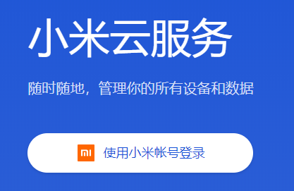
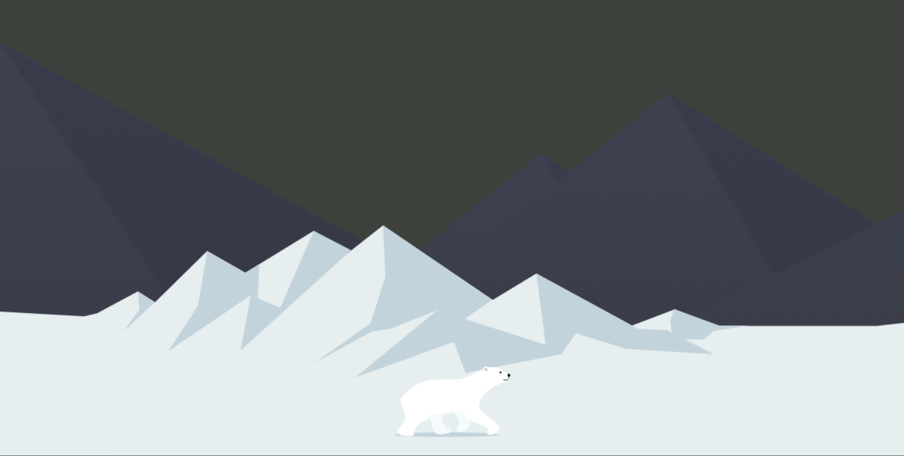

# CSS 


> 参考文档

* 手册类
  * [w3School](https://www.w3school.com.cn/css/css_reference.asp)
  * [菜鸟教程](https://www.runoob.com/css/css-tutorial.html)
* 教程
  * [B站视频教程](https://www.bilibili.com/video/BV14J4114768?np=124)
    * [教程代码](https://gitee.com/xiaoqiang001/html_css_material)


①②③④⑤⑥⑦⑧⑨

[TOC]


# 1. 基础知识


## 1.1 选择器

[选择器一览表](https://www.runoob.com/cssref/css-selectors.html)


"CSS"列表示在CSS版本的属性定义（CSS1，CSS2，或对CSS3）。

| 选择器                                                       | 示例                  | 示例说明                                                  | CSS  |
| :----------------------------------------------------------- | :-------------------- | :-------------------------------------------------------- | :--- |
| [.*class*](https://www.runoob.com/cssref/sel-class.html)     | .intro                | 选择所有class="intro"的元素                               | 1    |
| [#*id*](https://www.runoob.com/cssref/sel-id.html)           | #firstname            | 选择所有id="firstname"的元素                              | 1    |
| [*](https://www.runoob.com/cssref/sel-all.html)              | *                     | 选择所有元素                                              | 2    |
| *[element](https://www.runoob.com/cssref/sel-element.html)*  | p                     | 选择所有<p>元素                                           | 1    |
| *[element,element](https://www.runoob.com/cssref/sel-element-comma.html)* | div,p                 | 选择所有<div>元素和<p>元素                                | 1    |
| [*element* *element*](https://www.runoob.com/cssref/sel-element-element.html) | div p                 | 选择<div>元素内的所有<p>元素                              | 1    |
| [*element*>*element*](https://www.runoob.com/cssref/sel-element-gt.html) | div>p                 | 选择所有父级是 <div> 元素的 <p> 元素                      | 2    |
| [*element*+*element*](https://www.runoob.com/cssref/sel-element-pluss.html) | div+p                 | 选择所有紧接着<div>元素之后的<p>元素                      | 2    |
| [[*attribute*\]](https://www.runoob.com/cssref/sel-attribute.html) | [target]              | 选择所有带有target属性元素                                | 2    |
| [[*attribute*=*value*\]](https://www.runoob.com/cssref/sel-attribute-value.html) | [target=-blank]       | 选择所有使用target="-blank"的元素                         | 2    |
| [[*attribute*~=*value*\]](https://www.runoob.com/cssref/sel-attribute-value-contains.html) | [title~=flower]       | 选择标题属性包含单词"flower"的所有元素                    | 2    |
| [[*attribute*\|=*language*\]](https://www.runoob.com/cssref/sel-attribute-value-lang.html) | [lang\|=en]           | 选择 lang 属性以 en 为开头的所有元素                      | 2    |
| [:link](https://www.runoob.com/cssref/sel-link.html)         | a:link                | 选择所有未访问链接                                        | 1    |
| [:visited](https://www.runoob.com/cssref/sel-visited.html)   | a:visited             | 选择所有访问过的链接                                      | 1    |
| [:active](https://www.runoob.com/cssref/sel-active.html)     | a:active              | 选择活动链接                                              | 1    |
| [:hover](https://www.runoob.com/cssref/sel-hover.html)       | a:hover               | 选择鼠标在链接上面时                                      | 1    |
| [:focus](https://www.runoob.com/cssref/sel-focus.html)       | input:focus           | 选择具有焦点的输入元素                                    | 2    |
| [:first-letter](https://www.runoob.com/cssref/sel-firstletter.html) | p:first-letter        | 选择每一个<p>元素的第一个字母                             | 1    |
| [:first-line](https://www.runoob.com/cssref/sel-firstline.html) | p:first-line          | 选择每一个<p>元素的第一行                                 | 1    |
| [:first-child](https://www.runoob.com/cssref/sel-firstchild.html) | p:first-child         | 指定只有当<p>元素是其父级的第一个子级的样式。             | 2    |
| [:before](https://www.runoob.com/cssref/sel-before.html)     | p:before              | 在每个<p>元素之前插入内容                                 | 2    |
| [:after](https://www.runoob.com/cssref/sel-after.html)       | p:after               | 在每个<p>元素之后插入内容                                 | 2    |
| [:lang(*language*)](https://www.runoob.com/cssref/sel-lang.html) | p:lang(it)            | 选择一个lang属性的起始值="it"的所有<p>元素                | 2    |
| [*element1*~*element2*](https://www.runoob.com/cssref/sel-gen-sibling.html) | p~ul                  | 选择p元素之后的每一个ul元素                               | 3    |
| [[*attribute*^=*value*\]](https://www.runoob.com/cssref/sel-attr-begin.html) | a[src^="https"]       | 选择每一个src属性的值以"https"开头的元素                  | 3    |
| [[*attribute*$=*value*\]](https://www.runoob.com/cssref/sel-attr-end.html) | a[src$=".pdf"]        | 选择每一个src属性的值以".pdf"结尾的元素                   | 3    |
| [[*attribute**=*value*\]](https://www.runoob.com/cssref/sel-attr-contain.html) | a[src*="runoob"]      | 选择每一个src属性的值包含子字符串"runoob"的元素           | 3    |
| [:first-of-type](https://www.runoob.com/cssref/sel-first-of-type.html) | p:first-of-type       | 选择每个p元素是其父级的第一个p元素                        | 3    |
| [:last-of-type](https://www.runoob.com/cssref/sel-last-of-type.html) | p:last-of-type        | 选择每个p元素是其父级的最后一个p元素                      | 3    |
| [:only-of-type](https://www.runoob.com/cssref/sel-only-of-type.html) | p:only-of-type        | 选择每个p元素是其父级的唯一p元素                          | 3    |
| [:only-child](https://www.runoob.com/cssref/sel-only-child.html) | p:only-child          | 选择每个p元素是其父级的唯一子元素                         | 3    |
| [:nth-child(*n*)](https://www.runoob.com/cssref/sel-nth-child.html) | p:nth-child(2)        | 选择每个p元素是其父级的第二个子元素                       | 3    |
| [:nth-last-child(*n*)](https://www.runoob.com/cssref/sel-nth-last-child.html) | p:nth-last-child(2)   | 选择每个p元素的是其父级的第二个子元素，从最后一个子项计数 | 3    |
| [:nth-of-type(*n*)](https://www.runoob.com/cssref/sel-nth-of-type.html) | p:nth-of-type(2)      | 选择每个p元素是其父级的第二个p元素                        | 3    |
| [:nth-last-of-type(*n*)](https://www.runoob.com/cssref/sel-nth-last-of-type.html) | p:nth-last-of-type(2) | 选择每个p元素的是其父级的第二个p元素，从最后一个子项计数  | 3    |
| [:last-child](https://www.runoob.com/cssref/sel-last-child.html) | p:last-child          | 选择每个p元素是其父级的最后一个子级。                     | 3    |
| [:root](https://www.runoob.com/cssref/sel-root.html)         | :root                 | 选择文档的根元素                                          | 3    |
| [:empty](https://www.runoob.com/cssref/sel-empty.html)       | p:empty               | 选择每个没有任何子级的p元素（包括文本节点）               | 3    |
| [:target](https://www.runoob.com/cssref/sel-target.html)     | #news:target          | 选择当前活动的#news元素（包含该锚名称的点击的URL）        | 3    |
| [:enabled](https://www.runoob.com/cssref/sel-enabled.html)   | input:enabled         | 选择每一个已启用的输入元素                                | 3    |
| [:disabled](https://www.runoob.com/cssref/sel-disabled.html) | input:disabled        | 选择每一个禁用的输入元素                                  | 3    |
| [:checked](https://www.runoob.com/cssref/sel-checked.html)   | input:checked         | 选择每个选中的输入元素                                    | 3    |
| [:not(*selector*)](https://www.runoob.com/cssref/sel-not.html) | :not(p)               | 选择每个并非p元素的元素                                   | 3    |
| [::selection](https://www.runoob.com/cssref/sel-selection.html) | ::selection           | 匹配元素中被用户选中或处于高亮状态的部分                  | 3    |
| [:out-of-range](https://www.runoob.com/cssref/sel-out-of-range.html) | :out-of-range         | 匹配值在指定区间之外的input元素                           | 3    |
| [:in-range](https://www.runoob.com/cssref/sel-in-range.html) | :in-range             | 匹配值在指定区间之内的input元素                           | 3    |
| [:read-write](https://www.runoob.com/cssref/sel-read-write.html) | :read-write           | 用于匹配可读及可写的元素                                  | 3    |
| [:read-only](https://www.runoob.com/cssref/sel-read-only.html) | :read-only            | 用于匹配设置 "readonly"（只读） 属性的元素                | 3    |
| [:optional](https://www.runoob.com/cssref/sel-optional.html) | :optional             | 用于匹配可选的输入元素                                    | 3    |
| [:required](https://www.runoob.com/cssref/sel-required.html) | :required             | 用于匹配设置了 "required" 属性的元素                      | 3    |
| [:valid](https://www.runoob.com/cssref/sel-valid.html)       | :valid                | 用于匹配输入值为合法的元素                                | 3    |
| [:invalid](https://www.runoob.com/cssref/sel-invalid.html)   | :invalid              | 用于匹配输入值为非法的元素                                | 3    |


### ①  基本选择器

标签选择器  类选择器  ID选择器 通配符选择器


### ②  复合选择器

后代选择器  子选择器 并集选择器 伪类选择器

* 后代选择器：div p
  * 用空格表示，可以是孩子或者孙子 
* 子选择器 div > p

* 伪类选择器： 用`:`表示
  * 链接伪类 `a:link   a:visited   a:hover  a:active`
    * 注意事项：书写顺序；实际中只修改`a 与 a:hover`
  * focus伪类：`input:focus`


## 1.2 字体属性

https://www.w3school.com.cn/css/css_font.asp

| 属性                                                         | 描述                                                   |
| :----------------------------------------------------------- | :----------------------------------------------------- |
| [font](https://www.w3school.com.cn/cssref/pr_font_font.asp)  | 简写属性。作用是把所有针对字体的属性设置在一个声明中。 |
| [font-family](https://www.w3school.com.cn/cssref/pr_font_font-family.asp) | 设置字体系列。                                         |
| [font-size](https://www.w3school.com.cn/cssref/pr_font_font-size.asp) | 设置字体的尺寸。                                       |
| [font-style](https://www.w3school.com.cn/cssref/pr_font_font-style.asp) | 设置字体风格。                                         |
| [font-variant](https://www.w3school.com.cn/cssref/pr_font_font-variant.asp) | 以小型大写字体或者正常字体显示文本。                   |
| [font-weight](https://www.w3school.com.cn/cssref/pr_font_weight.asp) | 设置字体的粗细。                                       |


## 1.3 文本属性

| 属性                                                         | 描述                   |
| :----------------------------------------------------------- | :--------------------- |
| [color](https://www.w3school.com.cn/cssref/pr_text_color.asp) | 设置文本颜色           |
| [line-height](https://www.w3school.com.cn/cssref/pr_dim_line-height.asp) | 设置行高。             |
| [letter-spacing](https://www.w3school.com.cn/cssref/pr_text_letter-spacing.asp) | 设置字符间距。         |
| [text-align](https://www.w3school.com.cn/cssref/pr_text_text-align.asp) | 对齐元素中的文本。     |
| [text-decoration](https://www.w3school.com.cn/cssref/pr_text_text-decoration.asp) | 向文本添加修饰。       |
| [text-indent](https://www.w3school.com.cn/cssref/pr_text_text-indent.asp) | 缩进元素中文本的首行。 |

text-indent:2em 

text-decoration 取消下划线

line-height  可以居中对齐


## 1.4 显示模式

块元素：占一行例如`div`    。 行元素：多个一行`span`

### ①   块元素

```
h1~h6  p div ul ol li
```

* 自己占一行
* 高度 宽度 内外边距 
* width 不写，默认宽度与父窗口一样宽 100%
* 是一个容器，里面可以放`块元素`与`行元素`

> 注意事项

* 文字块`p h1` 等不能放置div了。


### ②  行元素

内联元素

```
<a> <strong> <b> <em> <i> <del> <s> <ins> <u> <span>
```

* 一行可以多个
* 高度与宽度设置无效
* 默认宽度就是自己本身宽度
* 行元素只能放`行元素`与`文本`  。
  * 不能放置div 等块元素
  * `<a>` 可以放块元素


### ③  行内块元素

```
input img td
```

* 可以设置宽度与高度
* 默认宽度是本身宽度（继承了行元素）
* 一行可以放多个


### ④ 显示模式转换

`行转块` 与 `转行内块` 用到的比较多。 [可以参考小米侧边栏案例](#4.1 小米侧边栏)


> 行转块: display: block;

例如将`<a>` 转换后，就可以设置高度与宽度


> 块转行: isplay: inline;

不能设置宽度与高度


> 转行内块：display:inline-block;

一行可以放多个


## 1.5 背景属性

背景颜色 背景图片 背景平铺 背景图片位置 背景图片固定


| 属性                                                         | 描述                                         |
| :----------------------------------------------------------- | :------------------------------------------- |
| [background](https://www.w3school.com.cn/cssref/pr_background.asp) | 简写属性，作用是将背景属性设置在一个声明中。 |
| [background-attachment](https://www.w3school.com.cn/cssref/pr_background-attachment.asp) | 背景图像是否固定或者随着页面的其余部分滚动。 |
| [background-color](https://www.w3school.com.cn/cssref/pr_background-color.asp) | 设置元素的背景颜色。                         |
| [background-image](https://www.w3school.com.cn/cssref/pr_background-image.asp) | 把图像设置为背景。                           |
| [background-position](https://www.w3school.com.cn/cssref/pr_background-position.asp) | 设置背景图像的起始位置。                     |
| [background-repeat](https://www.w3school.com.cn/cssref/pr_background-repeat.asp) | 设置背景图像是否及如何重复。                 |


### 1.5.1 背景图片

background-image属性描述了元素的背景图像。

实际开发常见于**logo**或者一些装饰性的**小图片** 或者是**超大的背景图片**.

优点是**非常便于控制位置**(精灵图也是一种运用场景)

```html
body
  { 
  background-image: url(bgimage.gif);
  background-color: #000000;
  }
```


#### ①   是否平铺：background-repeat

默认都是平铺的。 可以设置沿着X或Y轴平铺。

可以添加背景图片与背景颜色，背景图片会靠上。


#### ②   指定位置：background-position

有三种方式：

| 值                                     | 描述                                                         |
| :------------------------------------- | :----------------------------------------------------------- |
| top left  center right bottom 两两组合 | 如果您仅规定了一个关键词，那么第二个值将是"center"。默认值：0% 0%。 |
| x% y%                                  | 第一个值是水平位置，第二个值是垂直位置。左上角是 0% 0%。右下角是 100% 100%。如果您仅规定了一个值，另一个值将是 50%。 |
| xpos ypos                              | 第一个值是水平位置，第二个值是垂直位置。左上角是 0 0。单位是像素 (0px 0px) 或任何其他的 CSS 单位。如果您仅规定了一个值，另一个值将是50%。您可以混合使用 % 和 position 值。 |

也可是混合单位

20px center;


#### ③  滚动或固定：background-attachment

[参考案例](https://www.w3school.com.cn/tiy/t.asp?f=csse_background-attachment)

| 值      | 描述                                                    |
| :------ | :------------------------------------------------------ |
| scroll  | 默认值。背景图像会随着页面其余部分的滚动而移动。        |
| fixed   | 当页面的其余部分滚动时，背景图像不会移动。              |
| inherit | 规定应该从父元素继承 background-attachment 属性的设置。 |


### 1.5.2 复合写法

让代码更加简洁

```css
background black url(imgs/bg.jpg) no-repeat fixed center top
```


### 1.5.3 半透明

背景颜色半透明，非常常见

```css
background rgba(0,0,0,0.3)
```


## 1.6 三大特性


### 1.6.1 层叠性

解决样式冲突，就近原则，用最后代码会覆盖上面的代码。

长江后浪推前浪。


### 1.6.2 继承性

子标签会继承父标签的属性。恰当使用，可以简化代码。

主要继承：

* 文字相关
* 颜色相关
* 行高：line-height
  * 行高不指定单位，例如：1.5 是什么意思: `line-height:1.5;`

不继承：

* 高度等信息


### 1.6.3 优先级


关键点是如何覆盖到上级的css样式


> 权重叠加


## 1.7 盒子模型

网页布局三大核心：盒子模型、浮动、定位。


### 1.7.1 布局的本质

> 具体步骤

* 1：将网页分割成大块的盒子 ,Box
* 2：摆放Box的位置（这一步比较难）
* 3：填充Box的内容

下图，展示了不同的盒子：


### 1.7.2 盒子的属性

主要属性有：

* 边框：border
* 外边距 margin
* 内边距 padding
* 实际内容 content

### 1.7.3 边框 border

#### ①   边框属性

border-width 粗细

border-color  颜色

border-style   虚线(dashed)，实线(solid)，点线(dotted)，

#### ②  边框简写

没有顺序限制

`border: 1px solid red`

四个边框，可以分别指定： border-top  border-bottom


#### ③  table边框设置

重点是把相邻单元格的边框合并，不然会粗。`border-collapse:collapse;`

可以统一设置`table td th`的边框

[html边框特性可以参考这里](https://www.runoob.com/html/html-tables.html)


#### ④ 边框改变盒子大小

这个边框的实际大小为：220px

```css
<div>
	width:200px;
	height:200px;
	background-color: pink;
	boder: 10px solid red;
</div>
```


#### ⑤ 圆角边框

可以变成圆形，圆角矩形等等。

```css
border-radius:10px;

/*圆形,必须是正方形*/
border-radius:50%;

/*圆角矩形，高度的一半*/
border-radius:50%;

/*设置4个角*/
border-radius:10px 20px 30px 40px;

/*只有一个角*/
border-top-left-radius:10px;
```


### 1.7.4 内边距padding

```
padding: 5px; 表示上下左右
```

**padding 实际会影响盒子大小。**


### 1.7.5 外边距 margin

**实际会影响盒子大小。**


### 1.7.6 内容 content


# 2. 网页布局

[CSS布局：float、position、flex、grid](https://www.jianshu.com/p/795d070e62f5)


网页布局准则: 

* 第一准则
  * 多个块级元素--纵向排列找**标准流**
  * 多个块级元素--横向排列找**浮动流**
* 第二准则
  * 先设置盒子大小,之后设置盒子的位置.


## 2.1 三种布局


> 标准流

默认按照`block inline` 来布局的。 也就是说什么都不做，就是标准流。


> 浮动流


> 固定流


## 2.2 标准流

默认按照`block inline` 来布局的。 也就是说什么都不做，就是标准流。


## 2.3 浮动流

> 为什么需要浮动?

有很多的布局效果,标准流没有办法完成,此时就可以利用浮动完成布局。因为浮动可以改变元素标签默认的排列方式。

浮动最典型的应用:**可以让多个块级元素-行内排列显示。**

> 什么是浮动?

float属性用于创建浮动框,将其移动到一边,直到左边缘或右边缘触及包含块或另-个浮动框的边缘。

可能的值

| 值      | 描述                                                 |
| :------ | :--------------------------------------------------- |
| left    | 元素向左浮动。                                       |
| right   | 元素向右浮动。                                       |
| none    | 默认值。元素不浮动，并会显示在其在文本中出现的位置。 |
| inherit | 规定应该从父元素继承 float 属性的值。                |


### 2.3.1 注意点

> 浮动和标准流的父盒子搭配。

* 先用标准流的父元素排列.上下位置.

* 之后内部子元素采取浮动排列左右位置

  

> 一个元素浮动了,理论上其余的兄弟元素也要浮动。

* 盒子里面有多个子盒子, 如果其中-一个盒子浮动了 ,那么其他兄弟也应该浮动,以防止引起问题。
*  浮动的盒子只会影响浮动盒子后面的标准流，不会影响前面的标准流.（例如下图：会在第一个标准流后面）


> 其他

* 浮动上沿对齐。
* 如果父级宽度装不下这些浮动的盒子，多出的盒子会另起一行对齐。
* 浮动有行内块属性。
  * 行盒子
    * 可以直接设置高度与宽度。例如：span添加`float:left` 。
  * 块级盒子
    * 没有设置宽度,默认宽度和父级一样宽。添加浮动后,它的默认宽度根据内容来决定


### 2.3.2 为啥清除浮动？

由于父级盒子很多情况下,不方便给高度,但是子盒子浮动又不占有位置,最后父级盒子高度为0时,就会
影响下面的标准流盒子。

[如果难以理解，看这个视频](https://www.bilibili.com/video/BV14J4114768?p=183)


### 2.3.3 如何清除？

```
/*在实际工作中，几乎只用下面的*/
clear:both;
```

常用后3种。

1.额外标签法也称为隔墙法,是W3C推荐的做法。
2.父级添加overflow属性
3.父级添加after伪元素
4.父级添加双伪元素


#### ①  额外标签法

额外标签法也称为隔墙法,是W3C推荐的做法。
额外标签法会在浮动元素末尾添加一个空的标签。

* 例如`<div style=" clear:both" > </div>` 
* 或者其他标签(如`<br/>`)。
* 必须块级元素，不能是行元素。

优点:通俗易懂，书写方便

缺点:添加许多无意义的标签,结构化较差


#### ② 父级添加overflow

```html
overflow:hidden;
```

overflow很神奇，还可以控制滚动轴，今后会详细说明。

●优点: 代码简洁
●缺点: 无法显示溢出的部分


#### ③  父级添加after伪元素


```html
.clearfix:after {
	content: "";
	display: block;
	height: 0;
	clear: both;
	visibility: hidden;
}

/* IE6、 7专有*/
.clearfix { 
	*zoom: 1;
}

/*父元素种添加这个*/
<div class="box clearfix">
    <div class='damao'>
       大毛
    </div>
    <div class="ermao">
        二毛
    </div>
</div>

```


#### ④ 父级添加双伪元素

小米、腾讯都用的是这个。

```html
.clearfix : before,
.clearfix : after { 
	content:"";
	display: table;
}

.clearfix:after {
	clear: both;
}

.clearfix {
	*zoom:1;
}

/*父元素种添加这个*/
<div class="box clearfix">
    <div class='damao'>
       大毛
    </div>
    <div class="ermao">
        二毛
    </div>
</div>
```


## 2.4 定位


### 2.4.1 为什么要定位？

* 一个图片浮动在另外一个上面
* 固定在屏幕上的某个位置


### 2.4.2 定位的组成

 定位= 定位模式+边偏移

#### ①  定位模式

通过`opsition`实现

可能的值

| 值       | 描述                                                         |
| :------- | :----------------------------------------------------------- |
| absolute | 生成**绝对定位**的元素，相对于 static 定位以外的第一个父元素进行定位。元素的位置通过 "left", "top", "right" 以及 "bottom" 属性进行规定。 |
| fixed    | 生成**固定定位**的元素，相对于浏览器窗口进行定位。元素的位置通过 "left", "top", "right" 以及 "bottom" 属性进行规定。 |
| relative | 生成**相对定位**的元素，相对于其正常位置进行定位。因此，"left:20" 会向元素的 LEFT 位置添加 20 像素。 |
| static   | 默认值。没有定位，元素出现在正常的流中（忽略 top, bottom, left, right 或者 z-index 声明）。 |
| inherit  | 规定应该从父元素继承 position 属性的值。                     |


* 在页面中不动：fixed
* 盖上另外一个盒子: absolute


#### ②  边偏移

边偏移就是定位的盒子移动到最终位置。有top、bottom、 left 和right 4个属性。


### 2.4.3 定位分类


#### 2.4.3.1 static-静态定位

不常用，`position:static`


#### 2.4.3.2 relative-相对定位

相对自我原有位子的定位。 **自恋型**

```css
position:relative;
top:100px;
```

虽然这个盒子走了，但是**位置还保留**。

例如`学成在线`中的鼠标移动上去，出现抖动的例子。

```css
.box .box-bd ul li:hover{
    box-shadow: 0 5px 8px -4px rgba(0,0,0,0.1);
    position: relative;
    top: -2px;
}
```


#### 2.4.3.3 absolute-绝对定位


##### ①  特点

是跟父元素来定位的。

> 绝对定位的特点: ( 务必记住)

* 1.如果**没有祖先元素**或者**祖先元素没有定位**,则以浏览器为准定位( Document文档)。
* 2.如果祖先元素有定位(相对、绝对、固定定位) , 则以最近一级的有定位祖先元素为参考点移动位置。
* 3.绝对**定位不占有位置**。


##### ② 应用案例

绝对定位的案例：轮播图


##### ③   父相子绝

 **[相对定位]常给[绝对定位]当爹**

为什么这么来说的，因为`absolute`的父元素必须有定位，不然就按照浏览器的定位来做。

所以为了不影响原有特性，可以给父元素加一个定位模式。


##### ④ 小技巧：在父盒子居中

例如淘宝图中的这几个按钮，在图片中居中。


#### 2.4.3.5 固定定位

**固定定位**是元素固定于**浏览器可视区的位置。主要使用场景**:可以在浏览器页面滚动时元素的位置不会改变。


##### ①  特点

> 固定定位的特点: (务必记住)

* 1.以浏览器的可视窗口为参照点移动元素。
  * 跟父元素没有任何关系
  * 不随滚动条滚动。
* 2.固定定位**不在占有原先的位置**。
  * 固定定位也是脱标的,其实固定定位也可以看做是一种特殊的绝对定位。


##### ② 技巧：固定版心右侧

小算法:
1.让固定定位的盒子left: 50%.走到浏览器可视区(也可以看做版心)的一半位置。
2.让固定定位的盒子margin-eft:版心宽度的一半距离。多走 版心宽度的一半位置
就可以让固定定位的盒子贴着版心右侧对齐了。

> 示例代码

```css
fixed {
	position: fixed;
	/*1.走浏览器宽度的一半*/
	left: 50%;
	/*2.利用margin 走版心盒子宽度的一半*/
	margin-left: 400px ;
	width: 50px;
	height: 150px;
	background-color: skyblue ;
}
```


#### 2.4.3.6 粘性定位(不常用)

粘性定位可以被认为是**相对定位和固定定位**的混合。Sticky 粘性的

**不常用的原因：兼容性较差, IE不支持。**

```
选择器{ position: sticky top: 10px; }
```

类似京东的这个导航，但是京东是用Js做的。


> 粘性定位的特点:

* 1.以浏览器的可视窗口为参照点移动元素(固定定位特点)
* 2.粘性定位占有原先的位置(相对定位特点)
* 3.必须添加top. left. right. bottom 其中-一个才有效
* 跟页面滚动搭配使用。兼容性较差, IE不支持。


### 2.4.4 定位特定用法


#### 2.4.4.1 叠放顺序

数值越大越放在上面

```
选择器{ z-index: 1; }
```

● 数值可以是正整数、负整数或0,默认是auto ,数值越大,盒子越靠上
● 如果属性值相同，则按照书写顺序,后来居上
● 数字后面不能加单位
● 只有定位的盒子才有 z-index属性


#### 2.4.4.2 特殊属性

绝对定位和固定定位也和浮动类似。
1.行内元素添加绝对或者固定定位,可以直接设置高度和宽度。
2.块级元素添加绝对或者固定定位,如果不给宽度或者高度,默认大小是内容的大小。


#### 2.4.4.3 如何压住准流的文字？

> 绝对定位(固定定位)会完全压住盒子

* **浮动元素不同,只会压住它下面标准流的盒子**,但是不会压住下面标准流盒子里面的文字。
* 绝对定位(固定定位)会压住下面标准流所有的内容。


> 浮动为什么不压文字呢？

浮动的最初是为了让文字围绕的. 例如下面的效果。


# 3. CSS高级语法


## 3.1 精灵图

核心原理:将网页中的一些小背景图像整合到-张大图中,这样服务器只需要一次请求就可以了。

1.精灵图主要针对于小的背景图片使用。
2.主要借助于背景位置来实现--background position.
3.一般情况下精灵图都是负值。( 千万注意网页中的坐标: x轴右边走是正值,左边走是负值，y轴同理。)

```css
.box1 {
	width: 60px;
	height: 60px;
	margin: 100px auto;
	background: url(images/sprites.png) no-repeat -182px 0;
}

```


###  精灵图工具 

* [生成精灵图 ](https://www.toptal.com/developers/css/sprite-generator/) 
  * 传入多个图，自动生成精灵图

* [精灵图自动测量工具](http://www.spritecow.com/)
  * 传入一个精灵图，自动生成相关的CSS


## 3.2 字体图标

网站上常用的字体图标。


●轻量级:一个图标字体要比一系列的图像要小。- -旦字体加载了,图标就会马上渲染出来,减少了服务器请求
●灵活性:本质其实是文字,可以很随意的改变颜色、产生阴影、透明效果、旋转等
●兼容性: 几乎支持所有的浏览器,请放心使用

1.如果遇到一-些结构和样式比较简单的小图标,就用字体图标。
2.如果遇到-些结构和样式复杂-点的小图片 ,就用精灵图。


### 3.2.1 下载图标


#### ① 打开字体网站

* http://icomoon.io

* http://www.iconfont.cn


#### ② 选中字体


#### ③ 点击生成并下载

解压后是这个样子


### 3.2.2  使用图标


#### ① 将fonts文件夹放到根目录

在style.css有引用的目录。

#### ② 将style.css放到指定地方

可以修改名字，然后在html中引用。

#### ③ 在代码中使用

```html
<head>
    <meta charset="UTF-8">
    <meta name="viewport" content="width=device-width, initial-scale=1.0">
    <meta http-equiv="X-UA-Compatible" content="ie=edge">
    <title>字体</title>
    <link rel="stylesheet" href="style.css">
    <style>
        * {
            margin: 0;
            padding: 0;
        }

        .w{
            width: 444px;
            height: 322px;
            margin: 100px auto;
        }

        .icon{
            color:red;
        }
     
    </style>
</head>

<body>
    <div class="w">
        <span class="icon-database icon"></span>
        <i class="icon-database icon"></i>
    </div>
</body>
```


### 3.2.3 字体的追加

打开网站，将`selection.json`上传，就发现自己以前选中的字体。

然后选中新的字体，然后重新下载。


## 3.3 三角的制作


如果将每个边都指定不同的颜色，就显示上图的样子

```css
div {
    width: 0;
    height: 0;
    line-height: 0;
    font-size: 0;
    border: 50px solid transparent;
    border- left-color: pink ;
}
```


> 京东三角的应用


```html
<style>
      .jd{
            position:relative;
            width: 120px;
            height: 249px;  
            margin-left: 50px;
            background-color:pink;
        }

        .jd-up {
            position: absolute;
            top: -10px;
            left: 80%;
            width: 0;
            height: 0;
            line-height: 0;
            font-size: 0;
            border: 5px solid transparent;
            border-bottom-color:pink ;
        }
</style>
    <div class="jd">
        <div class="jd-up"></div>
    </div>	
```


## 3.4 页面样式


### 3.4.1 改变鼠标样式

```
1i {cursor: pointer; 
```

常用的：

* default
* pointer 小手
* move 移动
* text  文字
* not-allowed   如京东不能小于1


可能的值  

| 值          | 描述                                                         |
| :---------- | :----------------------------------------------------------- |
| *url*       | 需使用的自定义光标的 URL。注释：请在此列表的末端始终定义一种普通的光标，以防没有由 URL 定义的可用光标。 |
| default     | 默认光标（通常是一个箭头）                                   |
| auto        | 默认。浏览器设置的光标。                                     |
| crosshair   | 光标呈现为十字线。                                           |
| **pointer** | 光标呈现为指示链接的指针（一只手）                           |
| move        | 此光标指示某对象可被移动。                                   |
| e-resize    | 此光标指示矩形框的边缘可被向右（东）移动。                   |
| ne-resize   | 此光标指示矩形框的边缘可被向上及向右移动（北/东）。          |
| nw-resize   | 此光标指示矩形框的边缘可被向上及向左移动（北/西）。          |
| n-resize    | 此光标指示矩形框的边缘可被向上（北）移动。                   |
| se-resize   | 此光标指示矩形框的边缘可被向下及向右移动（南/东）。          |
| sw-resize   | 此光标指示矩形框的边缘可被向下及向左移动（南/西）。          |
| s-resize    | 此光标指示矩形框的边缘可被向下移动（南）。                   |
| w-resize    | 此光标指示矩形框的边缘可被向左移动（西）。                   |
| text        | 此光标指示文本。                                             |
| wait        | 此光标指示程序正忙（通常是一只表或沙漏）。                   |
| help        | 此光标指示可用的帮助（通常是一个问号或一个气球）。           |


### 3.4.2 表单轮廓

给表单添加outline: 0;或者outline: none;样式之后,就可以去掉默认的蓝色边框。

学成在线上面的搜索框。

```html
input {outline: none;}
```


### 3.4.3  放置表单域拖拽

默认这个小三角可以拖动文本框的大小。文本域要放在一行。


```html
textarea {
	resize: none
}
<!-- 2.防止拖拽文本域-->
<textarea name=
id=""
cols="30"
rows= "10">< /textarea>
```


## 3.5 行内块和文字垂直居中

```css
vertical-align:middle;
```

该属性定义行内元素的基线相对于该元素所在行的基线的垂直对齐。


### 3.5.1 图片与文字居中





例如学成在想中用户图像与昵称，可以在图像上添加：

```
.user img{
    vertical-align:middle;
}
```


### 3.5.2 文本框与文字居中

给文本框添加`vertical-align:middle;`

```
<textarea name="" id=" cols="30" rows= "10" ></textarea>请您留言
```


### 3.5.3 可能的值

| 值          | 描述                                                         |
| :---------- | :----------------------------------------------------------- |
| baseline    | 默认。元素放置在父元素的基线上。                             |
| sub         | 垂直对齐文本的下标。                                         |
| super       | 垂直对齐文本的上标                                           |
| top         | 把元素的顶端与行中最高元素的顶端对齐                         |
| text-top    | 把元素的顶端与父元素字体的顶端对齐                           |
| middle      | 把此元素放置在父元素的中部。                                 |
| bottom      | 把元素的顶端与行中最低的元素的顶端对齐。                     |
| text-bottom | 把元素的底端与父元素字体的底端对齐。                         |
| length      |                                                              |
| %           | 使用 "line-height" 属性的百分比值来排列此元素。允许使用负值。 |
| inherit     | 规定应该从父元素继承 vertical-align 属性的值。               |


### 3.5.4 图片底侧空白缝隙

由于默认是`vertical-align:baseline`，是基线对齐，所以有小边框。

修改成：`vertical-align:middle` 等任意数值就行。


> 第二种解决方案

修改成块元素也可以 `display:block;`  推荐用第一种。


### 3.5.5 溢出文字用省略号

①②③④⑤⑥⑦⑧⑨


#### ① 单行文本

```css
/*1.先强制一行内显示文本*/
white-space: nowrap; ( 默认normal自动换行)
/*2.超出的部分隐藏*/
overflow: hidden;
/*3.文字用省略号替代超出的部分*/
text-overflow: ellipsis;
```


#### ② 多行文本

多行文本溢出显示省略号,有较大兼容性问题,适合于webKit浏览器或移动端(移动端大部分是webkit内核)

这里必须：将div的高度设置成一定高度。

```css
overflow: hidden;
text-overflow: ellipsis;
/*弹性伸缩盒子模型显示*/
display: -webkit-box;
/*限制在一个块元素显示的文本的行数*/
-webkit-line-clamp: 2;
/*设置或检索伸缩盒对象的子元素的排列方式*/
-webkit-box-orient: vertical ;

```

> 技巧

可以让后台的人来做。 因为这个功能在IE种不能用。


## 3.6  布局技巧

### 3.6.1 margin负值的运用

https://www.taobao.com/

淘宝首页，每个页面都有一个细线边框，这样重叠在一起，就是2像素。那么怎么做呢？


```css
ul li{
	float:left;
	list-style: none;
	width: 150px;
	height:200px;
	border: 1px solid  red; 
	margin-left: -1px;
}


<ul>
	<li>1</li>
	<li>1</li>
	<li>1</li>
	<li>1</li>
	<li>1</li>
</ul>
```


> 如何让鼠标移动过去的时候，像淘宝一样有边框

第一种方法：如果盒子没有相对定位，那么添加相对定位就可以了。相对定位会压住普通定位

```css
ul li:hover{
    position:relative;
    border: 1px solid blue;
}
```


第二种方法：如果li有相对定位，那么例子z-index提高层级。

```css
ul li:hover{
    z-index: 1;
    border: 1px solid blue;
}
```


### 3.6.2 文字围绕浮动元素

通过浮动的文字特性，用最简单的代码来实现。


```css
<style>
    * {
		margin:0px;
        padding:0px;
    }
	.box{
		width: 300px ;
		height: 70px;
		background-color: pink;
        margin:0 auto;
        padding:5px;
	}

    .pic {
        float: left;
        width: 120px;
        height: 60px;
        margin-right:5px;
	}

    .pic img {
    	width: 100%;
    }
</style>


<body>
	<div class="box">
		<div class="pic">
			
		</div>
		<p>1232213123123123</p>
	</div>
< /body>

```


### 3.6.3 行内块的巧妙运用

通过行内块，快速制作一个分页组件。

行内块的好处：

* 默认每个块都都有一个空格
* 给父块设置`text-align:center;`，那么子元素就居中了。
* 注意：要在文件头添加：`* {margin:0px;padding:ppx;}`


```html
    <div class="box w">
        <a href="#" class="prev">&lt;上一页</a>
        <a href="#">1</a>
        <a href="#" class="current">2</a>
        <a href="#">3</a>
        <a href="#">4</a>
        <a href="#">5</a>
        <a href="#">6</a>
        <a href="#" class="epl">...</a>
        <a href="#" class="next">下一页&gt;</a>
        &nbsp;&nbsp;到第<input/>页&nbsp;&nbsp;  
        <a class="button" href="#">确定</a>
    </div>
```


### 3.6.4 css三角强化

这种布局不常用了。

例如京东的这个小三角是怎么做出的呢？[参考视频](https://www.bilibili.com/video/BV14J4114768?p=271)


```css
.box1 {
	width: 0;
	height: 0;
	border-top: 100px solid transparent ;
	border-right: 50px solid skyblue ;
	border-bottom: 0 solid。blue;
	border-left: 0 solid green;
}
```

简写方式：

```css
/* 1.只保留右边的边框有颜色*/
border- color: transparent  red transparent transparent;
/* 2.样式都是solid */
border-style: solid;
/* 3. 上边框宽度要大，
右边框宽度稍小，其 余的边框该为0 */
border-width: 100px 50px 0 0 ; 

```


> 具体的例子

```html
<head>
    <meta charset="UTF-8">
    <meta name="viewport" content="width=device-width, initial-scale=1.0">
    <meta http-equiv="X-UA-Compatible" content="ie=edge">
    <title>分页</title>
    <style>
        * {
            margin: 0px;
            padding: 0px;
        }

        .w{
            width: 1240px;
            margin: 0px auto;
        }

        em, i {
            font-style: normal;
        }

        .box{
            margin: 10px auto;
            text-align: center;
            background-color:pink;
            width: 180px;
            height: 24px;
            border: 1px solid red;
        }

        .box .left{
            float: left;
            width: 50%;
            height: 24px;
            background-color: red;
            color: #fff;
            text-align: center;
            line-height: 24px;
        }

        .box .sj{
            float: left;
            /* 1.只保留右边的边框有颜色*/
            border-color: transparent  #fff transparent transparent;
            /* 2.样式都是solid */
            border-style: solid;
            /* 3. 上边框宽度要大，
            右边框宽度稍小，其 余的边框该为0 */
            border-width: 24px 12px 0 0;
            margin-left: -12px;
        }

        .box .right{
            float: left;
            width: 50%;
            height: 24px;
            background-color: #fff;
            text-align: center;
            line-height: 24px;
            color: #999;
            text-decoration: line-through;
            font-size: 12px;

        }
    </style>
</head>

<body>
    <div class="box">
        <div class="left">
            <i>¥</i>
            <span>98.80</span>
        </div>
        <div class="sj"></div>
        <div class="right">
            <i>¥</i>
            <span>198.80</span>
        </div>
    </div>
</body>
```


> 另外一个写法

这个结构看起来好点，把三角放到了left的盒中了，这样定位代码更加清晰。

```html
<head>
    <meta charset="UTF-8">
    <meta name="viewport" content="width=device-width, initial-scale=1.0">
    <meta http-equiv="X-UA-Compatible" content="ie=edge">
    <title>CSS三角强化的巧妙运用</title>
    <style>
         .box1 {
            width: 0;
            height: 0;
            /* 把上边框宽度调大 */
            /* border-top: 100px solid transparent;
            border-right: 50px solid skyblue; */
            /* 左边和下边的边框宽度设置为0 */
            /* border-bottom: 0 solid blue;
            border-left: 0 solid green; */
           /* 1.只保留右边的边框有颜色 */
           border-color: transparent red transparent transparent;
            /* 2. 样式都是solid */
            border-style: solid;
            /* 3. 上边框宽度要大， 右边框 宽度稍小， 其余的边框该为 0 */
            border-width: 100px 50px 0 0 ;

        }
        .price {
            width: 160px;
            height: 24px;
            line-height: 24px;
            border: 1px solid red;
            margin: 0 auto;
        }
        .miaosha {
            position: relative;
            float: left;
            width: 90px;
            height: 100%;
            background-color:red;
            text-align: center;
            color: #fff;
            font-weight: 700;
            margin-right: 8px;

        }
        .miaosha i {
            position: absolute;
            right: 0;
            top: 0;
            width: 0;
            height: 0;
            border-color: transparent #fff transparent transparent;
            border-style: solid;
            border-width: 24px 10px 0 0;
        }
        .origin {
            font-size: 12px;
            color: gray;
            text-decoration: line-through;
        }
    </style>
</head>
<body>
        <div class="box1"></div>
        <div class="price">
            <span class="miaosha">
                ¥1650
                <i></i>
            </span>
            <span class="origin">¥5650</span>
        </div>
</body>
</html>
```


### 3.6.5 CSS 初始化

例如京东的初始化代码

* 右键查看京东代码
* 点击[first-screen.chunk.css](https://misc.360buyimg.com/mtd/pc/index_2019/1.0.0/static/css/first-screen.chunk.css)
* background-image 前的代码复制过来


```css
/* 把我们所有标签的内外边距清零 */
* {
    margin: 0;
    padding: 0
}
/* em 和 i 斜体的文字不倾斜 */
em,
i {
    font-style: normal
}
/* 去掉li 的小圆点 */
li {
    list-style: none
}

img {
    /* border 0 照顾低版本浏览器 如果 图片外面包含了链接会有边框的问题 */
    border: 0;
    /* 取消图片底侧有空白缝隙的问题 */
    vertical-align: middle
}

button {
    /* 当我们鼠标经过button 按钮的时候，鼠标变成小手 */
    cursor: pointer
}

a {
    color: #666;
    text-decoration: none
}

a:hover {
    color: #c81623
}

button,
input {
    /* "\5B8B\4F53" 就是宋体的意思 这样浏览器兼容性比较好 */
    font-family: Microsoft YaHei, Heiti SC, tahoma, arial, Hiragino Sans GB, "\5B8B\4F53", sans-serif
}

body {
    /* CSS3 抗锯齿形 让文字显示的更加清晰 */
    -webkit-font-smoothing: antialiased;
    background-color: #fff;
    font: 12px/1.5 Microsoft YaHei, Heiti SC, tahoma, arial, Hiragino Sans GB, "\5B8B\4F53", sans-serif;
    color: #666
}

.hide,
.none {
    display: none
}
/* 清除浮动 */
.clearfix:after {
    visibility: hidden;
    clear: both;
    display: block;
    content: ".";
    height: 0
}

.clearfix {
    *zoom: 1
}
```


[其他一些初始化文章](https://blog.csdn.net/weixin_43320501/article/details/84851831?utm_medium=distribute.pc_relevant.none-task-blog-BlogCommendFromMachineLearnPai2-2.channel_param&depth_1-utm_source=distribute.pc_relevant.none-task-blog-BlogCommendFromMachineLearnPai2-2.channel_param)


## 3.7 HTML5与CSS3

IE9 以上浏览器与移动端适用。

### 3.7.1 HTML5


#### ① 语义化标签

以前布局,我们基本用div来做。div 对于搜索引擎来说,是没有语义的。

* header
* nav 导航标签
* article 内容标签
* section 定义文档的某个区域，类似div
* aside 侧边栏
* footer  尾部

注意:
●这种语义化标准主要 是针对搜索引擎的
●这些新标签页面中可以使用多次
●在 IE9中,需要把这些元素转换为块级元素
●实际中我们移动端更喜欢使用这些标签
●HTML5还增加了很多其他标签,我们后面再慢慢学


例如小米中的转换

```css
article,aside,details,figcaption,figure,footer,header,hgroup,main,menu,nav,section,summary{display:block}
```


#### ② 多媒体标签

1.音频: <audio>
2.视频: <video>


> 视频


添加静音标签`muted= "muted"`，这样在谷歌浏览器下，也可以播放。

```css
<video src= "media/mi.mp4" autoplay= " autoplay" muted= "muted"></video>
```

建议适用mp4


HTML5 中的新属性。

| 属性                                                         | 值       | 描述                                                         |
| :----------------------------------------------------------- | :------- | :----------------------------------------------------------- |
| [autoplay](https://www.w3school.com.cn/tags/att_audio_autoplay.asp) | autoplay | 如果出现该属性，则音频在就绪后马上播放。                     |
| [controls](https://www.w3school.com.cn/tags/att_audio_controls.asp) | controls | 如果出现该属性，则向用户显示控件，比如播放按钮。             |
| [loop](https://www.w3school.com.cn/tags/att_audio_loop.asp)  | loop     | 如果出现该属性，则每当音频结束时重新开始播放。               |
| [muted](https://www.w3school.com.cn/tags/att_audio_muted.asp) | muted    | 规定视频输出应该被静音。                                     |
| [preload](https://www.w3school.com.cn/tags/att_audio_preload.asp) | preload  | 如果出现该属性，则音频在页面加载时进行加载，并预备播放。如果使用 "autoplay"，则忽略该属性。 |
| [src](https://www.w3school.com.cn/tags/att_audio_src.asp)    | *url*    | 要播放的音频的 URL。                                         |
| poster                                                       |          | 加载前的背景图片                                             |


> 音频标签

google默认不播放，需要用js来做。

```html
<audio controls height="100" width="100">
  <source src="horse.mp3" type="audio/mpeg">
  <source src="horse.ogg" type="audio/ogg">
  <embed height="50" width="100" src="horse.mp3">
</audio>
```


#### ③ 新增input类型


> type属性

属性值

| 值             | 描述                                                         |
| :------------- | :----------------------------------------------------------- |
| button         | 定义可点击的按钮（大多与 JavaScript 使用来启动脚本）         |
| checkbox       | 定义复选框。                                                 |
| color          | 定义拾色器。                                                 |
| date           | 定义日期字段（带有 calendar 控件）                           |
| datetime       | 定义日期字段（带有 calendar 和 time 控件）                   |
| datetime-local | 定义日期字段（带有 calendar 和 time 控件）                   |
| month          | 定义日期字段的月（带有 calendar 控件）                       |
| week           | 定义日期字段的周（带有 calendar 控件）                       |
| time           | 定义日期字段的时、分、秒（带有 time 控件）                   |
| email          | 定义用于 e-mail 地址的文本字段                               |
| file           | 定义输入字段和 "浏览..." 按钮，供文件上传                    |
| hidden         | 定义隐藏输入字段                                             |
| image          | 定义图像作为提交按钮                                         |
| number         | 定义带有 spinner 控件的数字字段                              |
| password       | 定义密码字段。字段中的字符会被遮蔽。                         |
| radio          | 定义单选按钮。                                               |
| range          | 定义带有 slider 控件的数字字段。                             |
| reset          | 定义重置按钮。重置按钮会将所有表单字段重置为初始值。         |
| search         | 定义用于搜索的文本字段。                                     |
| submit         | 定义提交按钮。提交按钮向服务器发送数据。                     |
| tel            | 定义用于电话号码的文本字段。                                 |
| text           | 默认。定义单行输入字段，用户可在其中输入文本。默认是 20 个字符。 |
| url            | 定义用于 URL 的文本字段。                                    |


#### ④ 新增表单属性

* required
* placeholder
* autofocus  自动获得焦点
* autocomplete  记录提交的数值
* multiple 多选文件

> 如何改变placeholder的颜色

```
input::placeholder{
	color:pink;
}
```


### 3.7.2 CSS3

IE9以上版本支持。

①②③④⑤⑥⑦⑧⑨

#### 3.7.2.1 新增选择器


##### ① 属性选择器

[参考网址](https://www.w3school.com.cn/cssref/selector_attr_contain.asp)

```css

/*属性等于某个数值--常用*/
input[type=text] {
	color:pink;
}

/*有value这个属性*/
input[value] {
	color:pink;
}

/*模糊匹配 以icon开头的*/
div[class^=icon] {
	color:pink;
}

/*模糊匹配 以icon结尾的*/
div[class$=icon] {
	color:pink;
}

/*模糊匹配 有icon的*/
div[class*=icon] {
	color:pink;
}
```

属性选择器的权重比较高：10


##### ② 结构选择器-选第几个

根据结构，也就是顺序。

```css
/* 1.选择uL里面的第一个孩子小i */
ul li:first-child {
	background-color:pink;
}


ul li:last-child {
	background-color:pink;
}

ul li:nth-child(2) {
	background-color:pink;
}


ul li:nth-child(even) {
	background-color:pink;
}

/*用公式   
n   : 全部
2n   : 偶数
2n+1 : 奇数
5n   : 5的倍数 (例如学成在线，一行5个。)
n+5  : 从第五个开始
-n+5 : 前5个
*/
ul li:nth-child(n) {
	background-color:pink;
}


/*
nth-of-type  nth-child 区别
nth-child 把所有孩子都计算 , 下面这个不会选择
*/
.section div:nth-child(1) {
	background-color: red;
}    
.section div:nth-of-type(1) {
	background-color: blue;
}

<div class='section'>
	<p> 123 </p>
	<div> 2 </div>
	<div> 3 </div>
</div>


```


> nth-child (n)选择某个父元素的一个或多个特定的子元素

* n 可以是数字,关键字和公式
* n如果是数字,就是选择第n个子元素，里面数字从1开始..
  * n可以是关键字:even偶数,odd奇数
  * n 可以是公式:常见的公式如下(如果n是公式,则从0开始计算,
  * 但是第0个元素或者超出了元素的个数会被忽略)

> 表格隔行变色


##### ③ 伪元素选择器(重点)

通过CSS创建一个CSS标签。

```
::before
::after
```

必须有content

●before 和after创建一个元素 ,但是属于**行内元素**
●新创建的这个元素在文档树中是找不到的 ,所以我们称为伪元素
●语法: element::before{}
●before 和after必须有content属性
●before在父元素内容的前面创建元素, after 在父元素内容的后面插入元素
●伪元素选择器和标签选择器一样，权重为1

```css
.child::before{
    content: "ddd";
}
```


#### 3.7.2.2 伪选择器案例


##### ①  小米箭头


> 适用场景


例如：带有的箭头，图片的遮罩。 不用在html中添加内容。

[相关视频](https://www.bilibili.com/video/BV14J4114768?p=288)


##### ② 土豆遮罩


> 常规做法

```css
        .mask{
            display:none;
            position: absolute;
            top: 0;
            width: 100%;
            height: 100%;
            background: url('arr.png') no-repeat  rgba(0,0,0,0.4)  center  center ;
        }

        /* 这个写法比较特别 */
        .tudou:hover .mask{
            display:block;
        }
```


> 改进做法

```css
        .tudou::before{
            content:'';
            display:none;
            position: absolute;
            top: 0;
            width: 100%;
            height: 100%;
            background: url('arr.png') no-repeat  rgba(0,0,0,0.4)  center  center ;
        }

        /* 这个写法比较特别 */
		.tudou:hover::before{
            display:block;
        }
```


##### ③  清除浮动

官方推荐的隔墙法。

```css
.clearfix::after {
	content: "";
	display: block;
	height: 0;
	clear: both;
	visibility: hidden;
}
```


```css
.clearfix::before, .clearfix::after {
	content:”";
	display:table;
}    
. clearfix:after {
	clear :both;
}
```


#### 3.7.2.3 border-box模型

可以分成两种情况:
1. box-sizing: content box盒子大小为width + padding + border ( 以前默认的)
2. box- sizing: border- box盒子大小为width


```css

div {
    width: 200px;
    height :
    200px ;
    background-color:pink;
    border: 20px solid red;
    padding: 15px ;
    box-sizing: content-box; /*传统模式*/
    box-sizing: border-box;  /*新的模式*/
}

```


#### 3.7.2.4 过滤函数

图像边模糊

```css
/*filter:函数();例如 : filter: blur(5px); blur模糊处理 数值越大越模糊*/

img {
    -webkit-filter: blur(5px); /* Chrome, Safari, Opera */
    filter: blur(5px);
}
```

[详细教程](https://www.runoob.com/cssref/css3-pr-filter.html)

* 转化图像的透明程度
* 图片使用高斯模糊效果
* 给图像设置一个阴影效果


#### 3.7.2.5 calc 函数

calc()此CSS函数让你在声明CSS属性值时执行一些计算。

```css
width: calc(100% - 80px);
```

例如让子盒子永远比父盒子小80像素

京东用到这种用法。


#### 3.7.2.5 动画过度

过渡动画:是从一个状态渐渐的过渡到另外一个状态
可以让我们页面更好看,更动感十足,虽然低版本浏览器不支持( ie9以下版本)但是不会影响
页面布局。
我们现在经常和:hover -起搭配使用。

```
transition:属性  花费时间   运动曲线  何时开始;
```

* 1.属性:想要变化的css属性，宽度高度背景颜色内外边距都可以。
  * 如果想要所有的属性都变化过渡，写一个all就可以。
* 2.花费时间:单位是秒(必须写单位)比如0.5s
* 3.运动曲线:默认是ease(**可以省略**)
* 4.何时开始: 单位是秒(必须写单位)可以设置延迟触发时间默认是0s ( **可以省略**)


> 下面例子变宽

```css
transition:with 0.5s;

/*两个,用逗号分隔*/
transition:with 0.5s,height 0.5s;

/*全部*/
transition:all 0.5s;
```


### 3.7.3 2D或3D转换


#### 3.7.3.1 transform-2D


* transform
  * translate
    * 类似定位，进行移动
    * 不会影响其他元素位置。 position:relative 的效果差不多
    * translateX(50%)是按照盒子自身的宽度的50%
    * 对行内元素无效
  * rotate 旋转
    * 单位 deg
    * 都是元素中心
  * transform-origin 设置旋转中心点
    * `transform-origin: left bottom;`
  * scale
    * scale(2,2)  分别放大2倍
    * 优点：
      * 如果只设置width与height，只从最上沿变大，会影响其他盒子。
      * scale大小变化，不影响其他盒子。
      * 以中心点向外放大。

##### ①  盒子居中


传统做法，做成绝对定位：向下向右移动50%，然后再后退盒子的50%,代码如下。

```css
    <div
      style="
        width: 200px;
        height: 200px;
        background-color: pink;
        position: relative;
      "
    >
      <p
        style="
          position: absolute;
          width: 50px;
          height: 50px;
          background-color: skyblue;
          left: 50%;
          top: 50%;

          margin-left: -25px;
          margin-top: -25px;
        "
      ></p>
    </div>
```

使用：`transform: translate(-50%,-50%);`  替换

```
margin-left: -25px;
margin-top: -25px;        
```

必须设置下面的属性

```css
* {
    margin: 0px;
    padding: 0px;
}
```


##### ②  图片旋转效果

```css

.translate{
    transition:all 0.5s;
}
.translate:hover{
    transform: rotate(360deg);
}

```


##### ③  旋转设置小三角

感觉用字体图标用起来比较方便，但是用旋转也可以做。

* 优点：有动画的效果。
* 缺点：代码写的比较多一点。

```css
        .sanjiao::after{
                content: "";
                display:inline-block;
                width: 8px;
                height: 8px;
                border-right:1px solid #ccc;
                border-bottom:1px solid #ccc;
                transform: rotate(45deg);
                margin-top: 10px;
                transition: all 0.5s;
        }


        .sanjiao:hover:after{
                transform: rotate(225deg);
                margin-top: 14px;
        }    


	<div
        style="
            width: 200px;
            height: 32px;
            border: 1px solid #ccc;
            text-align: right;
            padding: 0 10px;
        "
        class="sanjiao"
    >
```


##### ④ 改变旋转点：从下翻上来


```css
      .origin{
        overflow: hidden;
        width: 200px;
        height: 200px;
        margin: 0 auto;
        border: 1px solid #ccc;
      }

      .origin::after{
        content: "小鱼";
        display: block;
        width: 100%;
        height: 100%;
        background-color:pink;
        transform-origin: left bottom;
        transform: rotate(180deg);
        transition: all 0.7s;
      }

      .origin:hover::after{
        transform: rotate(0deg);
      }

<div  class="origin"></div>
```


##### ⑤ 鼠标经过图片放大

在商品列表中，鼠标经过有一个动画效果。这里可以使用图片放大，就不用关心边框的问题了。

* 使用scale
* 外边框使用overflow:hidden；避免图片超过边框。

```css
      .scale{
          display: inline-block;
          border: 1px solid #ccc;
          height: 161px;
          overflow: hidden;
      }

      .scale img:hover{
          transform: scale(1.1);
      }
```


##### ⑥  分页按钮特效

鼠标经过那个按钮，那个按钮变大。


```css
      .page{
        width: 200px;
        height: 50px;
        line-height: 50px;
        border: 1px solid #ccc;
        margin: 0 auto ;
        padding: 0 15px;
      }

      .page button{
          width: 25px;
          height: 25px;
          border: 1px solid skyblue;
          border-radius: 50%;
          transition: scale 0.3s;
          margin-left: 10px;
      }

      .page button:hover{
        transform: scale(1.1);
      }

    <div class="page">
        <button>1</button>
        <button>2</button>
        <button>3</button>
        <button>4</button>
        <button>5</button>
    </div>
```


##### ⑦ 简写

transform 用空格可以实现多个效果。 但是有顺序， 要先位移，然后做其他的效果


> 2D变化总结

●转换transform 我们简单理解就是变形有2D和3D之分
●我们暂且学了三个分别是位移旋转和缩放
●2D 移动**translate**(x, y)最大的优势是不影响其他盒子 ，里面参数用% ,是相对于自身宽度和高度来计算的
●可以分开写比如 translateX(x)和translateY(y)
●2D旋转**rotate**(度数) 可以实现旋转元素度数的单位是deg
●2D 缩放**sacle**(x,y)里面参数是数字不跟单位可以是小数最大的优势不影响其他盒子
●设置转换中心点 **transform-origin**:xy;参数可以百分比、 像素或者是方位名词
●当我们进行综合写法 ,同时有位移和其他属性的时候,记得要将位移放到最前


#### 3.7.3.2 动画 animation

> 制作动画分为两步:

1. 先定义动画
2. 再使用(调用)动画


> 动画序列

0%是动画的开始, 100% 是动画的完成。这样的规则就是动画序列。
●在 @keyframes中规定某项CSS样式,就能创建由当前样式逐渐改为新样式的动画效果。
●动画是使元素从- 种样式逐渐变化为另-种样式的效果。 您可以改变任意多的样式任意多的次数。
●
请用百分比来规定变化发生的时间,或用关键词"from"和"to" ,等同于6%和100%。


> 属性

https://www.w3school.com.cn/cssref/pr_animation.asp

语法

```
animation: name duration timing-function delay iteration-count direction;
```

| 值                                                           | 描述                                     |
| ------------------------------------------------------------ | ---------------------------------------- |
| *[animation-name](https://www.w3school.com.cn/cssref/pr_animation-name.asp)* | 规定需要绑定到选择器的 keyframe 名称。。 |
| *[animation-duration](https://www.w3school.com.cn/cssref/pr_animation-duration.asp)* | 规定完成动画所花费的时间，以秒或毫秒计。 |
| *[animation-timing-function](https://www.w3school.com.cn/cssref/pr_animation-timing-function.asp)* | 规定动画的速度曲线。                     |
| *[animation-delay](https://www.w3school.com.cn/cssref/pr_animation-delay.asp)* | 规定在动画开始之前的延迟。               |
| *[animation-iteration-count](https://www.w3school.com.cn/cssref/pr_animation-iteration-count.asp)* | 规定动画应该播放的次数。                 |
| *[animation-direction](https://www.w3school.com.cn/cssref/pr_animation-direction.asp)* | 规定是否应该轮流反向播放动画。           |

`animation-fill-mode:forwards` 停在最终位置，不在动了。

`animation-play-state`  鼠标放在上面就停止了，然后移动后，还继续走。


##### ① 动画例子

```css
/* 定义动画 */
@keyframes move{
    /*也可以用from to 来替换*/
    0%{
        transform: translateX(0px);
    }

    100%{
        transform:translateX(500px)
    }
}

.my_move{
    width: 50px;
    height: 50px;
    background-color: pink;
    /* 使用动画 */
    animation-name: move;
    animation-duration: 1s;
}
```


##### ② 大数据热力图-闪烁


* 定义一个div,里面包含4个小div.
* 如何让这4个div重叠在一起？ 
  * `top:50%; left:50% ; transform:translate(-50%,-50%)`
* 如何让闪烁？
  * 让阴影进行变化。
  * 让不同的盒子，启动的时间不一样，这样就造成了闪烁的效果。
  * 用scale不好看，会把阴影变大。


```html
<style>   
       .city {
            position: absolute;
            top: 200px;
            right: 193px;
            color: #fff;
        }
        

        
        .dotted {
            width: 8px;
            height: 8px;
            background-color: #09f;
            border-radius: 50%;
        }
        
        .city div[class^="pulse"] {
            /* 保证我们小波纹在父盒子里面水平垂直居中 放大之后就会中心向四周发散 */
            position: absolute;
            top: 50%;
            left: 50%;
            transform: translate(-50%, -50%);
            width: 8px;
            height: 8px;
            box-shadow: 0 0 12px #009dfd;
            border-radius: 50%;
            animation: pulse 1.2s linear infinite;
        }
        
        .city div.pulse2 {
            animation-delay: 0.4s;
        }
        
        .city div.pulse3 {
            animation-delay: 0.8s;
        }
        
        @keyframes pulse {
            0% {}
            70% {
                /* transform: scale(5);  我们不要用scale 因为他会让 阴影变大*/
                width: 40px;
                height: 40px;
                opacity: 1;
            }
            100% {
                width: 70px;
                height: 70px;
                opacity: 0;
            }
        }
    </style>  


<div class="city">
    <div class="dotted"></div>
    <div class="pulse1"></div>
    <div class="pulse2"></div>
    <div class="pulse3"></div>
</div>
```


##### ③ 打印机效果

使用了steps的属性。

* 定义一个div，里面有20个字。
* 先让div的宽度为0 , 然后记录每个字的宽度，计算一共需要多少步。
* 然后使用step让div的宽度扩展到最后。
* 使用forwards保证会在结尾结束
* 使用overflow来隐藏文字。  使用 `white-space:nowrap` 要求文字步折行。

```css
        .text{
            width: 0;
            height: 30px;
            font-size: 20px;
            /* background-color: pink; */
            animation-name: typein;
            animation-duration: 2s;
            animation-fill-mode: forwards;
            animation-timing-function: steps(7);
            overflow: hidden;
        }
        @keyframes typein{
            0%{
            }
            100%{
                width: 145px;
            }
        }

    <div class="text">
        小鱼是个好宝宝
    </div>
```


##### ④ 奔跑的大熊


[视频中的案例](https://www.bilibili.com/video/BV14J4114768?p=374) 是给div添加了一个背景，然后通过移动背景位置来进行效果显示。在给div添加两个动画时，可以通过`逗号`来实现。

我是给div添加了一个图片，分别给图片与div，添加了两个动画。

还有以下技巧需要实现：

* 如果添加两张背景图片，并且显示不同的位置。
* 如果将小熊移动到浏览器的最下面。我使用的是`position: absolute;bottom: 0;margin-bottom: 20px;`
  * 使用`top:100%;` 效果不行，会出现滚动轴。




```html
 <head>
     <style>
      * {
        margin: 0;
        padding: 0;
      }
      body {
        background-image: url(images/bear/bg1.png), url(images/bear/bg2.png);
        background-repeat: no-repeat, no-repeat;
        background-attachment: fixed, fixed;
        background-position: bottom left, bottom left;
        background-color: #3d413c;
        /* background-size: contain, cover; */
      }

      .bear {
        position: absolute;
        width: 200px;
        height: 100px;
        bottom: 0;
        margin-bottom: 20px;

        overflow: hidden;
        animation-name: move;
        animation-duration: 3s;
        animation-fill-mode: forwards;
      }

      .bear img {
        animation-name: runing;
        animation-timing-function: steps(8);
        animation-duration: 1s;
        animation-iteration-count: infinite;
      }

      @keyframes runing {
        0% {
          transform: translateX(0);
        }
        100% {
          transform: translateX(-1600px);
        }
      }

      @keyframes move {
        from {
          left: 0;
        }
        to {
          left: 50%;
          transform: translateX(-50%);
        }
      }
    </style>
  </head>
  <body>
    <div class="bear">
      
    </div>
  </body>
```


#### 3.7.3.2 3D效果

三维坐标系其实就是指立体空间,立体空间是由3个轴共同组成的。

* x轴: 水平向右 
  
* 注意: x右边是正值,左边是负值
  
* y轴:垂直向下

  * 注意: y下面是正值，上面是负值

* z轴: 垂直屏幕

  * 注意:往外面是正值,往里面是负值

  

> 主要知识点

* 3D位移: translate3d(x,y,z)
* 3D旋转: rotate3d(x,y,z)
* 透视: perspective
  * 放父窗口，一帮放在body
* 3D星现transfrom-style
  * 放在父盒子，保证子盒子有3D效果


##### ① 两面盒子

* box父盒子里面包含前后两个子盒子
* box是翻转的盒子front是前面盒子back是后面盒子
  * 初始状态：将后面盒子先反转180度
  * 鼠标移动上去后，将父盒子反转过来，就能看到背面了。
    * 要保证父盒子的子盒子也要有3d效果`transform-style: preserve-3d;`


```html
      .pai {
        position: relative;
        width: 100px;
        height: 100px;
        margin: 0 auto;

        transition: transform 1s;
        transform-style: preserve-3d;
        transform: rotateX(20deg);
      }

      .pai:hover {
        cursor: pointer;
        transform: rotateX(20deg) rotateY(180deg);
      }

      .front,
      .back {
        position: absolute;
        left: 0;
        top: 0;
        width: 100%;
        height: 100%;
        background-color: blue;
        color: #fff;
        text-align: center;
        line-height: 100px;
        border-radius: 50%;
      }

      .back {
        background-color: red;
        transform: rotateY(180deg);
      }


    <div class="pai">
      <div class="back">反面</div>
      <div class="front">正面</div>
    </div>
```


##### ② 3D导航栏

有两个div

* 其中一个放倒，然后往下移动一半。
* 正面那个，向前移动一半。


```html
 <style>
     .menu3d {
        position: relative;
        margin-left: 50px;
        width: 64px;
        height: 32px;
        transform-style: preserve-3d;

        transition: transform 0.5s;
      }

      .menu3d:hover {
        transform: rotateX(90deg);
      }

      .menu3d .front,
      .menu3d .bottom {
        position: absolute;
        width: 100%;
        height: 100%;
        left: 0;
        right: 0;
        background-color: red;
        color: #fff;
        text-align: center;
        line-height: 32px;
      }

      .menu3d .bottom {
        background-color: blue;
        /* 必须先选准后移动，并且x轴移动的角度要做判断 */
        transform: translateY(16px) rotateX(-90deg);
      }

      .menu3d .front {
        z-index: 1;
        transform: translateZ(16px);
      }
    </style>

    <ul>
      <li>
        <div class="menu3d">
          <div class="front">正面</div>
          <div class="bottom">反面</div>
        </div>
      </li>
    </ul>
```


#####  ③ 旋转木马


```html
    <style>
        body {
            perspective: 1000px;
        }
        
        section {
            position: relative;
            width: 300px;
            height: 200px;
            margin: 150px auto;
            transform-style: preserve-3d;
            /* 添加动画效果 */
            animation: rotate 10s linear infinite;
            background: url(media/pig.jpg) no-repeat;
        }
        
        section:hover {
            /* 鼠标放入section 停止动画 */
            animation-play-state: paused;
        }
        
        @keyframes rotate {
            0% {
                transform: rotateY(0);
            }
            100% {
                transform: rotateY(360deg);
            }
        }
        
        section div {
            position: absolute;
            top: 0;
            left: 0;
            width: 100%;
            height: 100%;
            background: url(media/dog.jpg) no-repeat;
        }
        
        section div:nth-child(1) {
            transform: rotateY(0) translateZ(300px);
        }
        
        section div:nth-child(2) {
            /* 先旋转好了再 移动距离 */
            transform: rotateY(60deg) translateZ(300px);
        }
        
        section div:nth-child(3) {
            /* 先旋转好了再 移动距离 */
            transform: rotateY(120deg) translateZ(300px);
        }
        
        section div:nth-child(4) {
            /* 先旋转好了再 移动距离 */
            transform: rotateY(180deg) translateZ(300px);
        }
        
        section div:nth-child(5) {
            /* 先旋转好了再 移动距离 */
            transform: rotateY(240deg) translateZ(300px);
        }
        
        section div:nth-child(6) {
            /* 先旋转好了再 移动距离 */
            transform: rotateY(300deg) translateZ(300px);
        }
    </style>
</head>

<body>
    <section>
        <div></div>
        <div></div>
        <div></div>
        <div></div>
        <div></div>
        <div></div>
    </section>
</body>
```


### 3.7.4 浏览器的私有前缀

> 私有前缀

* -moz- :代表firefox浏览器私有属性
* -ms- :代表ie浏览器私有属性
* -webkit- :代表safari、chrome 私有属性
* -0-: 代表Opera私有属性


提倡写法

```css
-moz -border- radius: 10px;
-webkit-border-radius: 10px;
-o-border-radius: 10px;
border radius: 10px;
```


①②③④⑤⑥⑦⑧⑨


# 4. 常用技巧


## 4.1 居中


### 4.1.1 垂直居中

当面没有考虑到这种情况，都是顶端居中的。

最后也找到了两个解决方法。

#### ① 单行文字

`行高=Box高度`  也就是单独设置`line-height`。

> 思考

* 如果height > line-height  文字偏上
* 如果height < line-height  文字偏下


#### ② 行内块与行元素的垂直居中

 在行内块中添加：`vertical-align:middle;`

这个的作用只能在兄弟元素之间起作用。

如果一行中与多个行内块元素，这时候要分别设置，如果设置不一样的参数，那么也乱套了，所以有些会在父元素上设置。


### 4.1.2 水平居中

#### ① 块元素

让盒子水平居中

* 步骤一：指定宽度
* 步骤二：设置margin

```css
margin:0 auto;  左右自适应。
```


#### ② 行内元素或者行内块元素

在父元素中，设置如下CSS

```css
text-align:center;
```


## 4.2 边框


### 4.2.1 塌陷1

相邻元素，如果没有设置：height , padding 会塌陷。 **这种没有办法解决**，认为是一种正常的方式。

* 都是正数，取最大
* 都是负数，取最小
* 有正有负数，取正+负


下面的例子，怎么修改下面盒子的margin-top,都不会改变间距，除非大于60px

```css
    <div style="width: 580px; height: 286px;background-color: #ddd; margin:10px auto; " >

        <div style="margin-bottom: 60px; 
            background-color: pink; " >
            margin-bottom: 20px;
        </div>


        <div style="margin-top: 40px; 
            background-color: skyblue; " >
            margin-bottom: 20px;
        </div>

    </div>
```


### 4.2.2 外边框合并（塌陷）

对于两个嵌套关系(父子关系)的块元素,父元素有上外边距同时子元素也有上外边距,此时父元素会塌陷较大的外边距值。


#### ① 场景重现

只要子盒子有`margin-top`，就有可能出现塌陷的问题。

```css
.father{
    width:400px;
    height:400px;
    background-color:purple;
    margin-top:50px;
    
}

.son{
    width:200px;
    height:200px;
    background-color:pink;
    margin-top:100px;
}

<div class="father">
	<div class="sun"/>
</div>
```


#### ② 解决方案

有很多解决方案，推荐使用：overflow:hidden

* 可以为父元素定义上边框。`boder: 1px solid transparent;`

* 可以为父元素定义上内边距。`padding: 1px;`

* 可以为父元素添加。`overflow:hidden;`

* 还有其他方法,比如浮动、固定,绝对定位的盒子不会有塌陷问题,后面咱们再总结。


### 4.2.3 清除内外边距

#### ① 产生原因

网页元素很多都带有默认的内外边距,而且不同浏览器默认的也不一致。因此我们在布局前,首先要清除下网页元素的内外边距。

例如`body`就有一个8px的margin. `ul li`也有类似的。

```html
<body>
123456
	<ul>
		<li>123</li>
	</ul>	
</body>
```


#### ②  解决方法

简单粗暴的方法

```html
* {
	padding:0; /*清除内边框*/
	margin:0; /*清除外边框*/
}
```

*注意;行内元素为了照顾兼容性,尽量只设置左右内外边距,不要设置上下内外边距。但是转换为块级和行内块元素就可以了*


## 4.3 阴影

### ① 盒子阴影

影子不占用空间

```html
box-shadow: 10px 10px 10px -4px rgba(0,0,0,0.3);
```

**注释：**box-shadow 向框添加一个或多个阴影。该属性是由逗号分隔的阴影列表，每个阴影由 2-4 个长度值、可选的颜色值以及可选的 inset 关键词来规定。省略长度的值是 0。

| 值         | 描述                                     | 测试                                                         |
| :--------- | :--------------------------------------- | :----------------------------------------------------------- |
| *h-shadow* | 必需。水平阴影的位置。允许负值。         | [测试](https://www.w3school.com.cn/tiy/c.asp?f=css_box-shadow) |
| *v-shadow* | 必需。垂直阴影的位置。允许负值。         | [测试](https://www.w3school.com.cn/tiy/c.asp?f=css_box-shadow) |
| *blur*     | 可选。模糊距离。                         | [测试](https://www.w3school.com.cn/tiy/c.asp?f=css_box-shadow&p=3) |
| *spread*   | 可选。阴影的尺寸。                       | [测试](https://www.w3school.com.cn/tiy/c.asp?f=css_box-shadow&p=7) |
| *color*    | 可选。阴影的颜色。请参阅 CSS 颜色值。    | [测试](https://www.w3school.com.cn/tiy/c.asp?f=css_box-shadow&p=10) |
| inset      | 可选。将外部阴影 (outset) 改为内部阴影。 | [测试](https://www.w3school.com.cn/tiy/c.asp?f=css_box-shadow&p=15) |


### ② 文字阴影

不常用

```
text-shadow: 
```

**注释：**text-shadow 属性向文本添加一个或多个阴影。该属性是逗号分隔的阴影列表，每个阴影有两个或三个长度值和一个可选的颜色值进行规定。省略的长度是 0。

| 值         | 描述                                                         | 测试                                                         |
| :--------- | :----------------------------------------------------------- | :----------------------------------------------------------- |
| *h-shadow* | 必需。水平阴影的位置。允许负值。                             | [测试](https://www.w3school.com.cn/tiy/c.asp?f=css_text-shadow) |
| *v-shadow* | 必需。垂直阴影的位置。允许负值。                             | [测试](https://www.w3school.com.cn/tiy/c.asp?f=css_text-shadow) |
| *blur*     | 可选。模糊的距离。                                           | [测试](https://www.w3school.com.cn/tiy/c.asp?f=css_text-shadow&p=11) |
| *color*    | 可选。阴影的颜色。参阅 [CSS 颜色值](https://www.w3school.com.cn/cssref/css_colors_legal.asp)。 | [测试](https://www.w3school.com.cn/tiy/c.asp?f=css_text-shadow&p=13) |


## 4.4 隐藏与显示

类似网站广告,当我们点击关闭就不见了.但是我们重新刷新页面,会重新出现!
本质:让一个元素在页面中隐藏或者显示出来。

1. display 显示隐藏
2. visibility 显示隐藏
3. overflow 溢出显示隐藏


### 4.4.1 display

```css
display:none;

display:block; /*还有显示的意思*/
```

位置不保留。后面的盒子会顶替上来。


### 4.4.2 visibility (保留位置)

```css
visibility:visible;/*还有显示的意思*/

visibility:hidden; 
```

位置保留。后面的盒子不会顶替上来。


### 4.4.3 overflow (溢出隐藏)

可能的值

| 值      | 描述                                                     |
| :------ | :------------------------------------------------------- |
| visible | **默认值**。内容不会被修剪，会呈现在元素框之外。         |
| hidden  | 内容会被修剪，并且其余内容是不可见的。                   |
| scroll  | 内容会被修剪，但是浏览器会显示滚动条以便查看其余的内容。 |
| auto    | 如果内容被修剪，则浏览器会显示滚动条以便查看其余的内容。 |
| inherit | 规定应该从父元素继承 overflow 属性的值。                 |

*auto : 需要的时候才有滚动条*

-般情况下。我们都不想让溢出的内容显示出来.因为溢出的部分会影响布局。
但是如果有定位的盒子.请慎用overflow.hidden 因为它会隐藏多余的部分。

#### 定位盒子.请慎用

下面这个盒子，如果用，会把hot给截取的 。


# 5. 常用工具


## 5.1 emmet语法

* 可以快速生成html或者css

快速格式化代码： vscode: shift+alt+f


## 5.2 抓图与测量工具

### ①  snipaste

其实QQ也有这个功能。

* 是一个截图工具，可以一直显示在前面。
  * 不耽误写代码


### ②  FastStone Capture

屏幕测量工具，里面有屏幕标尺的工具


## 5.3 PS


### 5.3.1 测量

> 具体步骤

因为网页美大部分效果图都是利用PS ( Photoshop )来做的,所以以后我们大部分切图工作都是在PS里面完成。
●文件→打开:可以打开我们要测量的图片
●Ctrl+R:可以打开标尺，或者视图>标尺
●右击标尺,把里面的单位改为像素
●Ctrl+加号(+)可以放大视图, Ctrl+减号(-)可以缩小视图
●按住空格键，鼠标可以变成小手,拖动PS视图
●用选区拖动可以测量大小


#### ①   笔记本测量有出入

> 重点注意事项

不要用笔记本的屏幕进行测量，因为有些笔记本的屏幕默认放大到150%，所以不准。

应该在笔记本上外接一个显示器，然后在另外一个显示器上测量。


#### ②  测量列表行高

列表的下沿+上文字 = 行高

下图中，两个绿色线之间就是行高。


> 如何测量列表与上一个元素的间距？

这个不好测量，因为这个行高可能是line-height或者是height.

如果是line-height，那么就需要 (line-height) - font-size，然后除以2。 得到上边的空白，然后在测量文字上沿的距离，然后减去空白。


### 5.3.2 取色

用Ps自己的功能取色


### 5.3.3 切图

#### 5.3.3.1 图层导出

##### ① 点击图层导出单个图

导出单个png图片。

##### ②  选中多个图层导出图片

如果图层上有文字。那么多个图层合并，然后导出


#### 5.3.3.2 切片导出

* 1.利用切片选中图片
  * 利用切片工具手动划出
* 2.导出选中的图片
  * 文件菜单→导出→存储为web设备所用格式→选择我们要的图片格式→存储。
  * 一定要选择：选中的切片


#### 5.3.3.3 插件-cutterman

* 官方网站：http://www.cutterman.cn/zh

* [教学视频](https://www.bilibili.com/video/BV14J4114768?p=194)


## 5.4 抓取网站工具


### 5.4.1 Spider - 网页抓取工具

* 

### 5.4.2 谷歌插件 web Scraper

* [使用说明](https://www.cnblogs.com/web-scraper/p/web-scraper-learn.html)
* 谷歌插件库：https://www.crx4chrome.com/
* 

### 5.4.3 谷歌插件 JSON-handle

下载地址：https://www.crx4chrome.com/extensions/iahnhfdhidomcpggpaimmmahffihkfnj/


## 5.5 像素大师

https://fancynode.com.cn/pxcook

一个自动把图片转换成CSS的工具，看看起来非常不错。


###  5.6 精灵图工具 

* [生成精灵图 ](https://www.toptal.com/developers/css/sprite-generator/) 
  * 传入多个图，自动生成精灵图

* [精灵图自动测量工具](http://www.spritecow.com/)
  * 传入一个精灵图，自动生成相关的CSS


# 6. 案例介绍


## 6.1 基本案例


### 6.1.1 小米侧边栏

[参考内容](https://www.bilibili.com/video/BV14J4114768?p=113)


案例的核心思路分为两步:

* 1.把链接a转换为块级元素,这样链接就可以单独占-行,并且有宽度和高度
  * `display: block;`

* 2.鼠标经过a给链接设置背景颜色


```html
    <style>
        a {
            display: block;

            width: 240px;
            line-height: 40px;

            background-color: #55585a;
            font-size: 16px;
            color: #fff;

            text-decoration:none;
            text-indent: 2em;
        }

        a:hover{
            background-color:#ff6700;
        }
    </style>


<body>
    <a href="#">手机 电话卡</a>
    <a href="#">电视 盒子</a>
    <a href="#">笔记本 平板</a>
    <a href="#">出行 穿戴</a>
    <a href="#">智能 路由器</a>
    <a href="#">健康 儿童</a>
    <a href="#">耳机 音响</a>
</body>
```


### 6.1.2 背景图片案例


#### 6.1.2.1 小图片

参考网址：https://pvp.qq.com/


> 如何让一个文字前面有一个图片？


```html
    <style>
        h3{
           line-height: 40px;
           width: 118px;

           font-size:14px;
           font-weight:400;

           padding-left: 25px;

           background-image: url(icon.png);
           background-repeat: no-repeat;
           background-position: left;
        }
    </style>


<h3>成长守护平台</h3>
```


#### 6.1.2.2 大背景图片

例如中间这个图片，如何让窗口放大缩小后，图片的中心还在页面中间？


当然也可以将body替换成div之类的。

```css
        body{
            background-image: url(big.jpg);
            background-repeat: no-repeat;
            background-position: top center ;
            /*
            混合方法，20px是距离顶部有20个像素
            background-position: center 20px ;
            */
        }
```


#### 6.1.2.3 五彩导航

鼠标移动到链接上，会显示不同的颜色


> 练习价值:

练习价值:
* 1.链接属于行内元素,但是此时需要宽度高度,因此需要模式转换
* 2.里面文字需要水平居中和垂直居中.因此需要单行文字垂直居中的代码.
  * 由于图片有一个小箭头，如何设置line-height，让文字靠上呢？
* 3.链接里面需要设置背景图片.因此需要用到背景的相关属性设置.
* 4.鼠标经过变化背景图片,因此需要用到链接伪类选择器.


> 示例代码：

```html
    <style>
        .nav a{
            display: inline-block;
            width: 120px;
            height: 58px;

            text-decoration: none;
            text-align: center;
            /* 比高度小一点，图片会向上 */
            line-height: 50px;

            color: white;
        }

        .bg1{
            background: url(wc-bg1.png) no-repeat;
        }
        .bg1:hover{
            background-image: url(wc-bg11.png);
        }

        .bg2{
            background: url(wc-bg2.png) no-repeat;
        }
        .bg2:hover{
            background-image: url(wc-bg22.png);
        }

    </style>


    <div class="nav">
        <a href="#" class="bg1">五彩导航</a>
        <a href="#" class="bg2">五彩导航</a>
    </div>
```


## 6.2 盒子案例

### 6.2.1 产品列表

[案例视频说明](https://www.bilibili.com/video/BV14J4114768?p=157)

#### 6.2.1.1 需求分析

做一个类似这样的模块


#### 6.2.1.2 设计规划


#### 6.2.1.3 具体开发

这个案例模拟了如何参考其他网站的例子，自己做一个类似的网站。

具体步骤如下：

##### ①   用格子搭建框架


##### ②  测量尺寸颜色

用ps

##### ③  写样式


#### 6.2.1.4 用到的知识点

* 用margin来解决外边框合并。
* 清除浏览器默认的内外边框  * margin padding 0
* 如何让盒子水平居中。 margin auto


#### 6.2.1.5 解惑


> 为啥用不同的盒子，只用div多好？

 因为每一个Html都有语义的。例如标题用`h`  段落用`p`


> 为什么用那么多类名呢？

便于阅读


### 6.2.2 品优购快报

[这里有一个模拟的案例](http://www.boyuanwl.com/)


重点练习一下测量的技巧。

这里里面有一个技巧，如何去掉 li的点。`list-style: none;`

其实，也可以不用`ul li`，用`<p>`  代码会更简洁一点。

```html
<head>    
	<style>
        * {
            margin:0px;
            padding:0px;
        }

        .news {
            margin: 50px auto;
            width: 250px;
            height: 165px;
            border: 1px solid #cccccc;
        }

        .news h3{
            padding: 0 15px;
            font-weight: 400;
            font-size: 14px;
            color: #666666;
            line-height: 32px;
            border-bottom: 1px dotted #cccccc;  
        }
        
        .news-bd{
            margin-top: 7px;
            padding-left: 20px;
        }

        .news-bd ul {
            list-style: none;
        }

        .news-bd ul li a {
            text-decoration: none;
            line-height: 23px;
            font-size: 12px;  
            color: #666666;
        }

        .news-bd ul li a:hover{
            text-decoration:underline;
        }
        </style>
</head>

<body>
    <div class="news">
        <h3>品优购快报</h3>
        <div class="news-bd">
            <ul>
                <li><a href="#">【特惠】爆款耳机5折秒！</a></li>
                <li><a href="#">【特惠】母亲节，健康好礼低至5折！</a></li>
                <li><a href="#">【特惠】爆款耳机5折秒！</a></li>
                <li><a href="#">【特惠】9.9元洗100张照片！</a></li>
                <li><a href="#">【特惠】长虹智能空调立省1000</a></li>
            </ul>
        </div>
    </div>
</body>
```


## 6.3 浮动案例


### 6.3.1 商品列表

#### ① 需求规划


步骤：

* 做一个大的Div居中。
* 然后做一个left，浮动到左侧。
* 然后做8个div，分别浮动到后面。设计巧妙的情况下，会折行下来。


#### ②  参考代码


```html
<head>
    <style>
        * {
            margin:0px;
            padding:0px;
        }

        .box{
            width: 1226px;
            height: 615px;
            background-color:pink;
            margin: 10px auto;
        }

        .left{
            float: left;
            width: 234px;
            height: 100%;
            background-color: purple;
        }

        .right{
            float: left;
            width: 992px;
            height: 100%;
            background-color:skyblue;
        }

        .right > div{
            float: left;
            width: 234px;
            height: 300px;
            background-color: pink;
            margin-left: 14px;
            margin-bottom: 14px;
        }
        </style>
</head>

<body>
    <div class="box">
        <div class="left">left</div>
        <div class="right">
            <div>1</div>
            <div>2</div>
            <div>3</div>
            <div>4</div>
            <div>5</div>
            <div>6</div>
            <div>7</div>
            <div>8</div>
        </div>
    </div>
</body>
```


### 6.3.2 搭建网页布局

搭建一个下面的网页布局。 实际上不建议使用float，可以使用`dispaly:flex 或者 table`


```html
<head>
    <style>
        * {
            margin:0px;
            padding:0px;
        }

        .top{
            height: 50px;
            background-color: gray;
        }

        .banner{
            width: 980px;
            height: 150px;
            background-color: gray;
            margin:10px auto;
        }

        ul{
            list-style: none;
        }

        .box{
            width: 980px;
            height: 300px;
            margin: 0 auto;
            background-color: gray;
        }


        .box li{
            float: left;
            width: 237.5px;
            height: 300px;
            background-color: pink;
            margin-right: 10px;
        }

        .box .last{
            margin-right: 0px;
        }

        .footer{
            height: 50px;
            margin-top: 10px;
            background-color: gray;
        }
  
        </style>
</head>

<body>
    <div class="top">top</div>
    <div class="banner">banner</div>
    <div class="box">
        <ul>
            <li>1</li>
            <li>2</li>
            <li>3</li>
            <li class="last">4</li>
        </ul>
    </div>
    <div class="footer">footer</div>
</body>
```


## 6.4 学成在线

[教学视频](https://www.bilibili.com/video/BV14J4114768?p=195)


> 准备工具

* psd图
* ps+cutterman
* vccode


### 6.4.1 规划

> CSS属性书写顺序(重点)

建议遵循以下顺序: 

* 1.布局定位属性
  * : display / position/ float / clear / vibility/ overflow (建议display第-个写,毕竟关系到模式)
* 2.自身属性
  * : width/ height/ margin/ padding / border / background
* 3.文本属性
  * : color/ font / text- decoration/ text- align/ vertical- align/ white- space / break word

* 4.其他属性(CSS3) 
  * : content/ cursor / border-radius/ box-shadow/ text- shadow/ background:linar-gradient...


> 页面布局整体思路

为了提高网页制作的效率,布局时通常有以下的整体思路:

* 1.必须确定页面的版心(可视区) , 我们测量可得知。
* 2.分析页面中的行模块,以及每个行模块中的列模块。其实页面布局第1准则.
* 3.一行中的列模块经常浮动布局,先确定每个列的大小，之后确定列的位置.页面布局第2准则
* 4.制作HTML结构。
  * 我们还是遵循,先有结构,后有样式的原则。结构永远最重要
* 5.所以先理清楚布局结构,再写代码尤为重要，这需要我们多写多积累


### 6.4.2 关键技术点

#### ①   扩大边框

为了让每行有5个，可以让最外的边框放大。

但是这样不一定合理，例如flex就可以实现，或者动态的让第5个边框没有margin-left


#### ②  清除浮动

这个例子，在做footer的时候，由于上面没有添加`清除浮动`， footer会移动上去。


#### ③ 公用css

* 首先去掉边框
* 确定主框的宽度，例如：`.w`
* 修改常用样式: `a li`
* 添加清除浮动

未来可以通过less等工具，让CSS像写代码一样具有变量的属性。

```css
* {
    margin: 0;
    padding: 0;
}

li{
    list-style: none;
}

a{
    text-decoration:none;
}

a:hover{
    color: #00a4ff;
}

body{
    background-color: #f3f5f7;
}

.clearfix:before,.clearfix:after {
    content:"";
    display:table; 
}

.clearfix:after {
    clear:both;
}

.clearfix {
    *zoom:1;
}


```


## 6.5 定位案例-淘宝焦点图


### 6.5.1 规划

1.大盒子我们类名为: tb- promo 淘宝广告
2.里面先放- 张图片。
3.左右两个按钮用链接就好了。左箭头 prev右箭头 next
4.底侧小圆点ul继续做。类名为promo nav


### 6.5.2 注意事项

* 定位必须指定：left top botomm right 其中的任意一个，不然不起作用。


## 6.6 显示与隐藏案例-土豆网

https://www.tudou.com/


核心原理:原先半透明的黑色遮罩看不见，鼠标经过大盒子.就显示出来。
遮罩的盒子不占有位置，就需要用绝对定位和display配合使用。


> 这个很重要

```css
        /* 这个写法比较特别 */
        .tudou:hover .mask{
            display:block;
        }
```


> 完整的代码

```html

<head>
    <meta charset="UTF-8">
    <meta name="viewport" content="width=device-width, initial-scale=1.0">
    <meta http-equiv="X-UA-Compatible" content="ie=edge">
    <title>土豆</title>
    <link rel="stylesheet" href="style.css">
    <style>
        * {
            margin: 0;
            padding: 0;
        }

        .tudou{
            position:relative;
            width: 444px;
            height: 322px;
            margin: 100px auto;
        }

        a {
            text-decoration: none;
            color: #fff;
        }

        .tudou img{
            width: 100%;
            height: 100%;
        }

        .mask{
            display:none;
            position: absolute;
            top: 0;
            width: 100%;
            height: 100%;
            background: url('arr.png') no-repeat  rgba(0,0,0,0.4)  center  center ;
        }

        /* 这个写法比较特别 */
        .tudou:hover .mask{
            display:block;
        }
    </style>
</head>

<body>
    <div class="tudou">
        <div class="mask"></div>
        
    </div>
</body>
```


## 6.7 CSS3 案例

### 6.7.1 进度条


```html
.bar{
    width: 150px;
    height: 15px;
    border: 1px solid red;
    border-radius: 7px;
    padding: 1px;
}
.bar_in
{
	width:50%;
	height:100%
	background-color: red;
	transition: width 0.5s;
}

.bar:hover .bar_in {
	width: 100% ;
}

<div class="bar">
    <div class="bar-in">
        
    </div>
</div>

```


### 6.7.2 小米logo


实际上有两个背景图，鼠标移动后，让背景的left进行移动。


## 6.8 品优购案例

案例：http://51boc.cn/


### 6.8.1 感受

#### ① 头部快捷菜单

在做`shortcut` 头部快捷菜单的时候，感觉有点乱了，主要是元素之间的定位。

看了一下京东，他们有些地方使用了`#id` 来进行css定位。


### 6.8.2 初始化项目


#### ① 建立目录


#### ② 创建base.css


参考京东的。并进行如下的修改`box-sizing: border-box;   `

```css
* {
    margin: 0;
    padding: 0;
    /* css3盒子模型 */
    box-sizing: border-box;    
}
```


[新浪的css指定了margin数值](https://n3.sinaimg.cn/index/css/index.css)

```css
html,body,ul,li,ol,dl,dd,dt,p,h1,h2,h3,h4,h5,h6,form,fieldset,legend,img{margin:0;padding:0}
```


淘宝

```css
 blockquote,body,button,dd,dl,dt,fieldset,form,h1,h2,h3,h4,h5,h6,hr,input,legend,li,ol,p,pre,td,textarea,th,ul{margin:0;padding:0}
```


#### ③ 创建index.html

> 自动生成代码

创建index.html文件，然后输入`!` 自动生成代码。

修改语言为`zh-CN`


> 引入base.css


#### ④ 建立common.css

common.css公共样式里面包含版心宽度、清除浮动、页面文字颜色等公共样式。


#### ⑤ 网站图标

* 第一步：制作favicon图标
  * 1.把品优购图标切成png图片。
  * 2.把png图片转换为ico图标,这需要借助于第三方转换网站 ,例如此特虫 : htp://www.bitbug.net/

* 第二步：favicon图标放到网站根目录下
* 第三步：在html中引用


```css
<link rel="shortcut icon" href="favicon.ico" type="image/x-icon">
```


#### ⑥  SEO优化

* title
* description
* Keywords

```html
<title>京东(JD.COM)-正品低价、品质保障、配送及时、轻松购物！</title>


<meta name="description"
          content="京东JD.COM-专业的综合网上购物商城,销售家电、数码通讯、电脑、家居百货、服装服饰、母婴、图书、食品等数万个品牌优质商品.便捷、诚信的服务，为您提供愉悦的网上购物体验!"/>

<meta name="Keywords" content="网上购物,网上商城,手机,笔记本,电脑,MP3,CD,VCD,DV,相机,数码,配件,手表,存储卡,京东"/>
```


### 6.8.3 首页制作--头部

将css 放到 common.css


#### ① 快捷导航


主要的难点是`右侧`。

* 小竖线
  
  * 用`li`来做。  可以适用`nth-child`选择偶数做特殊样式。
  
* 下拉箭头
  * 要适用到字体。
  * 使用到`after`伪元素，但是这样做不好调整上下位置。
    * 建议参考京东，单独用一个`i`来包裹。
  
* 动态效果

  * 移动到小箭头，箭头向上。
  * 出现下拉菜单

* 下拉菜单

  * 主框的下边框要有阴影，这个更自然。
  * 菜单使用`绝对定位` ，下浮到父亲的最底部。
  * 菜单里面使用`dl dd  float:left` 进行排列。

  

```css
.arrow-icon::after{
    display: inline-block;
    content: "\e91e";
    font-family: 'icomoon';
    margin-left: 5px;
}

.arrow-icon:hover::after{
    content: "\e921";
}
```


①②③④⑤⑥⑦⑧⑨


#### ② 头部区域


>  logo要优化


* logo 里面首先放一个h1标签,目的是为了提权,告诉搜索引擎,这个地方很重要。

* h1里面再放一个链接,可以返回首页的,把logo的背景图片给链接即可。
* 为了搜索引擎收录我们,我们链接里面要放文字(网站名称) , 但是文字不要显示出来。
  * 方法1 : text-indent移到盒子外面( text indent:- 9999px) , 然后overflow:hidden ,淘宝的做法。
  * 方法2:直接给font-size:0;就看不到文字了,京东的做法。
* 最后给链接个title属性,这样鼠标放到logo.上就可以看到提示文字了。


```html
<style>
#header .logo{
    position: absolute;
    /* 父窗口高度/2 减去子窗口高度 */
    top: calc( 100%/2 - 61px/2 );
    width: 171px;
    height: 61px;
}


#header .logo a{
    font-size: 0px;
    display: block;
    width: 171px;
    height: 61px;
    background:url(../images/logo.png) no-repeat;
}
</style>


<section id="header" class="header w">
        <div class="logo">
            <h1><a href="index.html" title="网站名称">网站名称</a></h1>
        </div>
</section>

```


> 搜索框

父盒子有2px的边框，然后把子盒子放入就可以了。


> 购物车上的那个圆角

●count 统计部分用绝对定位做
●count 统计部分不要给宽度,因为可能买的件数比较多,让件数撑开就好了,给一个高度
●- -定注意左下角不是圆角,其余三个是圆角写法: border-radius: 7px 7px 7px 0;


#### ③  主导航


有几个关键点：

* 横向导航的`服装城 美妆馆` 的`<a>` 应该转成`inline-block`，这样不用移动到文字上，也能点击。
* 全部分类的下的详细分类做成`position:absolute`，因为其他页面中要显示出现。
* 鼠标移动到详细分类中，应该与最左边有一个2px的区间。
* 小箭头不好做，可以使用`posion`定位来实现。`子绝父相`一定要记得。


### 6.8.4 首页制作--底部

* 如果要用flex底部就能居中对齐了。
* 使用了精灵图
  * 用精灵图工具对背景图片进行处理。

```css
.icons_service1 {
	background: url('../images/icons.png') no-repeat -253px -3px;
	width: 49px;
	height: 49px;
}
```


### 6.8.5 首页制作--main

中间部分单独做一个css: `index.css`


main盒子宽度为980像素,位置距离左边220px (margin-left) ,给高度就不用清除浮动

* focus
* Newsflash


#### ①  轮播模块

轮播图我做成背景图片了。 应该做成 `ul>li` ，然后把多个图片放在一起。

通过不同的方式，把图片移动进来。

#### ② 新闻快报

* 九宫格不好做
  * 视频教程中，是通过 `overflow:hidden`  把多余的切除的，方法也不错。
* 文字多了以后，要出现省略号。
* 电影票处，有一个`减`的字符。

### 6.8.6 首页制作--今日推荐


制作难点：

* 那几个小不通栏杆的小细线怎么处理？
  * 通过伪元素来添加
    * 怎么添加顶头？
    * 最后一个怎么不添加？


```css
.recom_bd li{
    position: relative;
    float: left;
}

.recom_bd li img{
    width: 248px;
    height: 163px;
}

.recom_bd li:nth-child(-n+3)::after{
    content: '';
    position: absolute;
    right: 0;
    top: 10px;
    width: 1px;
    height: 145px;
    background-color: #ddd;
}
```

`-n+3` 选择前三个

`position: absolute;` 来设置小细线

京东头部是通过不同的`li`来设置细线。其他的地方都是通过`after`来设置的。

```css
content: "";
display: block;
position: absolute;
top: 50%;
right: 0;
width: 1px;
height: 200px;
background: linear-gradient(180deg,white,#eeeeee,white);
```


### 6.8.7 首页制作--猜你喜欢


* 右侧`换一批` 没有很好的办法与`猜你喜欢对齐`， 只能使用手工调整的方法。
  * 使用`line-height` 比总体高度小的方法，让字体向下。
  * 也可以用[大号字体]-[小号字体]的大小，然后取`margin-top`来做。
* 下面的列表使用了ul>li
  * 为了不掉下来，让ul的宽度大了一点。
  * 为了有那个小边框，在图片下面做了一个小的div, 然后让这个div有一个右侧的边框。


### 6.8.8 首页制作--floor

家用电器为主


#### ①  标题制作

* 高度，从`家用电器`上沿到下面的线来测量，得到的是：30px
* 分隔符，使用了最简单的方法
  * `<li><a href="">热门</a>|</li>`

#### ② 主区域制作

* 分三个区域
* 都是用图片做出来的。


### 6.8.9 电梯


#### ①  如何贴着右侧15px?

使用一个div:app ，将首页除了头部外的功能区给包裹起来。

然后用一个`elevator` 绝对定位，通过left: 50%;定位到中间，然后加上1200/60 + 15px 就移动到右侧了。

那么如何贴到左侧呢？ 使用`margin-left: -(600px + 15px + 电梯的宽度) ;`

```css
#app{
    position: relative;
}

.elevator{
    position: absolute;
    top: 0;
    left: 50%;
    margin-left: 615px;
}
```


#### ②  如何跟随滚动轴滑动

要使用js了。给电梯添加一个class ,向下面的。

```css
.elevator_fix {
    position: fixed;
    top: 75px;
    -webkit-animation: eleShow .5s ease both;
    animation: eleShow .5s ease both;
}
```


#### ③  如何添加分割线？

使用 after

```css
.elevator_item .item_line::after{
    content: "";
    display: block;
    position:absolute;
    width: 40px;
    height: 1px;
    bottom: 0;
    background-color: #fff;
}
```


#### ④ 如何两个字一行？

一个字大小是`14px`,3个字就是`42px`，只要小于42px就可以了。

```
    width: 38px;
    height: 38px;
```


#### ⑤ 如何做动画？

* li的背景变成红色
* a变成白色，要覆盖默认值。
* 要把那个线也给变成红色。

```css
.elevator_item .item_line::after{
    content: "";
    display: block;
    position:absolute;
    width: 40px;
    height: 1px;
    bottom: 0;
    background-color: #fff;
}

.elevator_list li:hover {
    background-color:red;
}

/* 移动上面后 a 颜色 */
.elevator_item a:hover {
    color: #fff !important;
}


/* 移动上面后 将分割线的背景也给变了 */
.elevator_list li:hover .item_line::after{
    background-color:red;
}
```


# 参考文档


[55个提高你CSS开发效率的必备片段](https://blog.csdn.net/qq_43459224/article/details/105067082)