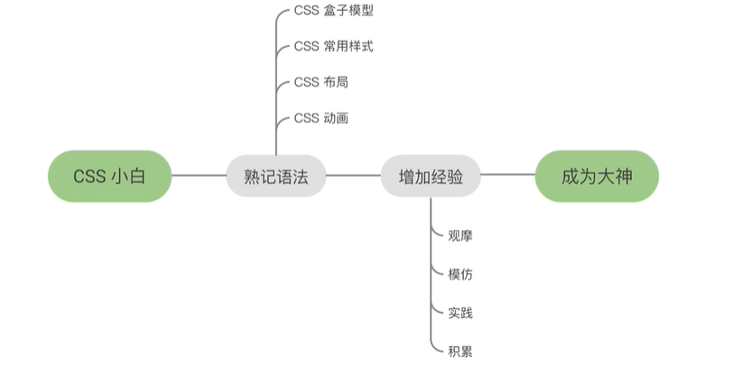

# CSS 深入

# 1. 常用工具

## 1.1 VsCode

### 1.1.1 常用插件

* Prettier 格式化（美化）代码
  * 在`setting`中找到`save`，然后设置`format on save`

* Bracket Pair Colorizer2 括号颜色配对
* Auto Rename Tag 修改标签时，反标签会同时变化
* LiverServer 保存后页面自动刷新
* Live Sass Compiler 监听并实时编译scss文件
  * 在文件中建立一个`scss`文件就可以了。
* Easy Less 
  * AntDesign中用到了less。所以就放弃了scss

## 1.2 CSS 工具

1.Less http://lesscss.org/

2.Sass http://sass-lang.com/

## 1.2 参考网站

### 1.2.1 CSS 相关

* [在线代码编辑与分享网站](https://codepen.io/  )
  * [最流行的效果](https://codepen.io/popular/pens/)
  * 经典的效果
* [awwwards设计网站--感觉不怎么样](awwwards.com)
* [csslayout-CSS样式网站](https://csslayout.io/)
  * 以flex模式为主
* [国内的一个CSS](https://chokcoco.github.io/CSS-Inspiration/#/)
* [动画效果animista.net](https://animista.net/)

1、[MDN developer.mozilla.org](https://developer.mozilla.org)
2、[caniuse.com 查看那些浏览器支持](https://caniuse.com/)
3、[css-tricks.com特效的参考网站](https://css-tricks.com/)
4、codepen.io
5、medium.com
6、hackernoon.com
7、stackoverflow.com
8、freecodecamp.com
9、reactjs.org
10、[segmentfault.com国内的可以看看](https://segmentfault.com/)
11、juejin.im

