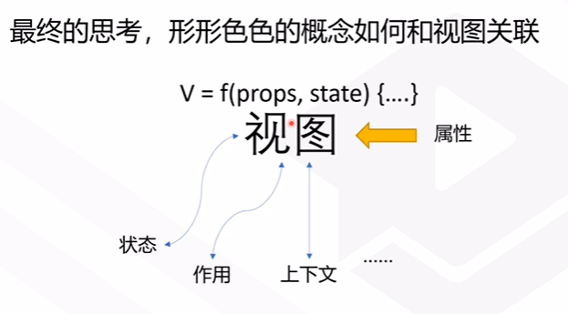
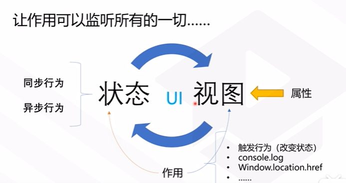
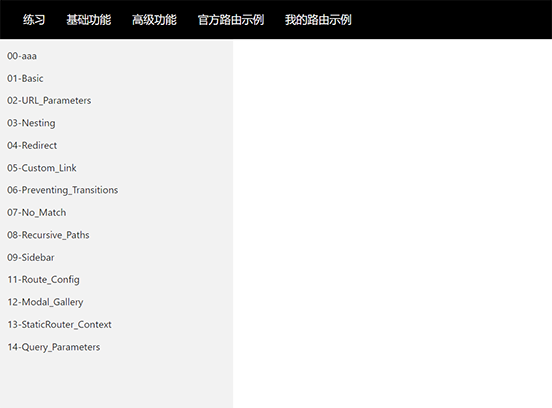
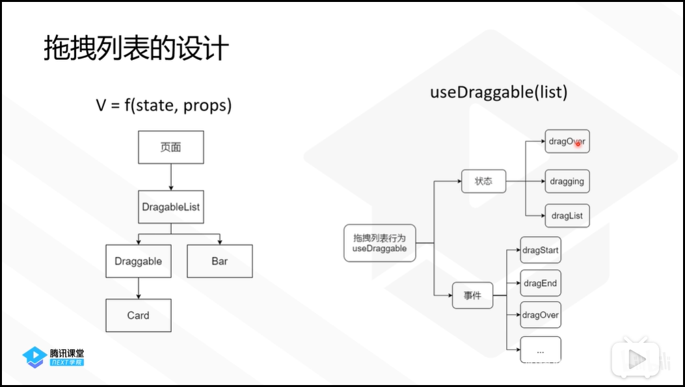
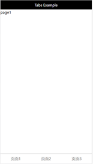
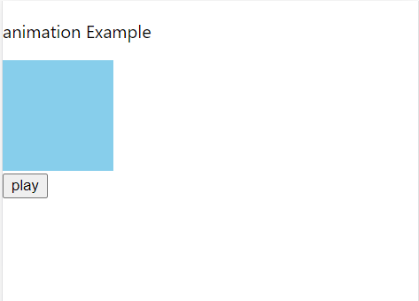

# Hooks 学习

[TOC]


# 1. 基本概念

hook是react跨里程碑的技术，hooks让程序更加简洁。

* 什么是状态？ useState
* 什么是作用?   useEffect
* 什么是上下文? useContext


```
状态与行为绑定。

作用与界面无关，界面看不到，例如setCookie,输出日志
```






# 2. 常用hook


## 2.1 useState

* 如何新建一个项目？

* 如何创建一个按钮，点击界面上的数值加1？
* 如何自己建立一个hook？使用use开头的函数
* 如何传递多个参数

### ① 基本例子

其中`setCount`可以修改成任意名称

```jsx
import React, { useState } from 'react';

export default function Example() {
  // 声明一个新的叫做 “count” 的 state 变量
  const [count, setCount] = useState(0);

  return (
    <div>
      <p>You clicked {count} times</p>
      <button onClick={() => setCount(count + 1)}>
        Click me
      </button>
    </div>
  );
}
```


### ② 函数式更新

有两种更新方式：

> 普通方式

`<button onClick={() => setCount(count + 1)}>`


> 函数方式

这里就不用写上count，可以用一个其他是变量名代替。

`<button onClick={() => setCount(prevCount =>prevCount  + 1)}>`


什么时候，用函数式更新？

* 当你发现不会刷新时候，要用到函数式更新，这样会强制更新。
* 推荐用函数式更新。
* [useCallback的例子，就必须要函数式更新](#3.2.2 useCallback)


## 2.2 useEffect

* useEffect的第二个参数的作用是什么？
* 如何使用bind，将useEffect种的代码移到外部？ bind的第一个参数可以设置为null

### ① 添加 useEffect

```jsx
import React, { useState, useEffect } from 'react';

function Example() {
  const [count, setCount] = useState(0);

  // 相当于 componentDidMount 和 componentDidUpdate:
  useEffect(() => {
    // 使用浏览器的 API 更新页面标题
    document.title = `You clicked ${count} times`;
  });

  return (
    <div>
      <p>You clicked {count} times</p>
      <button onClick={() => setCount(count + 1)}>
        Click me
      </button>
    </div>
  );
}

```


### ② 清除 effect

通过return来清楚副作用。例如定时器。

例如：React 会在组件销毁时取消对 `ChatAPI` 的订阅

```jsx
import React, { useState, useEffect } from 'react'
export default()=>{

    const [count,setCount]=useState(0);
    
    function myEffect(){
       const I= setInterval(()=>{
            console.log(count)
            setCount(x=>x+1);
        },1000);
    
       return ()=>clearInterval(I); 
    }
    
    useEffect(myEffect,[]);
    
    return(<div>
        <p>useEffect example</p>
        <p>count:{count}</p>
    </div>)
}

```


### ③ effect 的条件执行

> 如果想执行只运行一次的 effect（仅在组件挂载和卸载时执行），可以传递一个空数组（`[]`）作为第二个参数。

`useEffect(myEffect,[]);` 


> 可以指定数值变化

`useEffect(myEffect,[count]);` 

当count变化时，使用这个。


> 可以输入函数

```jsx
useEffect(myEffect,[Math.floor(count/10)]);
```


## 2.3 useContext

* 皮肤、用户Id、这些公用的内容，都可以包含到context中
* 做一个例子，有一个页面，包含toolBar，里面包含了按钮。需要把样式透传下去。

[官网给出的另一个例子](https://react.docschina.org/docs/hooks-reference.html#usecontext)

### ① 简单的contexxt

```jsx
const themes = {
  light: {
    foreground: "#000000",
    background: "#eeeeee"
  },
  dark: {
    foreground: "#ffffff",
    background: "#222222"
  }
};

const ThemeContext = React.createContext(themes.light);

function App() {
  return (
    <ThemeContext.Provider value={themes.dark}>
      <Toolbar />
    </ThemeContext.Provider>
  );
}

function Toolbar(props) {
  return (
    <div>
      <ThemedButton />
    </div>
  );
}

function ThemedButton() {
  const theme = useContext(ThemeContext);
  return (
    <button style={{ background: theme.background, color: theme.foreground }}>
      I am styled by theme context!
    </button>
  );
}
```


### ② 追加函数

如何将官方网站的例子里面，添加一个函数，也透传下去？

```jsx
import React, { useEffect, useContext } from 'react';
import './App.css';
import { useState } from 'react';


// 存储颜色的对象
const themes = {
  light: {
    foreground: "#000000",
    background: "#eeeeee"
  },
  dark: {
    foreground: "#ffffff",
    background: "#222222"
  }
};


// 第一步：要创建一个context
const ThemeContext = React.createContext({
  theme: themes.light,
  toggle: ()=>{}
});


// 默认页面,不想将参数一层一层传递到 button
export default()=>{
  const [theme,setTheme]=useState(themes.light);

  //第二步：在最上层来包含一个父组件
  return (
    <ThemeContext.Provider value={{
      theme,
      toggle: ()=>{
        setTheme(theme===themes.light? themes.dark:themes.light);
      }
    }}>
      <Toolbar />
    </ThemeContext.Provider>
  );
};


const Toolbar=()=>{
  return(
    <ThemedButton/>
  );
};


// 最底层的按钮
const ThemedButton=()=>{
  // 第三步使用
  const context = useContext(ThemeContext);
  return(
    <button style={{
      fontSize: "32px",
      color: context.foreground,
      backgroundColor: context.theme.background
    }}

    onClick ={context.toggle}
    >click me</button>
    
    );
};
```


### ③ 重构函数

如何将函数中的方法给移动走呢？

```jsx
const getThemeContextValue=(theme,setTheme)=>{
  return {
    theme,
    toggle: ()=>{
      setTheme(theme===themes.light? themes.dark:themes.light);
    }
  }
}


// 默认页面,不想将参数一层一层传递到 button
export default()=>{

  const [theme,setTheme] = useState(themes.light);

  //第二步：在最上层来包含一个父组件
  return (
    <ThemeContext.Provider value={getThemeContextValue(theme,setTheme)}>
      <Toolbar />
    </ThemeContext.Provider>
  );
};
```


## 2.4 useRef

有些react以外的控件，可以通过这种方法来引用。

```jsx
function TextInputWithFocusButton() {
  const inputEl = useRef(null);
  const onButtonClick = () => {
    // `current` 指向已挂载到 DOM 上的文本输入元素
    inputEl.current.focus();
  };
  return (
    <>
      <input ref={inputEl} type="text" />
      <button onClick={onButtonClick}>Focus the input</button>
    </>
  );
}
```

本质上，`useRef` 就像是可以在其 `.current` 属性中保存一个可变值的“盒子”。


如何在一个函数中缓存一个数值呢？

```jsx
import React, { useState, useRef } from 'react'

export default()=>{
    const [count,setCount]=useState(0);
    const prev=useRef(null);
    return(<div>
        <p>the example for save a value</p>
    <p>curren:{count}</p>
    <p>prev:{prev.current}</p>

    <button onClick={()=>{setCount(count+1);prev.current=count;}}>+</button>
    <button onClick={()=>{setCount(count-1);prev.current=count;}}>-</button>    
    </div>)
}
```

当然也可以通过`state`来实现


```jsx
import React, { useState, useRef } from 'react'

export default()=>{
    const [count,setCount]=useState(0);
    const [prev,setPrev]=useState(null);
    return(<div>
        <p>the example for save a value</p>
    <p>curren:{count}</p>
    <p>prev:{prev}</p>

    <button onClick={()=>{setCount(count+1);setPrev(count);}}>+</button>
    <button onClick={()=>{setCount(count-1);setPrev(count);}}>-</button>    
    </div>)
}
```


# 3 其他hook

## 3.1 useReducer

是一种设计模式，[`useState`](https://zh-hans.reactjs.org/docs/hooks-reference.html#usestate) 的替代方案。它接收一个形如 `(state, action) => newState` 的 reducer，并返回当前的 state 以及与其配套的 `dispatch` 方法。（如果你熟悉 Redux 的话，就已经知道它如何工作了。）

在某些场景下，`useReducer` 会比 `useState` 更适用，例如 state 逻辑较复杂且包含多个子值，或者下一个 state 依赖于之前的 state 等。并且，使用 `useReducer` 还能给那些会触发深更新的组件做性能优化，因为[你可以向子组件传递 `dispatch` 而不是回调函数](https://zh-hans.reactjs.org/docs/hooks-faq.html#how-to-avoid-passing-callbacks-down) 。


```jsx
import React, { useReducer } from 'react';

const initialState={count:0};

function reducer(state,action){
    switch(action.type){
        case 'increment':
            return {count:state.count+1};
        case 'decrement':
            return {count:state.count-1};
        default:
            throw new Error();

    }
}

export default()=>{
    const [state,dispatch]=useReducer(reducer,initialState);

    return(<div>
        <p>useReducer example</p>
        <p>you count:{state.count}</p>
        <button onClick={() => dispatch({type:'decrement'})}>+</button>
        <button onClick={() => dispatch({type: 'increment'})}>+</button>
    </div>);

}
```


## 3.2 缓存

`useCallback(fn, deps)` 相当于 `useMemo(() => fn, deps)`。


### 3.2.1 useMemo

**你可以把 `useMemo` 作为性能优化的手段，但不要把它当成语义上的保证。**

```jsx
import React, { useState, useMemo } from 'react'
import moment from 'moment';

export default()=>{
    const [count,setCount]=useState(0);
    const memorizedText=useMemo(()=>{
        return `this is a memorized test ${moment().format('YYYY-MM-DD HH:mm:ss')}`;
    },[])

    return(<div>
        <p>useMemo example</p>
        <p>{memorizedText}</p>
    <p>you clicked count:{count}</p>
        <button onClick={()=>setCount(count+1)}>clicked me</button>
    </div>);
}
```

请先`tyarn add mement`


### 3.2.2 useCallback

当你把回调函数传递给经过优化的并使用引用相等性去避免非必要渲染（例如 `shouldComponentUpdate`）的子组件时，它将非常有用。


如果没有进行useCallback,那么add函数会被不停的追加。

```jsx
import React, { useState, useCallback } from 'react'

const s = new Set();
export default()=>{
    const [count,setCount]=useState(0);
    // function add(){
    //     setCount(count+1);
    // }
    const add=useCallback(()=>{
        setCount(count=>count+1);
    },[]);

    s.add(add);

    console.log(s.size);

    return(<div>
        <p>useCallback example</p>
        <p>you clicked number:{count}</p>
        <button onClick={add}>click me</button>

    </div>);
}
```


## 3.4 useImperativeHandle

`useImperativeHandle` 可以让你在使用 `ref` 时自定义暴露给父组件的实例值。在大多数情况下，应当避免使用 ref 这样的命令式代码。`useImperativeHandle` 应当与 [`forwardRef`](https://zh-hans.reactjs.org/docs/react-api.html#reactforwardref) 一起使用：


## 3.5 useLayoutEffect

我们推荐你**一开始先用 `useEffect`**，只有当它出问题的时候再尝试使用 `useLayoutEffect`。

其函数签名与 `useEffect` 相同，但它会在所有的 DOM 变更之后同步调用 effect。可以使用它来读取 DOM 布局并同步触发重渲染。在浏览器执行绘制之前，`useLayoutEffect` 内部的更新计划将被同步刷新。


# 4. 自定义hook

## 4.1  官方的例子

```jsx
import React, { useState, useEffect } from 'react';

function useFriendStatus(friendID) {
  const [isOnline, setIsOnline] = useState(null);

  function handleStatusChange(status) {
    setIsOnline(status.isOnline);
  }

  useEffect(() => {
    ChatAPI.subscribeToFriendStatus(friendID, handleStatusChange);
    return () => {
      ChatAPI.unsubscribeFromFriendStatus(friendID, handleStatusChange);
    };
  });

  return isOnline;
}

function FriendStatus(props) {
  const isOnline = useFriendStatus(props.friend.id);

  if (isOnline === null) {
    return 'Loading...';
  }
  return isOnline ? 'Online' : 'Offline';
}

function FriendListItem(props) {
  const isOnline = useFriendStatus(props.friend.id);

  return (
    <li style={{ color: isOnline ? 'green' : 'black' }}>
      {props.friend.name}
    </li>
  );
}
```


## 4.2 综合例子


# 5. 使用建议


## 5.1 必坑指南


* useState的：`函数式更新`，看useState的例子
* useEffect中的`清理effect`， 看useEffect的例子


bind(null,count)

promise


## 5.2 尽量构造hook

尽量构造自己的hook，进行重用。

下面模拟了一个例子，用来模拟从服务器提取数据。

```jsx
import React, { useState, useEffect } from 'react'

// 停止一段时间
function sleep(time){
    return new Promise((resolve)=>{
        setTimeout(()=>{
            resolve()
        },time)
    });

}

// 构造一个异步函数,模拟从服务器得到person数据
async function fetchPerson(){
    await sleep(2000);
    return ['a','b','c'];
}

// 自定义钩子程序，从服务器得到数据，然后填到list中。
function usePerson(){
    const [list,setList]=useState(null);
    async function request(){
        const response =await fetchPerson();
        setList(response);
        
    };
    useEffect(()=>{
        request();
    },[]);
    return list;
}

//如果正在取数据，那么就显示loading,取到数据，就显示一个列表
export default()=>{
    const list = usePerson();

    if(list === null){
        return (<div>loading</div>)
    }


    return(<div>
       {list.map((value,index)=>
            <li key={index}>{value}</li>
       )}
    </div>)
}
```


## 5.3 每个状态一个hook

下面给出了那个可以封装在一起，那些不用放在一起。

```jsx
// 这两个无关的属性，建议放在两个hook中，
const [state,setState]=useState({
    count:0,
    company: "Apple"
});

//否则在set的时候很难受。
<button
    onclick={()=>{
        setState(prev=>{
            return {
                comany:prev.company,
                count:prev.count+1
            }
        })
    }}>+</button>
//下面这个可以放在一起，因为他们是一类的。
const [personList,setPersonList]=useSate({
    isError: false,
    loading: true,
    data: []
    })    
    
    
```


## 5.4 忘记生命周期

hook的状态，没有生命周期了。


## 5.5 高级技巧


### 5.5.1 useLayoutEffect

与useEffect功能一样，会比useEffect执行快，不经常用。


### 5.5.2 useImperativeHandle 


# 6. 项目实战


## 6.1 封装菜单

利用动态加载技术，就可以自动将例子加载到一个页面中。其中重要的Router技术。

具体可以参考:[React路由说明](router.md)




## 6.2 拖拽列表

### 6.2.1 拖动怎么做？

开发一个拖拽列表。

#### ①  传统做法

参考网址：https://www.cnblogs.com/moqiutao/p/6365113.html

* 关键点
  * 设置元素可拖放
  * 拖动什么 - ondragstart 和 setData()
  * 放到何处 - ondragover
  * 进行放置 - ondrop


* 应该怎么做？

  * ·首先有要拖动的对象。

    * 触发：ondragstart事件，在这个事件中，可以把自身ID存到一个地方。(有不同的存法)

  * 其次有要放置的对象。

    * 触发两个事件
      * ondragover:这个好处理，阻止控件执行本身的事件
      * ondrop:用来放内容

    

#### ② 新式做法

将要显示的内容放在一个数组中，改变顺序后，让react来调整页面的显示。


### 6.2.2 设计




#### ① 总体设计

分两步进行设计：

* 设计整个UI的层次。
* 设计useHooks:
  * 状态：dragOver dragging dragList
  * 事件：dragStart dragEnd .....


#### ② 编写步骤

> 第一步：先写静态页

* 撰写UI层
* 撰写css来完善UI
* 撰写use来处理数据


> 第二部：添加动态脚本

* 添加事件，这些细节的脚本，可以抽象到use中。


### 6.2.3 设计细节

#### ①  被拖动组件

* 必须设置成：`draggable={true} `
* 将`http`的事件`onDragStart`与`onDragEnd` 抽象到钩子程序中
  * 这样减少了UI层的逻辑，UI层就关心数据与显示的样式。
* 当开始拖动时，就设置全局变量`dragging`，拖动结束时就设置为null


#### ② 放置位置组件

* 这个组件只标记位置，并不像传统的组件，用来将组件变成内部组件。
* 这个组件必须有一定宽度，不然`onDragOver`事件无法捕获。
* 当拖动到组件上面的时候，高度可以改版，这样就效果更明显。


### 6.2.4 思考与总结


### 6.2.5 相关代码

https://codesandbox.io/s/flamboyant-knuth-ytocc?file=/src/useDraggable.js


#### ① UI部分

```jsx
import React from 'react'

import "./dragList.css"

import useDraggable from './useDraggable'


const list = [
    {
      src:
        "https://ss1.bdstatic.com/70cFuXSh_Q1YnxGkpoWK1HF6hhy/it/u=2963416465,4001527064&fm=26&gp=0.jpg",
      title: "冠军"
    },
    {
      title: "亚军",
      src:
        "https://ss0.bdstatic.com/70cFuHSh_Q1YnxGkpoWK1HF6hhy/it/u=3140683318,1993072558&fm=26&gp=0.jpg"
    },
    {
      title: "季军",
      src:
        "https://ss3.bdstatic.com/70cFv8Sh_Q1YnxGkpoWK1HF6hhy/it/u=2221913505,3009818890&fm=26&gp=0.jpg"
    }
  ];


  function cls(def, ...conditions) {
    const list = [def];
    conditions.forEach(cond => {
      if (cond[0]) {
        list.push(cond[1]);
      }
    });
    return list.join(" ");
  }  

export default function APP(){

    return(<div className="App">
        <p>DragList Example</p>
        <DraggableList list={list}/>
    </div>)
}

// 这是一个包装层
function DraggableList({list}){


    const {dragList,createDraggerProps,createDropperProps} = useDraggable(list);

  

    return dragList.map((item,i)=>{
        if(item.type==="BAR"){
            return <Bar id={i}  {...createDropperProps(i)} key={item.id} />;
        }else{
            return <Draggable  {...createDraggerProps(i, item.id)}>
                <Card {...item.data}/>
            </Draggable>
        }
    })
}


function Draggable({children, eventHandlers, dragging, id}){
    return  (
    <div
        {...eventHandlers} 
        draggable={true}    
        className={cls("draggable", [dragging === id, "dragging"])}
    >
        {children}
    </div>
    );
}

function Bar({ id, dragging, dragOver, eventHandlers }){
    if (id === dragging + 1) {
        return null;
    }

    return (
    <div 
        {...eventHandlers}
        className={cls("draggable--bar", [dragOver === id, "dragover"])}
    >
      <div
        className="inner"
        style={{
          height: id === dragOver ? "80px" : "0px"
        }}
      />
    </div>
    );
}


function Card({src,title}){
    return <div className="card">
        </img>
        <span>{title}</span>
    </div>

}
```


#### ② 钩子部分

```jsx
import React, { useState } from 'react'

const DRAGGABLE= "DRAGGABLE"
const BAR= "BAR"


function draggable(item,id){
    return {
        type:DRAGGABLE,
        id,
        data:item
    }
}

function insertBars(list){
    let i=0;
    const newBar =()=>{
        return {
            type: BAR,
            id: i++
        }
    }

    return [newBar()].concat(
        ...list.map(item=>{
            return [draggable(item,i++),newBar()]
        })
    )
}


function clacChanging(list, drag, drop) {
    list = list.slice();
  
    const dragItem = list[drag];
  
    // dir > 0从下往上 <0 从上往下
    const dir = drag > drop ? -2 : 2;
    // drop的地方是bar
    const end = dir > 0 ? drop - 1 : drop + 1;
  
    for (let i = drag; i != end; i += dir) {
      list[i] = list[i + dir];
    }
  
    list[end] = dragItem;
    return list;
  }


export default  function useDraggable(list){

    const [dragList, setDragList] = useState(() => {
        return insertBars(list);
      });

    const [dragOver,setDragOver] = useState(null);
    const [dragging,setDragging] = useState(null);


    return {
        dragList,
        //放置的属性
        createDropperProps: id => {
            return {
              dragging,
              dragOver,
              eventHandlers: {
                onDragOver: e => {
                  e.preventDefault();
                  setDragOver(id);
                },
                onDragLeave: e => {
                  e.preventDefault();
                  setDragOver(null);
                },
                onDrop: e => {
                  e.preventDefault();
                  setDragOver(null);
                  setDragList(list => {
                    return clacChanging(list, dragging, id);
                  });
                }
              }
            };
          },
        //拖动的属性
        createDraggerProps:(id, key)=>{
            return {
                id,
                key,
                dragging,
                eventHandlers:{
                    onDragStart:() =>{
                        setDragging(id);
                    },
                    onDragEnd:()=>{
                        
                        setDragging(null);
                    }
                }
            }
        }
    }
}
```


#### ③ CSS部分

```css
.App {
    font-family: sans-serif;
    text-align: center;
  }


.card {
    display: flex;
    align-items: center;
    padding: 10px;
    box-shadow: grey 1px 2px 3px;
    cursor: pointer;
    user-select: none;
}


.card img{
    border-radius: 36px;
    width: 72px;
    height: 72px;
}


.card span{
    margin-left: 20px;
}

.draggable--bar{
    transition: background-color 1s ease-out;
    padding: 10px;

}

.draggable--bar.dragover .inner {
    transition: height 0.3s ease;
    margin: 10px 0;
    background-color: rgba(0, 0, 0, 0.1);
  }


  .draggable {
    background: white;
    transition: all 0.3s ease;
  }
  
  .draggable.dragging {
    opacity: 0;
    position: fixed;
    width: 100%;
  }
```


## 6.3 轮播广告

代码地址：https://codesandbox.io/s/lucid-haze-4fi6c?file=/src/App.js


### 6.3.1 轮播广告思路


#### ① 静态页面制作

* 第一步：将3张图横着排起来。
  * 修改display的效果。
* 第二步：通过调整父组件大小，掩盖上另外两张图。 
* 第三步：通过css的`transform: translateX(-33%);` 向左移动图片
  * 这里手工改变`-33%`  或`-66%`就可以录播效果了

#### ② 动态效果实现

如何动态的改变`-33%`这个数值？例如间隔300秒，将这个数值变更成：0 -33.33 -66.76

如果把这几张图的index为：0，1，2.

(100/3)%是每个图片占的百分比，那么index=1 的位置就是：(100/3)*1%


> 定时器的设置 useEffect

* 记录开始时间
* 开始计数器，每隔300秒，调用`回调函数`
  * 得到调用的次数，返回给`回调函数`


> 状态变更 useState


###  6.3.2 思考与总结


> 要充分理解UI的含义

如果分解问题呢？

* 第一步：找到那些变量，可能导致页面进行变化的变量。
* 第二部：将这些变量，用useXXXX的函数来解决，让UI看起来非常简单。


#### ① 轮播广告案例

控制轮播广告的就是CSS的中的`transform: translateX(-33%);` 。

所以将这个数值，放在useXXX中就可以了。


#### ② 拖拽列表案例

这个比较复杂，但是核心是那个显示的列表：dragList。如果要想调整顺序，就弄好列表就可以了。


### 6.3.3 相关代码

#### ① UI部分


```jsx
import React , { useState,useEffect }  from 'react'
import "./imgSlider.css"


const imgs = [
    "http://5b0988e595225.cdn.sohucs.com/images/20190724/a801831af3c743a4b97e443121f44f30.jpeg",
    "https://th.bing.com/th?id=OIP.qsPu-MfQrZdhoLjWf0SDKwHaEo&pid=Api&rs=1",
    "https://th.bing.com/th?id=OIP.R_mn8O9thXZN4aXRk5XKJgHaEo&pid=Api&rs=1"
  ];

/**
 * 提供基于时间间隔重复调用callback的hooks
 * @param {*} callback
 * @param {*} interval
 */
function useInterval(callback, interval) {
    useEffect(() => {
      const start = new Date().getTime();
      const I = setInterval(() => {
        const diff =   new Date().getTime() - start;
        const times = Math.floor(diff / interval);
        callback(times);
      }, interval);
      return () => clearInterval(I);
    }, []);
  }
  
  /**
   * 提供实现slider的底层
   * @param {*} N
   */
  function useSlider(N, speed = 3000) {
    const [slider, setSlider] = useState(0);
    useInterval(times => {
      setSlider(_ => times % N);
    }, speed);
    return slider;
  }

export default ()=>{
    const slider = useSlider(imgs.length);
    return(<div>
        <p> img slider example </p>
        <div className="scroller">
            <div 
                className="inner"
                style={{
                    width: `${imgs.length*100}%`,
                    transform: `translateX(-${(100/imgs.length) * slider }%)`
                    //transform: `translateX(-66%)`
                }}

            >
                {imgs.map(src=>{
                    return ();
                })}
            </div>
        </div>

    </div>)


}
```


#### ② css部分

```jsx


.scroller{
    width: 400px;
    height: 250px;
    overflow:hidden;
}


.scroller .inner::-webkit-scrollbar{
    display: none;
}


.scroller .inner{
    overflow: scroll;
    transition: transform 0.3s ease;
    /* transform: translateX(-20%); */
}

.scroller .inner img{
    /* width: 33.33%; */
    display: block;
    height: 250px;
    float: left;
}


```


# 


## 6.4 tabs页面




### 6.4.1 制作思路

* 如何通过useState来控制那个页面显示？
* 如何为tab，添加事件？
* 如何制作动画效果？使用useEffect


> html的技巧

* 要填充页面需要设置body下的div为100%

```css
html,body, #root{
    height: 100%;
}
```


* flex的技巧

`flex-direction: column;`  向下堆积

`flex:1;` 最大限度填充页面

`text-align:center;` 文字居中


* 文字向下居中

`line-height: 40px;`  这个比较重要。


* 透明与动画

`opacity: 0;` 表示全部透明。

`transition: opacity 0.3s ease;`透明度切换


### 6.4.2 相关代码


#### ① UI部分

```jsx
import React, { useState, useEffect } from 'react'
import './styles.css'


// 一个动画的效果，进入的时候全部透明，过了300后显示不透明
const useAnimation=({className,delay=300})=>{
    const [state,setState]=useState('enter');
    useEffect(()=>{
        const I = setInterval(()=>{
            setState("entered")
        },delay);
        return(()=>{
            clearInterval(I);
        })

    },[])
    return `${className}-${state}`;
}


const Page=({children})=>{
    const animationClass = useAnimation({
        className: 'page'
    });
    return(
        <div className={`page ${animationClass}`}>
            {children}
        </div>
    );
}

//必须大写开头
const  Page1=()=>{
    return(<Page>page1</Page>);
}
const  Page2=()=>{
    return(<Page>page2</Page>);
}
const  Page3=()=>{
    return(<Page>page3</Page>);
}

function Tabs({options,onTabClicked}){
    return(<div className="tabs">
        {
            options.map((item,i)=>{
                return(<div  
                            onClick={()=>onTabClicked(item.key)}  
                            className="tabs-item"  
                            key={i} >
                                {item.title}
                        </div>);
            })
        }
    </div>);
}


const tabsArray=[
    {
        title: '页面1',
        key: 'page1'
    },
    {
        title: '页面2',
        key: 'page2'
    },
    {
        title: '页面3',
        key: 'page3'
    }

];

export default()=>{
    const [tabKey,setTabKey] = useState("page1");

    const onTabClicked=(key)=>{
        setTabKey(key)
    }

    return(
        <React.Fragment>
            <header>Tabs Example</header>
            {tabKey==="page1" && <Page1/>}
            {tabKey==="page2" && <Page2/>}
            {tabKey==="page3" && <Page3/>}
            <Tabs options={tabsArray} onTabClicked={onTabClicked}/>
        </React.Fragment>
    );
}
```

#### ② CSS部分

```css

html,body, #root{
    height: 100%;
    display: flex;
    flex-direction: column;
}


header{
    background-color: black;
    color: white;
    padding: 8px 6px;
    text-align: center;
    
}


.page{
    flex: 1;
    transition: opacity 0.3s ease;
}

/* opacity=0 表示全部透明 */
.page-enter{
    opacity: 0;
}

.page-entered{
    opacity: 1;
}


.tabs{
    display: flex;
    border-top: 1px solid #cccccc;
}


.tabs-item {
    flex: 1;
    color: #8c8c8c;
    text-align:center;
    /* 不要使用height */
    line-height: 40px;
    cursor: pointer;
}

```


##  6.5 自己封装form


### 6.5.1 最原始的形态

这时候`input`需要自定定义`onChange`，来得到输入的信息

```jsx
import React, { useState } from 'react'
import './styles.css'

export default()=>{
    const [text1,setText1]=useState("aaaa");
    return(<div>
        Form example
        <div>
            <input 
                value={text1} 
                onChange={(e)=>{setText1(e.target.value)}} 
            />
        </div>
    </div>);
}
```


### 6.5.2 自己封装Item

```jsx
import React, { useState } from 'react'
import './styles.css'

const useFormItem=(name,defaultValue="")=>{
    const [value,setValue]=useState(defaultValue);
    return(
        {
            value,
            name,
            onChange: e=>{
                setValue(e.target.value)
            }, 
        }
    );
}

export default()=>{
    const item1 = useFormItem("input1",123);

    const onSubmit=()=>{
        console.log(item1.value);
    };


    return(<div>
        Form example
        <div>
            <input {...item1}  />
        </div>
        <div>
            <br/>
            <button onClick={onSubmit}>submit</button>
        </div>
    </div>);
}
```


### 6.5.3  自己封装Form


```jsx
import React, { useState } from 'react'
import './styles.css'

const useForm=()=>{
    const [items,setItems]=useState([]);
    
    const findIndex=(array,name)=>{
        let index = array.findIndex(v=> {
            return v.name===name;
          });
        return index;  
    }

    const addItem=(name,defaultValue)=>{
        const array = items.slice();
        const index =findIndex(array,name);
        if(index===-1){
            const item={
                name,
                value:defaultValue
            }
            array.push(item); 
            setItems(array);
            return item;    
        }
        return items[index];
    }


    const handleChange=(name,value)=>{
        const array = items.slice();
        array[findIndex(array,name)].value=value
        setItems(array);
    }

    return {
        init: (name,defaultValue="")=>{
            const item=addItem(name,defaultValue);
            return {
                ...item,
                onChange: e=>{
                    handleChange(name,e.target.value)
                },
            }
        },

        getValues:()=>{
            return items;
        }
    }
}

export default()=>{
    const form = useForm();

    const onSubmit=()=>{
        console.log(form.getValues())
    }

    return(<div>
        Form example
        <div>
            <div>
                name:<input {...form.init("name")}/>
            </div>
            <div>
                age　:<input {...form.init("age")}/>
            </div>
            <div>
                <button onClick={onSubmit}>
                    submit
                </button>
            </div>
        </div>
    </div>);
}
```


## 6.6 封装request

很多框架都提供了一些查询api的函数，这个例子讲了大概的原理。你会发现自己封装一个类似的组件，也没有什么复杂的。

参考网址：https://github.com/kyjm/react-hooks-example/blob/master/src/examples/5-arch/02-usehooks.js


### 6.6.2 功能描述

做一个useRequest来，来模拟访问一个后台的api接口。

如果没有数据，那么就显示`loading`，如果有数据就用列表的形式显示出来，并且提供一个`reload`按钮。


### 6.6.3 用到的组件 

#### ① mockjs

https://www.cnblogs.com/fengwenya/p/12205761.html

```
# 安装
npm install mockjs
 

# 导入 mockjs
import mockjs from 'mockjs';
```


#### ② Promise

参考这个网址：https://www.runoob.com/w3cnote/javascript-promise-object.html


### 6.6.4 相关代码

```jsx
import React, { useState, useEffect, useReducer } from 'react'
import MockJs from 'mockjs'

function request(url,params){
    return new Promise((resole,reject)=>{
        setTimeout(()=>{
            resole(MockJs.mock({
                [`list|1-${params}`]:[{
                    'name':'@cname'
                }]
            }).list.map(x=>x.name)
            );
        },2000)
    })
}

function useRequest(url,params){
    const [data,setData]=useState(null);
    
    const reload=()=>{
        setData(null);
        request(url,params).then(data=>setData(data));
    }
    useEffect(()=>{
        request(url,params).then(data=>setData(data));
    },[])
    return [data,reload];
}

export default ()=>{
    const [data,reload]=useRequest("http://aaa.api",10);
    if(data===null){
        return(<div>loading.....</div>)
    }

    return(<div>
        <p>useRequest Example</p>
        <ul>
            {
                data.map(name=>{
                return(<li key={name}>{name}</li>)
                })
            }
        </ul>
        <div>
            <button onClick={reload}>reload</button>
        </div>
    </div>);
}
```


## 6.7 封装动画组件

动画效果，无非包含两个状态，开始与结束。然后使用`css transform` 来控制动态变化的效果。

点击下面的按钮，然后这个框向右移动，等待3秒后，再移动回来。





### 6.7.1 Js代码

```js
import React, { useEffect, useState } from 'react'
import './animation.css'

function useAnimation(_clsName,duration=3000){
    const [phase,setPhase]=useState(0);
    const [className,setClassName]=useState(_clsName);

    function play(){
        setPhase(1);
    }

    useEffect(()=>{
        if(phase===1){
            setClassName(_clsName+" "+ _clsName+"-start");
            setTimeout(()=>{
                setClassName(_clsName)
                setPhase(0)
            },duration)
        }
        return(()=>{})
    },[phase]);

    return [className,play]
}

export default ()=>{
    const [className,play]=useAnimation('box')
    return(<div>
        <p>animation Example</p>
        <div className={className}/>
        <div>
            <button onClick={play}>play</button>
        </div>
    </div>)
}
```


### 6.7.2 Css代码

相关代码


```css
.box{
    width: 100px;
    height: 100px;
    background-color: skyblue;
}

.box-start{
    margin-left: 100px;
    transition: margin-left .3s ease;
}
```

