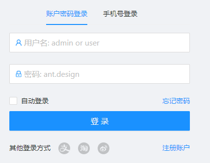
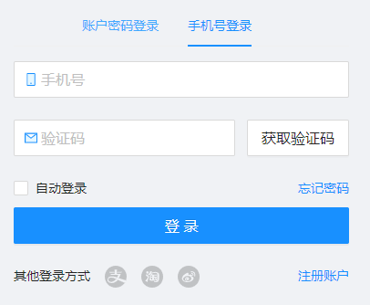

# 用户登陆


# 1. 分析与设计


## 1.1 需求描述

假设用例描述如下（实际用例描述要详细的多）：

* 可以通过用户名登陆
* 可以通过手机号+验证码登陆
* 可以通过第三方登陆
* 也可以注册


## 1.2 UI设计


### ① 总体布局

* 由于登陆、注册或者错误提示，都会使用到公用的部分。
  * 所以这部分页面单独做了一个模板，也就是红色以外的部分。
* 中间区域有一个切换的地方，所以把自动登陆一下作为公用部分。


### ② 页面规划

使用到的ant组件：

* Tabs,Form, Input, Button, Checkbox, Row,Col
* @ant-design/icons  图标

总体规划：

 * 整个区域的子组件靠左，因为父组件是居中。
   	* text-align: left;
 * [忘记密码]  [注册账户] 浮动到右边。
   	* float: right;
 * 除了使用浮动功能，还可以使用Row与Col组件
   	* [获取验证码]就使用了Row与Col组件
      	* 使用Row组件的好处是在不同屏幕尺寸在可以自动放缩，缺点是写的代码多。








> 使用Row或者样式的代码

```tsx
              <Input
                prefix={<MailTwoTone className={styles.prefixIcon} />}
                placeholder="验证码"
                style={{
                  width: '65%',
                  marginRight: 10,
                }}
              />
              <Button
                style={{
                  float: 'right',
                }}
              >
                获取验证码
              </Button>
```

```tsx
              <Row gutter={8} justify="end">
                <Col span={16}>
                  <Input
                    prefix={<MailTwoTone className={styles.prefixIcon} />}
                    placeholder="验证码"
                  />
                </Col>
                <Col span={8} className={styles.captcha_button}>
                  <Button>获取验证码</Button>
                </Col>
              </Row>
```


### ③ 页面逻辑

> 两个Tab页面，如果取消某个的输入

通过if来显示不同的控件，以及输入内容。


> 验证码的操作

* 初始化状态，可以点击获取验证码按钮。
* 点击获取验证码按钮
  * 状态变成倒计时:使用了`Statistic统计数值`控件
    * 这个控件可以设置结束时间，当时间到了之后，会触发`onFinish`函数，这时候将状态设置回去。
  * 为了测试用，显示一个`message`提示信息。


## 1.3 运行配置-app.tsx

UMI默认的一个运行配置，具体运行时配置，[见这个文档](https://umijs.org/zh-CN/docs/runtime-config)。

antDesignPro的app.tsx主要用到了下面的内容：

* [生产和消费初始化数据:getInitialState()](https://umijs.org/zh-CN/plugins/plugin-initial-state)
  * 布局的配置
  * 当前用户信息
  * 得到当前用户信息

* layout:[默认使用了proLayout](https://procomponents.ant.design/components/layout)
  * onPageChange:页面改变时，进行逻辑判断
  * 设置头部、左边框、底部
  * 设定页面的样式
* [网络请求和错误处理方案](https://umijs.org/zh-CN/plugins/plugin-request)
  * 错误处理
  * 拦截器
  * 

## 1.4 网络请求

`@umijs/plugin-request` 基于 [umi-request](https://github.com/umijs/umi-request) 和 [ahooks](http://ahooks.js.org/hooks) 的 `useRequest` 提供了一套统一的网络请求和错误处理方案。


### 1.4.1 主要接口

#### ① useRequest

该插件内置了 [@ahooksjs/use-request](https://ahooks.js.org/zh-CN/hooks/async)，你可以在组件内通过该 Hook 简单便捷的消费数据。示例如下：

```typescript
import { useRequest } from 'umi';

export default () => {
  const { data, error, loading } = useRequest(() => {
    return services.getUserList('/api/test');
  });
  if (loading) {
    return <div>loading...</div>;
  }
  if (error) {
    return <div>{error.message}</div>;
  }
  return <div>{data.name}</div>;
};
```

更多配置你可以参考 [@ahooksjs/use-request](https://ahooks.js.org/zh-CN/hooks/async) 的文档，你也可以查看知乎专栏文章[《useRequest- 蚂蚁中台标准请求 Hooks》](https://zhuanlan.zhihu.com/p/106796295)了解 useRequest。


#### ② request

通过 `import { request } from 'umi';` 你可以使用内置的请求方法。 `request` 接收两个参数，第一个参数是 `url`，第二个参数是请求的 `options`。`options` 具体格式参考 [umi-request](https://github.com/umijs/umi-request)。

`request` 的大部分用法等同于 `umi-request`，一个不同的是 `options` 扩展了一个配置 `skipErrorHandler`，该配置为 `true` 是会跳过默认的错误处理，用于项目中部分特殊的接口。

示例如下：

```typescript
request('/api/user', {
  params: {
    name: 1,
  },
  skipErrorHandler: true,
})
```

#### ③ 拦截器-token

该配置接收一个数组，数组的每一项为一个 request 拦截器。等同于 umi-request 的 `request.interceptors.request.use()`。具体见 umi-request 的[拦截器文档](https://github.com/umijs/umi-request#interceptor)。


### 1.4.2 统一返回格式

错误处理是所有项目都会遇到的问题，我们约定了一个接口格式规范如下：

```typescript
interface ErrorInfoStructure {
  success: boolean; // if request is success
  data?: any; // response data
  errorCode?: string; // code for errorType
  errorMessage?: string; // message display to user 
  showType?: number; // error display type： 0 silent; 1 message.warn; 2 message.error; 4 notification; 9 page
  traceId?: string; // Convenient for back-end Troubleshooting: unique request ID
  host?: string; // onvenient for backend Troubleshooting: host of current access server
}
```

后端接口规范不满足的情况下你可以通过配置 `errorConfig.adaptor` 来做适配。


#### ① 疑问：成功是否用这个接口？

如果在看有些API返回值，不管是错误还是成功，都用这个接口，只不过通过`success`来做判断。

当然，有些系统只有错误才使用这个接口规范，通过捕获异常，来让系统处理。

所以，需要专门讨论这个问题？


#### ②后端相应的改进

springboot提供的错误返回值，要做相应的处理。

详细内容见：[详细配置文档](https://umijs.org/plugins/plugin-request)

> wukong的错误返回值

```json
{
    "timestamp": "2018-05-24T06:31:51.423+0000",
    "status": 500,
    "error": "Internal Server Error",
    "message": "para1.name: 长度需要在6和50之间, para1.email: 不是一个合法的电子邮件地址",
    "path": "/result/para"
}
```


### 1.4.3 默认错误处理

antDesignPro使用自定义错误处理，我看了UMI的文档，实际antPro的错误还没有默认的错误处理机制好。

默认的错误处理机制有如下好处：

* 可以定时是否要提示。
* 可以定义要跳转的页面


```typescript
export enum ErrorShowType {
  SILENT = 0, // 不提示错误
  WARN_MESSAGE = 1, // 警告信息提示
  ERROR_MESSAGE = 2, // 错误信息提示
  NOTIFICATION = 4, // 通知提示
  REDIRECT = 9, // 页面跳转
}
```


### 1.4.4 自定义错误处理

当然如果感觉默认的错误提示不详细，可以使用自定错误处理机制，建议在antPro的基础上进行修改。

```typescript
const codeMessage = {
  200: '服务器成功返回请求的数据。',
  201: '新建或修改数据成功。',
  202: '一个请求已经进入后台排队（异步任务）。',
  204: '删除数据成功。',
  400: '发出的请求有错误，服务器没有进行新建或修改数据的操作。',
  401: '用户没有权限（令牌、用户名、密码错误）。',
  403: '用户得到授权，但是访问是被禁止的。',
  404: '发出的请求针对的是不存在的记录，服务器没有进行操作。',
  405: '请求方法不被允许。',
  406: '请求的格式不可得。',
  410: '请求的资源被永久删除，且不会再得到的。',
  422: '当创建一个对象时，发生一个验证错误。',
  500: '服务器发生错误，请检查服务器。',
  502: '网关错误。',
  503: '服务不可用，服务器暂时过载或维护。',
  504: '网关超时。',
};

const errorHandler = (error: ResponseError) => {
  const { response, data } = error;

  console.log(data);
  if (response && response.status) {
    let errorText = codeMessage[response.status] || response.statusText;
    const { status, url } = response;
    if (data && data.errorMessage) {
      errorText = data.errorMessage;
    }
    notification.error({
      message: `请求错误 ${status}: ${url}`,
      description: errorText,
    });
  }
  if (!response) {
    notification.error({
      description: '您的网络发生异常，无法连接服务器',
      message: '网络异常',
    });
  }
  throw error;
};

export const request: RequestConfig = {
  errorHandler,
};
```


### 1.4.5 页面中捕获错误

使用`try` 来捕获错误，并且使用`const { response, data } = error`，来得到错误的内容

```typescript
  const fetchUserInfo = async () => {
    try {
      const currentUser = await queryCurrent();
      return currentUser;
    } catch (error) {
      console.log(error);
      const { response, data } = error;
      console.log(response);
      console.log(data);
      history.push('/user/login');
    }
    return undefined;
  };
```


### 1.4.6 Jwt的token


#### ① 得到token

通过login得到token


#### ② 将token保存到缓存


```js
const tokenKey = 'wk-token';
const autoLoginKey = 'wk-autoLogin';

/**
 * 设置自动登录装填
 * @param autoLogin
 */
export function setAutoLogin(autoLogin) {
  return localStorage.setItem(autoLoginKey, autoLogin);
}

/**
 * 得到是否自动登录
 * @returns {boolean}
 */
export function getAutoLogin() {
  const value = localStorage.getItem(autoLoginKey);
  if (typeof value === 'undefined') {
    return false;
  }
  if (value === 'true') {
    return true;
  }
  return false;
}

/**
 * 得到token 如果是自动登录，那么就从local得到session
 * @returns {string}
 */
export function getToken() {
  localStorage.getItem(tokenKey);
  if (getAutoLogin()) {
    return localStorage.getItem(tokenKey);
  }
  return sessionStorage.getItem(tokenKey);
}

/**
 * 清空token
 */
export function clearnToken() {
  localStorage.removeItem(tokenKey);
  sessionStorage.removeItem(tokenKey);
}

/**
 * 设置token，如果没有自动登录，那么就设置到session，当关闭浏览器，就不会自动登录
 * @param token token
 */
export function setToken(token) {
  clearnToken();
  if (getAutoLogin()) {
    localStorage.setItem(tokenKey, token);
  } else {
    sessionStorage.setItem(tokenKey, token);
  }
}
```

> 上面有一个隐患

网上有人说：`sessionStorage` 当打开一个新的页面时候，会消失


> 我试着将token保存到


#### ③ 设置headers

```typescript
export const request: RequestConfig = {
  errorHandler,
  headers: {
    Authorization: `123456789`,
  },
};
```


#### ④ 刷新token

通过request 拦截器来进行处理

### 1.4.7 request 拦截器

requestInterceptors该配置接收一个数组，数组的每一项为一个 request 拦截器。等同于 umi-request 的 `request.interceptors.request.use()`。具体见 umi-request 的[拦截器文档](https://github.com/umijs/umi-request#interceptor)。

```
可以拦截下来，去刷新一个新的token
```

> 参考文档

* [做jwt拦截器](https://github.com/ant-design/ant-design-pro/issues/7225)

  

> 例子代码

```typescript
import { ResponseError, RequestOptionsInit } from 'umi-request';
const requestInterceptors = (url: string, options: RequestOptionsInit) => {
  console.log('---------------------------');
  console.log(url);
  console.log(options);
  return {
    url,
    options: { ...options },
  };
};

export const request: RequestConfig = {
  errorHandler,
  headers: {
    Authorization: `123456789`,
  },
  requestInterceptors: [requestInterceptors],
};
```


## 1.5 useRequest

有两种调用方法：

* 在service调用，页面调用service
* 在页面中调用。

### 1.5.1 基本用法

要单独安装并导入：`import { useRequest } from 'ahooks';`


> 模拟一个API函数

```typescript
  // 使用 mockjs 等三方库
  'GET /api/tags': (req: Request, res: Response) => {
    //console.log(req.headers.authorization);
    res.send(
      mockjs.mock({
        'list|10': [{ name: '@city', 'value|1-100': 50, 'type|0-2': 1 }],
      }),
    );
  },
```


> 可以在此程序中调用

在这个程序中，可以调用 service或者api的函数

```tsx
import React from 'react';
import { useRequest } from 'ahooks';
import { List, Avatar } from 'antd';
import { queryCurrent } from '@/services/user';
import styles from './index.less';

export interface tag {
  name: string;
  value: number;
  type?: number;
}

export default () => {
  //直接从一个api获取数据
  const tagsReq = useRequest('/api/tags');

  //从一个service中获取数据
  const userReq = useRequest(queryCurrent);

  if (tagsReq.loading) {
    return <div>loading...</div>;
  }
  if (tagsReq.error) {
    return <div>{tagsReq.error.message}</div>;
  }

  console.log(tagsReq.data);
  console.log(userReq.data);

  return (
    <div>
      <div>
        <Avatar src={userReq?.data?.avatar} />
        {userReq?.data?.name}
      </div>
      <List
        itemLayout="horizontal"
        dataSource={tagsReq.data.list}
        renderItem={(item: tag) => (
          <List.Item>
            <List.Item.Meta
              title={item.name}
              description={'生产总值：' + item.value + '亿元'}
            />
          </List.Item>
        )}
      />
    </div>
  );
};
```


### 1.5.2 update例子

①②③④⑤⑥⑦⑧⑨


#### ① 模拟一个mock

```js
  //模拟了一个update数据
  'POST /api/setting/update': (req: Request, res: Response) => {
    console.log(req.body);
    console.log('--------------------');
    const { name, value } = req.body;
    console.log(name + ':' + value);
    res.send({ data: { name, value }, success: true });
  },
```


#### ② 页面中调用(不推荐)

主要是传递参数太复杂了，可以将这段函数，放到service中。

```jsx
  //手工触发一个update
  const [sName, setSName] = useState('');
  const userSettingUpdate = useRequest(
    {
      url: '/api/setting/update',
      method: 'post',
       body: '{ "name": "wwww", "value": "123" }',
      //body: JSON.stringify({ name: sName }),
      headers: { 'Content-Type': 'application/json' },
    },
    {
      manual: true,
      onSuccess: (result, params) => {
        // console.log(result);
        // console.log(params);
        if (result.sucess) {
        }
      },
    },
  );


      <input
        onChange={(e) => setSName(e.target.value)}
        value={sName}
        placeholder="请输入名称"
        style={{ width: 240, marginRight: 16 }}
      />
      <button
        disabled={userSettingUpdate.loading}
        type="button"
        onClick={() => userSettingUpdate.run({ name: 'sss', value: '123' })}
      >
        {userSettingUpdate.loading ? 'loading' : 'Edit'}
      </button>
```


#### ③ service中调用


> 创建一个service

```typescript
//模拟一个update

export interface updateSettingParamType {
  name?: string;
  value?: number;
}

export async function updateSetting(params: updateSettingParamType) {
  console.log(params);
  return request<any>('/api/setting/update', {
    method: 'POST',
    data: params,
  });
}
```


> 页面中调用

```jsx
  //手工触发一个update
  const [sName, setSName] = useState('');
  const userSettingUpdate = useRequest(updateSetting, {
    manual: true,
    onSuccess: (result, params) => {
      console.log(result);
      // console.log(params);
      if (result.sucess) {
      }
    },
  });

      <input
        onChange={(e) => setSName(e.target.value)}
        value={sName}
        placeholder="请输入名称"
        style={{ width: 240, marginRight: 16 }}
      />
      <button
        disabled={userSettingUpdate.loading}
        type="button"
        onClick={() => userSettingUpdate.run({ name: sName, value: 123 })}
      >
        {userSettingUpdate.loading ? 'loading' : 'Edit'}
      </button>
```


### 1.5.3 轮询

[官方网址]([https://ahooks.js.org/zh-CN/hooks/async#%E8%BD%AE%E8%AF%A2](https://ahooks.js.org/zh-CN/hooks/async#轮询))

> 模拟一个API

一定要有一个双引号

```js
  'GET /api/random': (req: Request, res: Response) => {
    res.send('"' + mockjs.mock('@cname') + '"');
  },
```


> 页面中的代码

可以点击stop停止查询，点击start 来启动

```jsx
  //做一个轮询
  const usePolling = useRequest('/api/random', {
    pollingInterval: 3000,
    pollingWhenHidden: false,
  });


      <p>UserName:{usePolling.loading ? 'loading.....' : usePolling.data}</p>
      <button type="button" onClick={usePolling.run}>
        start
      </button>
      <button
        type="button"
        onClick={usePolling.cancel}
        style={{ marginLeft: 8 }}
      >
        stop
      </button>
```


### 1.5.4 并发操作

[官网的例子]([https://ahooks.js.org/zh-CN/hooks/async#%E5%B9%B6%E8%A1%8C%E8%AF%B7%E6%B1%82](https://ahooks.js.org/zh-CN/hooks/async#并行请求))

默认情况下，新请求会覆盖旧请求。如果设置了 fetchKey，则可以实现多个请求并行，fetches 存储了多个请求的状态。外层的状态为最新触发的 fetches 数据。

#### ① 模拟一个mock

如果让一个接口同时支持Post 与Get，还没有找到更好的方法，只能复制一份了。

```js
  //模拟得到用户列表
  'GET /api/demo/getUsers': (req: Request, res: Response) => {
    res.send([
      { id: '1', username: 'A' },
      { id: '2', username: 'B' },
      { id: '3', username: 'C' },
    ]);
  },
  //模拟删除一个用户
  'POST /api/demo/delUser': (req: Request, res: Response) => {
    console.log(req.query.id);
    res.send('1');
  },
  'GET /api/demo/delUser': (req: Request, res: Response) => {
    console.log(req.query.id + 'ddd');
    res.send('1');
  },
```


####  ②  创建service

```typescript
//模拟得到一个用户列表，或删除一个用户列表
export interface userType {
  id: string;
  username: string;
}

export async function getUsers() {
  return request<userType[]>('/api/demo/getUsers');
}

export async function delUser(id: string) {
  return request<number>('/api/demo/delUser?id=' + id, { method: 'POST' });
}
```


#### ③ 页面中调用


```jsx
  //做一个并发的例子
  const useUserList = useRequest(getUsers);
  const useDelUser = useRequest(delUser, {
    manual: true,
    fetchKey: (id) => id,
    onSuccess: (result, params) => {
      console.log(result);
      if (result) {
        message.success(`Disabled user ${params[0]}`);
      }
    },
  });


      <ul>
        {useUserList?.data?.map((user) => (
          <li key={user.id} style={{ marginTop: 8 }}>
            <button
              type="button"
              disabled={useDelUser?.fetches[user.id]?.loading}
              onClick={() => {
                useDelUser?.run(user.id);
              }}
            >
              delete {user.username}
            </button>
          </li>
        ))}
      </ul>
```


### 1.5.5 串行操作

这个有缓存，只能执行一次。[官方文档]([https://ahooks.js.org/zh-CN/hooks/async#%E4%BE%9D%E8%B5%96%E8%AF%B7%E6%B1%82](https://ahooks.js.org/zh-CN/hooks/async#依赖请求))

#### ① 模拟mock

```js
  //模拟并行操作
  'GET /api/demo/getUserByName': (req: Request, res: Response) => {
    console.log('getUserByName');
    res.send({ id: '1', username: mockjs.mock('@cname') });
  },
  'GET /api/demo/getUserTodoList': (req: Request, res: Response) => {
    console.log(req.query.id + ':todo List');
    res.send(
      mockjs.mock({
        'list|3': [{ 'id|+1': 1, todoname: '去 @city', 'value|1-100': 50 }],
      }).list,
    );
  },
```


####  ②  页面中调用

```jsx
  //做一个串行的例子
  const useChun1 = useRequest('/api/demo/getUserByName?name=123', {
    manual: true,
  });
  const useChun2 = useRequest('/api/demo/getUserTodoList?id=1', {
    ready: !!useChun1?.data,
  });
  console.log(useChun2?.data?.length);


      <p>
        User: {useChun1?.loading ? 'loading....' : useChun1?.data?.username}
      </p>
      <p>
        {useChun1?.loading || useChun2?.loading ? (
          'loading....'
        ) : (
          <ul style={{ marginLeft: 28 }}>
            {useChun2?.data?.map((todo: any) => (
              <li key={todo.id}>{todo.todoname}</li>
            ))}
          </ul>
        )}
      </p>
      <button
        type="button"
        onClick={() => {
          useChun1?.run();
        }}
      >
        查询
      </button>
```


### 1.5.6 防抖&节流

在一个框中输入内容，就会根据内容来检索程序。 中间可以设置500ms的间隔时间。

防抖使用：debounceInterval

节流使用：throttleInterval

```jsx
  //做一个防抖例子
  const useDeb = useRequest('/api/demo/getUserTodoList', {
    debounceInterval: 500,
    manual: true,
  });


      <p>请输入内容</p>
      <input type="text" onChange={(e) => useDeb?.run(e.target.value)} />
      {useDeb?.loading ? (
        <p>loading...</p>
      ) : (
        <ul style={{ marginLeft: 28 }}>
          {useDeb?.data?.map((todo: any) => (
            <li key={todo.id}> {todo.todoname}</li>
          ))}
        </ul>
      )}
```


### 1.5.7 缓存 & SWR & 预加载

这里例子需要把相应的内容做成组件。不符合常用的编程习惯。[详细见官方的例子]([https://ahooks.js.org/zh-CN/hooks/async#%E7%BC%93%E5%AD%98--swr](https://ahooks.js.org/zh-CN/hooks/async#缓存--swr))。


如果在里面添加上了`manual: true`， 那么就没有缓存这个功能，但是官方说可以做`预加载`，感觉实用性不强。


### 1.5.8 屏幕聚焦重新请求

如果你设置了 `options.refreshOnWindowFocus = true` ，则在浏览器窗口 `refocus` 和 `revisible` 时，会重新发起请求。你可以通过设置 `options.focusTimespan` 来设置请求间隔，默认为 `5000ms` 。


### 1.5.9 修改返回值

通过`mutate`来修改返回值

```jsx
      <button
        onClick={() => {
          useMutate?.run({});
        }}
      >
        search
      </button>
      <p>{useMutate?.data}</p>
//做一个突变
  const useMutate = useRequest('/api/random', {
    manual: true,
    onSuccess: (result) => {
      useMutate.mutate('dddd');
    },
  });
```


### 1.5.10 依赖刷新

#### ① 模拟一个mock

```js
  //模拟依赖刷新
  'GET /api/demo/getSchool': (req: Request, res: Response) => {
    console.log(req.query.id);
    const id = req.query.id;
    switch (id) {
      case '1':
        res.status(200).send('Tsinghua University');
        break;
      case '2':
        res.status(200).send('Beijing University');
        break;
      case '3':
        res.status(200).send('Zhejiang University');
        break;
      default:
        res.status(200).send('none12333');
    }
  },
```


#### ②  创建service

```js
export async function getSchool(id: string) {
  return request<string>('/api/demo/getSchool?id=' + id);
}
```


#### ③ 页面中调用

```jsx
  const [schoolId, setSchoolId] = useState('1');
  const useDep = useRequest(() => getSchool(schoolId), {
    refreshDeps: [schoolId],
  });

      <select onChange={(e) => setSchoolId(e.target.value)} value={schoolId}>
        <option value="1">school1</option>
        <option value="2">school2</option>
        <option value="3">school3</option>
      </select>
      <p>School:{useDep?.loading ? 'loading' : useDep?.data}</p>

```


## 1.6 逻辑设计


### 1.6.1 login

整理一下思路：

* 页面逻辑
  * 点击按钮后调用：异步Service函数
    * 点击按钮后，有一个状态
    * 异步函数有正确返回值，也可能有错误返回值
      * 正常情况下，跳转到上次浏览的页面。或者是首页
      * 错误情况下，提示一个错误提示框。
* Service层
  * 调用Mock API
  * 可能会处理一部分逻辑，大部分都很简单。
* Mock API
  * [可以做一些延迟处理-roadhog-api-doc]([https://pro.ant.design/docs/mock-api-cn#%E5%A6%82%E4%BD%95%E6%A8%A1%E6%8B%9F%E5%BB%B6%E8%BF%9F](https://pro.ant.design/docs/mock-api-cn#如何模拟延迟))


#### ① mock

```ts
  'POST /api/login/account': (req: Request, res: Response) => {
    const { password, username, type } = req.body;
    if (password === 'ant.design' && username === 'admin') {
      res.send({
        status: 'ok',
        type,
        currentAuthority: 'admin',
      });
      access = 'admin';
      return;
    }
    if (password === 'ant.design' && username === 'user') {
      res.send({
        status: 'ok',
        type,
        currentAuthority: 'user',
      });
      access = 'user';
      return;
    }
    if (type === '2') {
      res.send({
        status: 'ok',
        type,
        currentAuthority: 'admin',
      });
      return;
    }

    res.send({
      status: 'error',
      type,
      currentAuthority: 'guest',
    });
    access = 'guest';
  },
      
// 调用 delay 函数，统一处理
export default delay(proxy, 1000);
```

#### ② service

```ts
export interface LoginParamsType {
  username: string;
  password: string;
  mobile: string;
  captcha: string;
  type: string;
  autoLogin: boolean;
}

export async function fakeAccountLogin(params: LoginParamsType) {
  return request<API.LoginStateType>('/api/login/account', {
    method: 'POST',
    data: params,
  });
}
```


#### ③ 页面函数

> Demo的逻辑有点特殊。

* 调用登录函数，返回成功后
  * 调用得到当前用户的函数。
  * 将当前用户填写到一个公用变量中


> 悟空框架的逻辑

* 登录成功后返回token信息与用户信息


#### 

