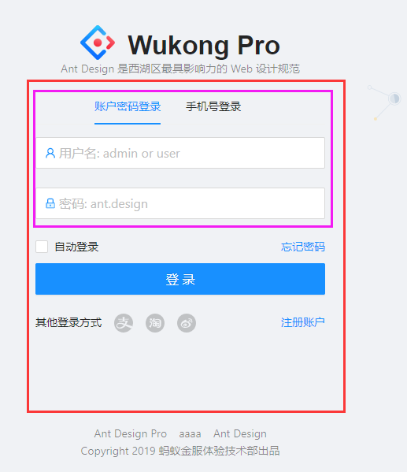

# 用户登陆


# 1. 分析与设计


## 1.1 需求描述

假设用例描述如下（实际用例描述要详细的多）：

* 可以通过用户名登陆
* 可以通过手机号+验证码登陆
* 可以通过第三方登陆
* 也可以注册


## 1.2 UI设计

①②③④⑤⑥⑦⑧⑨

### ① 总体布局

* 由于登陆、注册或者错误提示，都会使用到公用的部分。
  * 所以这部分页面单独做了一个模板，也就是红色以外的部分。
* 中间区域有一个切换的地方，所以把自动登陆一下作为公用部分。




### ② 页面规划

使用到的ant组件：

* Tabs,Form, Input, Button, Checkbox, Row,Col
* @ant-design/icons  图标

总体规划：

 * 整个区域的子组件靠左，因为父组件是居中。
   	* text-align: left;
 * [忘记密码]  [注册账户] 浮动到右边。
   	* float: right;
 * 除了使用浮动功能，还可以使用Row与Col组件
   	* [获取验证码]就使用了Row与Col组件
      	* 使用Row组件的好处是在不同屏幕尺寸在可以自动放缩，缺点是写的代码多。


> 使用Row或者样式的代码

```tsx
              <Input
                prefix={<MailTwoTone className={styles.prefixIcon} />}
                placeholder="验证码"
                style={{
                  width: '65%',
                  marginRight: 10,
                }}
              />
              <Button
                style={{
                  float: 'right',
                }}
              >
                获取验证码
              </Button>
```

```tsx
              <Row gutter={8} justify="end">
                <Col span={16}>
                  <Input
                    prefix={<MailTwoTone className={styles.prefixIcon} />}
                    placeholder="验证码"
                  />
                </Col>
                <Col span={8} className={styles.captcha_button}>
                  <Button>获取验证码</Button>
                </Col>
              </Row>
```


### ③ 页面逻辑

> 两个Tab页面，如果取消某个的输入

通过if来显示不同的控件，以及输入内容。


> 验证码的操作

* 初始化状态，可以点击获取验证码按钮。
* 点击获取验证码按钮
  * 状态变成倒计时:使用了`Statistic统计数值`控件
    * 这个控件可以设置结束时间，当时间到了之后，会触发`onFinish`函数，这时候将状态设置回去。
  * 为了测试用，显示一个`message`提示信息。


## 1.3 逻辑设计


### ① 数据结构


### ② 公用函数


### ③ 页面函数