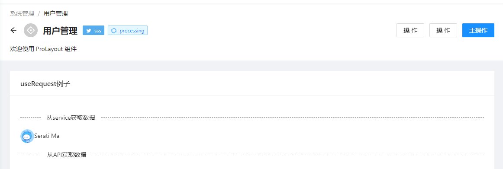
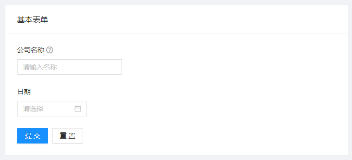
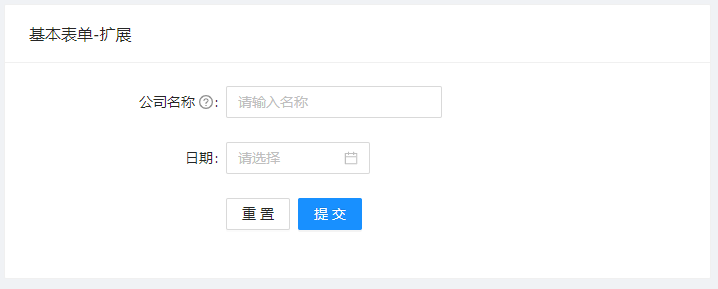
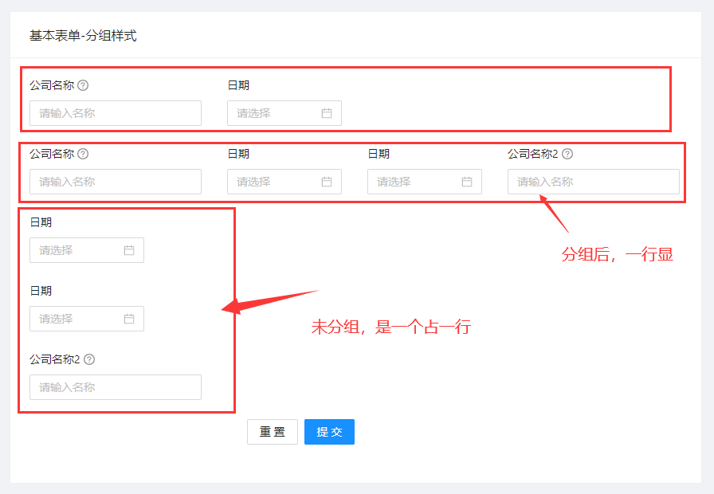
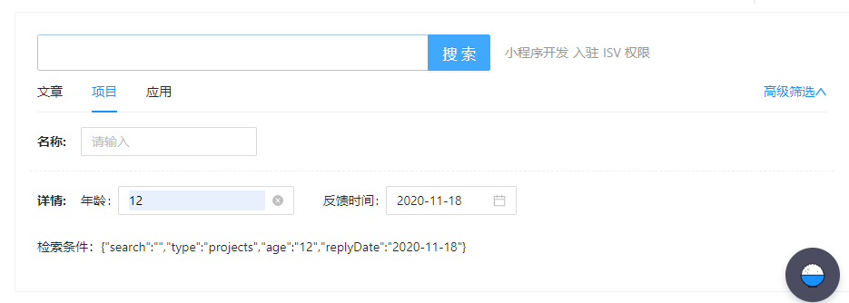
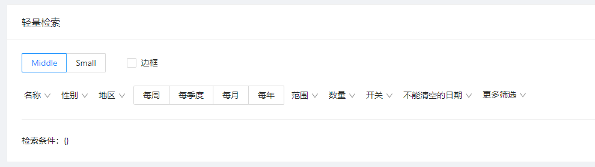
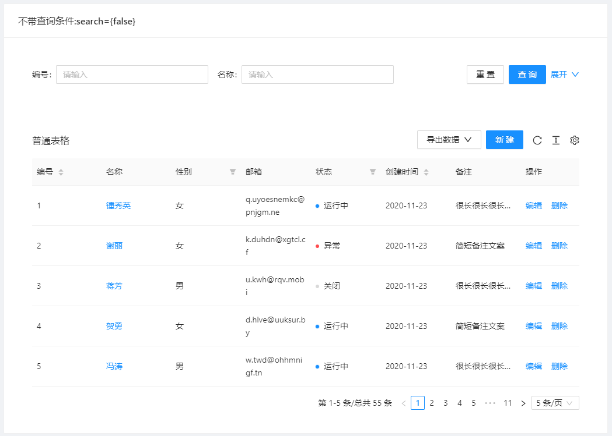
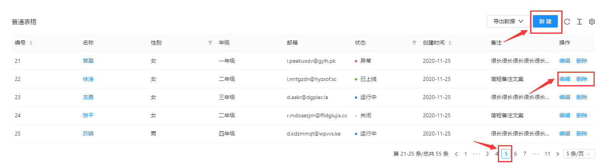

# Pro5 相关知识


[TOC]


# 1. 快速开始


## 1.1 安装

[参考文档](https://beta-pro.ant.design/docs/getting-started-cn)

```cmd
yarn create umi
```

推荐使用 [tyarn](https://www.npmjs.com/package/tyarn) 来进行包管理，可以极大地减少 install 的时间和失败的概率，并且完全兼容 npm。


## 1.2 常用方法


```shell
#安装组件
yarn install

#启动程序
yarn start

#分析组件
yarn analyze

#查看你的代码有哪些问题: lint:fix 会自动修复代码
yarn lint 

#打包
yarn build
```


## 1.3 常用语法

哪些简单的就不在这里描述了，这里只描述那些容易被遗忘的重要语法

### 1.3.1 类型定义

Omit ：去掉某个属性

```typescript
type User = {
  id: string;
  name: string;
  email: string;
};

type UserWithoutEmail = Omit<User, "email">;

// 等价于:
type UserWithoutEmail = {
  id: string;
  name: string;
};
```


Partial: 将每一对中的 `key` 变为可选，即添加 `?`

```typescript
interface IUser {
  name: string
  age: number
  department: string
}
type optional = Partial<IUser>

// optional的结果如下
type optional = {
    name?: string | undefined;
    age?: number | undefined;
    department?: string | undefined;
}
```


keyof: 即 `索引类型查询操作符`，我们可以将 `keyof` 作用于`泛型 T` 上来获取`泛型 T` 上的`所有 public 属性名`构成的 `联合类型`

```typescript
type unionKey = keyof IUser

// unionKey 结果如下，其获得了接口类型 IUser 中的所有属性名组成的联合类型
type unionKey = "name" | "age" | "department"
```

这样T[P]可以组成联合类型

```typescript
type unionKey = keyof IUser // "name" | "age" | "department"

type values = IUser[unionKey] // string | number 属性值类型组成的联合类型
```


# 2. 从0开始

假设从umi开始，构建整个antPro框架。


## 2.1 加入布局


### 2.1.1 全局布局

[ProLayout - 高级布局官方说明](https://procomponents.ant.design/components/layout)

这里有一个坑，如果用UMI来生成项目，那么使用的`pro-layout`版本比较低，需要参考`antPro5`中的版本，使用最新的`pro-layout`。

#### ① 基本配置

比如想要 ant-design-pro 的布局。在配置文件中添加：

这个方法好像不太灵活。

```diff
import { defineConfig } from 'umi';
export default defineConfig({
+ layout: {},
  routes: [
    { path: '/', component: '@/pages/index' },
  ],
});
```


#### ② 添加404

在配置文件中添加：

```json
    {
      component: './404',
    },
```

在`pages`中添加`404.tsx`文件，具体内容省略


#### ③ 添加Footer与Header

[自定义页脚](https://procomponents.ant.design/components/layout#自定义页脚)

有两种方法：

* 单独做一个layout，来实现。
* 使用app.tsx扩展能力来实现。

### 2.1.2 局部布局

例如：为login添加Layout

在`user`目录下，建立`login regist`目录，但是在`user`下有很多相同的内容，所以要做一个统一的样式。


#### ① 取消默认Layout

配置`loyout:false`

```json
    {
      path: '/user',
      layout: false,
      routes: [
        {
          name: 'login',
          path: '/user/login',
          component: '@/pages/user/login/index',
        },
      ],
    },
```


#### ②  创建特有Layout

[官方文档](https://umijs.org/zh-CN/docs/convention-routing#动态路由) , 目录下有 `_layout.tsx` 时会生成嵌套路由。


①②③④⑤⑥⑦⑧⑨

#### ③ 配置路由

这里要配置`exact: false,`  同时要单独配置一个 `404`的页面，这个页面可以重用。

```json
      path: '/user',
      layout: false,
      component: '@/pages/user/_layout',
      exact: false,
      routes: [
        {
          name: 'login',
          path: '/user/login',
          component: '@/pages/user/login/index',
        },
        {
          component: './404',
        },
      ],
    },
```


## 2.2 运行时配置

运行时配置和配置的区别是他跑在浏览器端，基于此，我们可以在这里写函数、jsx、import 浏览器端依赖等等，注意不要引入 node 依赖。[参考文档](https://umijs.org/zh-CN/docs/runtime-config)

约定 `src/app.tsx` 为运行时配置。

### 2.2.1 应用点

* 修改路由：patchRoutes
* 覆盖渲染：render
  * 比如用于渲染之前做权限校验
  * 请求服务端根据响应动态更新路由
* 路由切换：onRouteChange
  * 埋点统计
  * 设置标题

### 2.2.2 插件

[官网地址](https://umijs.org/zh-CN/plugins/preset-react)

* 权限管理
* 统计管理
  * 百度
  * google
* 初始化数据管理
  * 导出 `getInitialState` 方法时启用

### 2.2.3 自定义插件

[官网说明](https://umijs.org/zh-CN/guide/plugin-develop)


### 2.2.4 具体使用(重点)


#### ① 得到初始化数据

例如：`src\components\RightContent\index.tsx`

使用useModel

```tsx
  const { initialState } = useModel('@@initialState');

  if (!initialState || !initialState.settings) {
    return null;
  }
```


## 2.3 添加菜单


### 2.3.1 手工添加


### 2.3.2 自动添加


## 2.4 使用多语言

ant Pro5中默认是没有多语言的。如果要使用，必须要开启。

### ① 开启

有两步

> config.ts中使用

```ts
  locale: {
    // default zh-CN
    default: 'zh-CN',
    antd: true,
    // default true, when it is true, will use `navigator.language` overwrite default
    baseNavigator: true,
  },
```


> 添加 src/locales

讲antPro的这个目录复制一份就可以了

### ② 使用


# 3. CSS

做前端CSS是绕不过去的。

> 重要的知识点

* less
* flex布局
* 媒体查询布局
* css模块化
  * 公用CSS
  * 引用组件CSS
  * 覆盖组件CSS

> 心得体会

* antPro Demo的css写的一般，可以参考
* 要重点了解antPro中一些可以公用的CSS
* `vscode`中，使用逗点，可以自动出现下拉框，把less文件中的css显示出来。


## 3.1 疑问


```less
@import '~antd/es/style/themes/default.less';

@pro-header-hover-bg: rgba(0, 0, 0, 0.025);   

&:global(.opened) {
      background: @pro-header-hover-bg;
}
```


# 4. 组件


## 4.1 布局


### ① Space间距

[参考网址](https://ant.design/components/space-cn/)

- 适合行内元素的水平间距。
- 可以设置各种水平对齐方式。

使用起来也很简单，使用`space`包裹，然后哦设置参数就可以了。

```tsx
<Space>
    .........
</Space>    
```


# 5. Hooks


## 5.1 useRequest

有两种调用方法：

* 在service调用，页面调用service
* 在页面中调用。

### 5.1.1 基本用法

要单独安装并导入：`import { useRequest } from 'ahooks';`


> 模拟一个API函数

```typescript
  // 使用 mockjs 等三方库
  'GET /api/tags': (req: Request, res: Response) => {
    //console.log(req.headers.authorization);
    res.send(
      mockjs.mock({
        'list|10': [{ name: '@city', 'value|1-100': 50, 'type|0-2': 1 }],
      }),
    );
  },
```


> 可以在此程序中调用

在这个程序中，可以调用 service或者api的函数

```tsx
import React from 'react';
import { useRequest } from 'ahooks';
import { List, Avatar } from 'antd';
import { queryCurrent } from '@/services/user';
import styles from './index.less';

export interface tag {
  name: string;
  value: number;
  type?: number;
}

export default () => {
  //直接从一个api获取数据
  const tagsReq = useRequest('/api/tags');

  //从一个service中获取数据
  const userReq = useRequest(queryCurrent);

  if (tagsReq.loading) {
    return <div>loading...</div>;
  }
  if (tagsReq.error) {
    return <div>{tagsReq.error.message}</div>;
  }

  console.log(tagsReq.data);
  console.log(userReq.data);

  return (
    <div>
      <div>
        <Avatar src={userReq?.data?.avatar} />
        {userReq?.data?.name}
      </div>
      <List
        itemLayout="horizontal"
        dataSource={tagsReq.data.list}
        renderItem={(item: tag) => (
          <List.Item>
            <List.Item.Meta
              title={item.name}
              description={'生产总值：' + item.value + '亿元'}
            />
          </List.Item>
        )}
      />
    </div>
  );
};
```


### 5.1.2 update例子

①②③④⑤⑥⑦⑧⑨


#### ① 模拟一个mock

```js
  //模拟了一个update数据
  'POST /api/setting/update': (req: Request, res: Response) => {
    console.log(req.body);
    console.log('--------------------');
    const { name, value } = req.body;
    console.log(name + ':' + value);
    res.send({ data: { name, value }, success: true });
  },
```


#### ② 页面中调用(不推荐)

主要是传递参数太复杂了，可以将这段函数，放到service中。

```jsx
  //手工触发一个update
  const [sName, setSName] = useState('');
  const userSettingUpdate = useRequest(
    {
      url: '/api/setting/update',
      method: 'post',
       body: '{ "name": "wwww", "value": "123" }',
      //body: JSON.stringify({ name: sName }),
      headers: { 'Content-Type': 'application/json' },
    },
    {
      manual: true,
      onSuccess: (result, params) => {
        // console.log(result);
        // console.log(params);
        if (result.sucess) {
        }
      },
    },
  );


      <input
        onChange={(e) => setSName(e.target.value)}
        value={sName}
        placeholder="请输入名称"
        style={{ width: 240, marginRight: 16 }}
      />
      <button
        disabled={userSettingUpdate.loading}
        type="button"
        onClick={() => userSettingUpdate.run({ name: 'sss', value: '123' })}
      >
        {userSettingUpdate.loading ? 'loading' : 'Edit'}
      </button>
```


#### ③ service中调用


> 创建一个service

```typescript
//模拟一个update

export interface updateSettingParamType {
  name?: string;
  value?: number;
}

export async function updateSetting(params: updateSettingParamType) {
  console.log(params);
  return request<any>('/api/setting/update', {
    method: 'POST',
    data: params,
  });
}
```


> 页面中调用

```jsx
  //手工触发一个update
  const [sName, setSName] = useState('');
  const userSettingUpdate = useRequest(updateSetting, {
    manual: true,
    onSuccess: (result, params) => {
      console.log(result);
      // console.log(params);
      if (result.sucess) {
      }
    },
  });

      <input
        onChange={(e) => setSName(e.target.value)}
        value={sName}
        placeholder="请输入名称"
        style={{ width: 240, marginRight: 16 }}
      />
      <button
        disabled={userSettingUpdate.loading}
        type="button"
        onClick={() => userSettingUpdate.run({ name: sName, value: 123 })}
      >
        {userSettingUpdate.loading ? 'loading' : 'Edit'}
      </button>
```


### 5.1.3 轮询

[官方网址]([https://ahooks.js.org/zh-CN/hooks/async#%E8%BD%AE%E8%AF%A2](https://ahooks.js.org/zh-CN/hooks/async#轮询))

> 模拟一个API

一定要有一个双引号

```js
  'GET /api/random': (req: Request, res: Response) => {
    res.send('"' + mockjs.mock('@cname') + '"');
  },
```


> 页面中的代码

可以点击stop停止查询，点击start 来启动

```jsx
  //做一个轮询
  const usePolling = useRequest('/api/random', {
    pollingInterval: 3000,
    pollingWhenHidden: false,
  });


      <p>UserName:{usePolling.loading ? 'loading.....' : usePolling.data}</p>
      <button type="button" onClick={usePolling.run}>
        start
      </button>
      <button
        type="button"
        onClick={usePolling.cancel}
        style={{ marginLeft: 8 }}
      >
        stop
      </button>
```


### 5.1.4 并发操作

[官网的例子]([https://ahooks.js.org/zh-CN/hooks/async#%E5%B9%B6%E8%A1%8C%E8%AF%B7%E6%B1%82](https://ahooks.js.org/zh-CN/hooks/async#并行请求))

默认情况下，新请求会覆盖旧请求。如果设置了 fetchKey，则可以实现多个请求并行，fetches 存储了多个请求的状态。外层的状态为最新触发的 fetches 数据。

#### ① 模拟一个mock

如果让一个接口同时支持Post 与Get，还没有找到更好的方法，只能复制一份了。

```js
  //模拟得到用户列表
  'GET /api/demo/getUsers': (req: Request, res: Response) => {
    res.send([
      { id: '1', username: 'A' },
      { id: '2', username: 'B' },
      { id: '3', username: 'C' },
    ]);
  },
  //模拟删除一个用户
  'POST /api/demo/delUser': (req: Request, res: Response) => {
    console.log(req.query.id);
    res.send('1');
  },
  'GET /api/demo/delUser': (req: Request, res: Response) => {
    console.log(req.query.id + 'ddd');
    res.send('1');
  },
```


####  ②  创建service

```typescript
//模拟得到一个用户列表，或删除一个用户列表
export interface userType {
  id: string;
  username: string;
}

export async function getUsers() {
  return request<userType[]>('/api/demo/getUsers');
}

export async function delUser(id: string) {
  return request<number>('/api/demo/delUser?id=' + id, { method: 'POST' });
}
```


#### ③ 页面中调用


```jsx
  //做一个并发的例子
  const useUserList = useRequest(getUsers);
  const useDelUser = useRequest(delUser, {
    manual: true,
    fetchKey: (id) => id,
    onSuccess: (result, params) => {
      console.log(result);
      if (result) {
        message.success(`Disabled user ${params[0]}`);
      }
    },
  });


      <ul>
        {useUserList?.data?.map((user) => (
          <li key={user.id} style={{ marginTop: 8 }}>
            <button
              type="button"
              disabled={useDelUser?.fetches[user.id]?.loading}
              onClick={() => {
                useDelUser?.run(user.id);
              }}
            >
              delete {user.username}
            </button>
          </li>
        ))}
      </ul>
```


### 5.1.5 串行操作

这个有缓存，只能执行一次。[官方文档]([https://ahooks.js.org/zh-CN/hooks/async#%E4%BE%9D%E8%B5%96%E8%AF%B7%E6%B1%82](https://ahooks.js.org/zh-CN/hooks/async#依赖请求))

#### ① 模拟mock

```js
  //模拟并行操作
  'GET /api/demo/getUserByName': (req: Request, res: Response) => {
    console.log('getUserByName');
    res.send({ id: '1', username: mockjs.mock('@cname') });
  },
  'GET /api/demo/getUserTodoList': (req: Request, res: Response) => {
    console.log(req.query.id + ':todo List');
    res.send(
      mockjs.mock({
        'list|3': [{ 'id|+1': 1, todoname: '去 @city', 'value|1-100': 50 }],
      }).list,
    );
  },
```


####  ②  页面中调用

```jsx
  //做一个串行的例子
  const useChun1 = useRequest('/api/demo/getUserByName?name=123', {
    manual: true,
  });
  const useChun2 = useRequest('/api/demo/getUserTodoList?id=1', {
    ready: !!useChun1?.data,
  });
  console.log(useChun2?.data?.length);


      <p>
        User: {useChun1?.loading ? 'loading....' : useChun1?.data?.username}
      </p>
      <p>
        {useChun1?.loading || useChun2?.loading ? (
          'loading....'
        ) : (
          <ul style={{ marginLeft: 28 }}>
            {useChun2?.data?.map((todo: any) => (
              <li key={todo.id}>{todo.todoname}</li>
            ))}
          </ul>
        )}
      </p>
      <button
        type="button"
        onClick={() => {
          useChun1?.run();
        }}
      >
        查询
      </button>
```


### 5.1.6 防抖&节流

在一个框中输入内容，就会根据内容来检索程序。 中间可以设置500ms的间隔时间。

防抖使用：debounceInterval

节流使用：throttleInterval

```jsx
  //做一个防抖例子
  const useDeb = useRequest('/api/demo/getUserTodoList', {
    debounceInterval: 500,
    manual: true,
  });


      <p>请输入内容</p>
      <input type="text" onChange={(e) => useDeb?.run(e.target.value)} />
      {useDeb?.loading ? (
        <p>loading...</p>
      ) : (
        <ul style={{ marginLeft: 28 }}>
          {useDeb?.data?.map((todo: any) => (
            <li key={todo.id}> {todo.todoname}</li>
          ))}
        </ul>
      )}
```


### 5.1.7 缓存 & SWR & 预加载

这里例子需要把相应的内容做成组件。不符合常用的编程习惯。[详细见官方的例子]([https://ahooks.js.org/zh-CN/hooks/async#%E7%BC%93%E5%AD%98--swr](https://ahooks.js.org/zh-CN/hooks/async#缓存--swr))。


如果在里面添加上了`manual: true`， 那么就没有缓存这个功能，但是官方说可以做`预加载`，感觉实用性不强。


### 5.1.8 屏幕聚焦重新请求

如果你设置了 `options.refreshOnWindowFocus = true` ，则在浏览器窗口 `refocus` 和 `revisible` 时，会重新发起请求。你可以通过设置 `options.focusTimespan` 来设置请求间隔，默认为 `5000ms` 。


### 5.1.9 修改返回值

通过`mutate`来修改返回值

```jsx
      <button
        onClick={() => {
          useMutate?.run({});
        }}
      >
        search
      </button>
      <p>{useMutate?.data}</p>
//做一个突变
  const useMutate = useRequest('/api/random', {
    manual: true,
    onSuccess: (result) => {
      useMutate.mutate('dddd');
    },
  });
```


### 5.1.10 依赖刷新

#### ① 模拟一个mock

```js
  //模拟依赖刷新
  'GET /api/demo/getSchool': (req: Request, res: Response) => {
    console.log(req.query.id);
    const id = req.query.id;
    switch (id) {
      case '1':
        res.status(200).send('Tsinghua University');
        break;
      case '2':
        res.status(200).send('Beijing University');
        break;
      case '3':
        res.status(200).send('Zhejiang University');
        break;
      default:
        res.status(200).send('none12333');
    }
  },
```


#### ②  创建service

```js
export async function getSchool(id: string) {
  return request<string>('/api/demo/getSchool?id=' + id);
}
```


#### ③ 页面中调用

```jsx
  const [schoolId, setSchoolId] = useState('1');
  const useDep = useRequest(() => getSchool(schoolId), {
    refreshDeps: [schoolId],
  });

      <select onChange={(e) => setSchoolId(e.target.value)} value={schoolId}>
        <option value="1">school1</option>
        <option value="2">school2</option>
        <option value="3">school3</option>
      </select>
      <p>School:{useDep?.loading ? 'loading' : useDep?.data}</p>

```


## 5.2 useRequest扩展

基于基础的 useRequest，我们可以进一步封装，实现更高级的定制需求。当前 useRequest 内置了 `集成请求库`，`分页` 和 `加载更多` 三种场景。你可以参考代码，实现自己的封装。参考 [useRequest](https://github.com/alibaba/hooks/blob/master/packages/use-request/src/useRequest.ts)、[usePaginated](https://github.com/alibaba/hooks/blob/master/packages/use-request/src/usePaginated.ts)、[useLoadMore](https://github.com/alibaba/hooks/blob/master/packages/use-request/src/useLoadMore.ts) 的实现。


### 5.2.1 集成API链接


```jsx
// 用法 1
const { data, error, loading } = useRequest('/api/userInfo');
// 用法 2
const { data, error, loading } = useRequest({
  url: '/api/changeUsername',
  method: 'post',
});
// 用法 3
const { data, error, loading } = useRequest((userId)=> `/api/userInfo/${userId}`);
// 用法 4
const { loading, run } = useRequest((username) => ({
  url: '/api/changeUsername',
  method: 'post',
  body: JSON.stringify({ username }),
}), {
  manual: true,
});
```


### 5.2.2 分页

#### ① 模拟mock

```js
  //模拟一个分页列表
  'GET /api/demo/getUserList': (req: Request, res: Response) => {
    console.log(`/api/demo/getUserList`);
    const current = req.query.current || 1;
    const pageSize = req.query.pageSize || 10;
    res.send(
      mockjs.mock({
        total: 55,
        [`list|${pageSize}`]: [
          {
            id: '@guid',
            name: '@cname',
            'gender|1': ['male', 'female'],
            email: '@email',
            disable: false,
          },
        ],
      }),
    );
  },
```


#### ②  创建service

```js
//模拟一个分页列表
export interface UserListItem {
  id: string;
  name: string;
  gender: 'male' | 'female';
  email: string;
  disabled: boolean;
}

export async function getUserList(params: {
  current: number;
  pageSize: number;
  gender?: string;
}) {
  return request<{ total: number; list: UserListItem[] }>(
    `/api/demo/getUserList?current=${params?.current}&pageSize=${params?.pageSize}`,
  );
}
```


#### ③ 页面中调用

```jsx
  // 模拟一个分页
  const usePage = useRequest(
    ({ current, pageSize }) => getUserList({ current, pageSize }),
    {
      paginated: true,
    },
  );

      {usePage?.loading ? (
        <p>Loading....</p>
      ) : (
        <ul style={{ marginLeft: 28 }}>
          {usePage?.data?.list?.map((user) => (
            <li key={user.id}>
              {user.name} - {user.email}
            </li>
          ))}
        </ul>
      )}
      <Pagination
        {...(usePage?.pagination as any)}
        showQuickJumper
        showSizeChanger
        onShowSizeChange={usePage?.pagination?.onChange}
        style={{ marginTop: 16, textAlign: 'right' }}
        disabled={usePage?.loading}
      ></Pagination>
```


### 5.2.3 Table

#### ① 模拟mock

下面的代码，关于排序那部分，没有实现

```js
 //模拟一个分页列表
  'GET /api/demo/getUserList': (req: Request, res: Response) => {
    console.log(`/api/demo/getUserList`);

    let current: number = <number>(req.query.current || 1);
    const pageSize: number = <number>(req.query.pageSize || 10);

    const total: number = userListConst.length;
    const totalPage: number = Math.ceil(total / pageSize);

    const sorter = JSON.parse(
      (req.query.sorter ? req.query.sorter : '{}') as string,
    );
    const filters = JSON.parse(
      (req.query.filters ? req.query.filters : '{}') as string,
    );

    let currentList: UserListItem[] = userListConst;

    console.log(sorter);
    if (sorter) {
      currentList = currentList.sort((prev, next) => {
        const key = sorter['field'] as string;
        // @ts-ignore
        if (sorter[key] === 'descend') {
          // @ts-ignore
          return next[key] - prev[key];
        } else {
          // @ts-ignore
          return prev[key] - next[key];
        }
      });
    } else {
      currentList = userListConst;
    }

    if (current > totalPage) {
      current = totalPage;
    }
    if (current <= 0) {
      current = 1;
    }
    console.log(current);

    //const currentList: UserListItem[] = [];

    let renList: UserListItem[] = currentList.slice(
      (current - 1) * pageSize,
      current * pageSize,
    );

    res.send({
      total,
      list: renList,
    });
  },
```


#### ②  创建service

```js
//模拟一个分页列表
export interface UserListItem {
  id: string;
  name: string;
  gender: 'male' | 'female';
  email: string;
  disabled: boolean;
}

export async function getUserList(params: {
  current: number;
  pageSize: number;
  filters?: {};
  sorter?: { field?: string; order?: ['ascend', 'descend'] };
}) {
  // console.log(params?.filters);
  // console.log(params?.sorter);
  return request<{ total: number; list: UserListItem[] }>(
    `/api/demo/getUserList`,
    {
      params: { ...params },
    },
  );
}
```


#### ③ 页面中调用

```jsx
import React, { useState } from 'react';
import { useRequest } from 'ahooks';
import { Card, Button, Divider, message, Table } from 'antd';

import { getUserList, UserListItem } from '@/services/user';
import listTest from '@/pages/listTest';

const getUserListFun = (params: { current: number; pageSize: number }) => {
  return getUserList({ ...params });
};

const columns = [
  {
    title: '编号',
    dataIndex: 'id',
    sorter: true,
    filters: [
      { text: '1-10', value: '10' },
      { text: '11-?', value: '55' },
    ],
  },
  { title: '名称', dataIndex: 'name', sorter: true },
  {
    title: '性别',
    dataIndex: 'gender',
    sorter: true,
    filters: [
      { text: '男', value: 'male' },
      { text: '女', value: 'female' },
    ],
  },
];

export default () => {
  const useTable = useRequest(getUserListFun, {
    paginated: true,
    defaultPageSize: 10,
  });
  //console.log(useTable?.params);
  //定义查询与排序
  const { sorter = {}, filters = {} } = useTable?.params[0] || ({} as any);
  return (
    <Card>
      <Button onClick={useTable?.refresh} style={{ marginBottom: 16 }}>
        刷新
      </Button>
      <Table columns={columns} rowKey="id" {...useTable?.tableProps} />
    </Card>
  );
};
```


### 5.2.4 LoadMore

#### ① 通过按钮LoadMore

还用的上面Table例子的mock与service

```jsx
  //loadmore例子
  const pageSize = 10;
  const useLoadMore = useRequest(
    (d: { total: number; list: [] } | undefined) => {
      const current = d ? d?.list.length / pageSize + 1 : 1;
      return getUserListFun({ current, pageSize });
    },
    {
      loadMore: true,
    },
  );


      <Divider orientation="left" plain dashed>
        loadmore
      </Divider>

      {useLoadMore.loading ? (
        <p>loading</p>
      ) : (
        <ul style={{ marginLeft: 28 }}>
          {useLoadMore.data?.list.map((user: UserListItem) => (
            <li key={user.id}>
              {user.id} - {user.name}
            </li>
          ))}
        </ul>
      )}

      <Button
        onClick={useLoadMore?.loadMore}
        disabled={useLoadMore.data?.total === useLoadMore.data?.list.length}
        loading={useLoadMore.loadingMore}
      >
        LoadMore
      </Button>
```


#### ② 滚动轴loadMore

如果 options 中存在 `ref`，则在滚动到底部时，自动触发 loadMore。当然此时你必须设置 `isNoMore`, 以便让 `useRequest` 知道何时停止。

追加下面的代码

```diff
  //loadmore例子
+ const containerRef = useRef<HTMLDivElement>(null);
  const pageSize = 10;
  const useLoadMore = useRequest(
    (d: { total: number; list: [] } | undefined) => {
      const current = d ? d?.list.length / pageSize + 1 : 1;
      return getUserListFun({ current, pageSize });
    },
    {
      loadMore: true,
+     ref: containerRef,
+     isNoMore: (d) => (d ? d.list.length >= d.total : false),
    },
  );
```


在整个页面中，追加一个Div

```jsx
<div ref={containerRef} style={{ height: 200, overflowY: 'auto' }}>
  .................................
</div>
```


## 5.3 UI-hooks


### 5.3.1 useDrop & useDrag

一对帮助你处理在拖拽中进行数据转移的 hooks

> useDrop 可以单独使用来接收文件、文字和网址的拖拽。
>
> useDrag 允许一个 dom 节点被拖拽，需要配合 useDrop 使用。
>
> 向节点内触发粘贴时也会被视为拖拽的内容


* 可以拖动的内容有：
  * file：系统上的一个文件
  * Html上的一个组件
  * 黏贴操作
  * 在浏览器地址栏中拖动一个Url


```less
.drawer {
  border: 1px dashed #e8e8e8;
  padding: 16px;
  text-align: center;
  margin-top: 10px;
}

.box {
  border: 1px solid #e8e8e8;
  padding: 16px;
  width: 80px;
  text-align: center;
  margin-right: 16px;
}
```


```jsx
import React, { useState } from 'react';
import { Card, Divider } from 'antd';
import { useDrag, useDrop } from 'ahooks';
import styles from './index.less';

export default () => {
  //设置一个中间变量
  const [dragging, setDragging] = useState<string | null>(null);
  const getDragProps = useDrag({
    onDragStart: (data) => {
      setDragging(data);
    },
    onDragEnd: () => {
      setDragging(null);
    },
  });

  const getDropsProps = (id: string) => {
    return useDrop({
      onDom: (content: string, e) => {
        alert(`${id}: ${content} 被放入了`);
      },
      onFiles: (files, e) => {
        console.log(e, files);
        alert(`${id}: ${files.length} file dropped`);
      },
      onUri: (uri, e) => {
        console.log(e);
        alert(`${id}: uri= ${uri} dropped`);
      },
      onText: (text, e) => {
        console.log(e);
        alert(`'${id}: text= ${text}' dropped`);
      },
    });
  };

  const [drop1Props, { isHovering: drop1Hovering }] = getDropsProps('d1');
  const [drop2Props, { isHovering: drop2Hovering }] = getDropsProps('d2');

  return (
    <Card>
      <Divider orientation="left" plain dashed>
        拖拽
      </Divider>
      <div id="a1" className={styles.drawer} {...drop1Props}>
        {drop1Hovering ? ' release here ' : 'drop here 1'}
      </div>

      <div id="a2" className={styles.drawer} {...drop2Props}>
        {drop2Hovering ? ' release here ' : 'drop here 1'}
      </div>
      <div
        style={{
          marginTop: 12,
          marginBottom: 12,
          display: 'flex',
          alignItems: 'center',
        }}
      >
        <div className={styles.box} {...getDragProps(`box1`)}>
          box1
        </div>
        <div className={styles.box} {...getDragProps(`box2`)}>
          box2
        </div>
        <a {...getDragProps(`a1`)}>你好呀</a>
      </div>
      <div>{dragging ? <>正在拖动:{dragging}</> : '没有拖动'}</div>
    </Card>
  );
};


```


### 5.3.2 useDynamicList

一个帮助你管理列表状态，并能生成唯一 key 的 Hook。

动态生成UI的组件。


#### ① Form的使用

Form的基本用法

* Form设置
  * 给整体指定初始化值`initialValues={{ remember: true }}`
  * `Form.Item` 来设定校验标准
* Form函数
  * 使用`const [form] = Form.useForm();`来调用相关函数
  * `from.validateFields().then().catch()`


#### ②  useDynamicList使用

* 定义一个`useDynamicList`对象。
* 定义一个`Row`函数，会调用`useDynamicList`对象的函数：
  * getKey：生成ID
  * remove: 移除
  * push：追加


在拖动的过程中，会使用一个[react组件](https://github.com/raisezhang/react-drag-listview)


```jsx
 //动态添加html元素的例子
  const useDy = useDynamicList(['小鱼', '岑岑']);
  const [form] = Form.useForm();

  const [resule, setResult] = useState('');
  const Row = (index: number, item: any) => (
    <div
      style={{ display: 'flex', alignItems: 'baseline' }}
      key={useDy.getKey(index)}
    >
      <div>
        <Form.Item
          rules={[{ required: true, message: 'required' }]}
          name={['id', useDy.getKey(index)]}
          initialValue={item}
        >
          <Input style={{ width: 300 }} placeholder="please input you name" />
        </Form.Item>
      </div>
      <div>
        {useDy.list.length > 1 && (
          <MinusCircleOutlined
            style={{ marginLeft: 8 }}
            onClick={() => useDy.remove(index)}
          />
        )}
        <PlusCircleOutlined
          style={{ marginLeft: 8 }}
          onClick={() => useDy.push('')}
        />
      </div>
    </div>
  );


return (
    <Card>
       <Divider orientation="left" plain dashed>
        useDynamicList:动态增加组件
      </Divider>
      <Form form={form}>{useDy.list.map((ele, index) => Row(index, ele))}</Form>

      <Button
        style={{ marginTop: 8 }}
        type="primary"
        onClick={() =>
          form
            .validateFields()
            .then((val) => {
              console.log(val);
              setResult(
                JSON.stringify(
                  (val || {}).id.filter((e: string) => {
                    console.log(!!e);
                    return !!e;
                  }),
                ),
              );
            })
            .catch(() => {})
        }
      >
        提交
      </Button>

      <div>{resule}</div>
    </Card>
  );
```


### 5.3.3 useSelections

常见联动 checkbox 逻辑封装，支持多选，单选，全选逻辑，还提供了是否选择，是否全选，是否半选的状态。

下面是一个例子，从服务器获取数据，然后进行选中。

```jsx
  //useSelections:常见联动 checkbox 逻辑封装 例子
  const useUserList = useRequest(getUserList, {
    onSuccess: ({ list }) => {
      //设置那个元素被选中，也可以这样来用
      useUserSelection.setSelected([list[1]]);
    },
  });
  const useUserSelection = useSelections(
    useUserList?.data?.list ? useUserList?.data?.list : [],
    [],
  );

  const selectedStr = (selected: UserListItem[]) => {
    let ren: string = '';
    selected.forEach((user: UserListItem) => {
      ren = ren + ' ' + user.name;
    });
    return ren;
  };

      <Divider orientation="left" plain dashed>
        useSelections:常见联动 checkbox 逻辑封装
      </Divider>
      <em>
        支持多选，单选，全选逻辑，还提供了是否选择，是否全选，是否半选的状态。
      </em>
      <div style={{ marginTop: 20 }}></div>
      <div style={{ marginTop: 20 }}>
        <Checkbox
          checked={useUserSelection.allSelected}
          onClick={useUserSelection.toggleAll}
          indeterminate={useUserSelection.partiallySelected}
        >
          Check All
        </Checkbox>
        {'    '}[选中：{selectedStr(useUserSelection.selected)}]
      </div>

      <div style={{ marginTop: 20 }}>
        {useUserList.data?.list.map((user) => (
          <Checkbox
            checked={useUserSelection.isSelected(user)}
            onClick={() => useUserSelection.toggle(user)}
            key={user.id}
          >
            {user.name}
          </Checkbox>
        ))}
      </div>
```


### 5.3.4 useVirtualList

提供虚拟化列表能力的 Hook，用于解决展示海量数据渲染时首屏渲染缓慢和滚动卡顿问题。

提供一个列表，用来显示很多数据，具体看[官网的介绍](https://ahooks.js.org/zh-CN/hooks/ui/use-virtual-list)


## 5.4 SideEffect Hooks


| 名称          | 说明                              |
| ------------- | --------------------------------- |
| useDebounce   | 处理防抖值的 Hook                 |
| useDebounceFn | 处理防抖函数的 Hook               |
| useInterval   | 处理 setInterval 的 Hook          |
| useThrottle   | 处理节流值的 Hook                 |
| useThrottleFn | 处理节流函数的 Hook，跟防抖差不多 |
| useTimeout    | 处理 setTimeout 计时器函数的 Hook |


## 5.5 State


| 名称                   | 说明                                                         |
| ---------------------- | ------------------------------------------------------------ |
| useUrlState            | 将状态同步到 url query 中                                    |
| useBoolean             | 优雅的管理 boolean 值的 Hook                                 |
| useControllableValue   | 在某些组件开发时，我们需要组件的状态即可以自己管理，也可以被外部控制，useControllableValue 就是帮你管理这种状态的 Hook。 |
| useCookieState         | 一个可以将状态持久化存储在 cookie 中的 Hook                  |
| useCountDown           | 一个用于管理倒计时的Hook                                     |
| useCounter             | 一个可以管理 count 的 Hook                                   |
| useHistoryTravel       | 优雅的管理状态变化历史，可以快速在状态变化历史中穿梭 - 前进跟后退。例如设置成undo redo |
| useLocalStorageState   | 一个可以将状态持久化存储在 localStorage 中的 Hook 。         |
| useMap                 | 一个可以管理 Map 类型状态的 Hook                             |
| useNetwork             | 一个可以管理网络连接状态的 Hook。                            |
| usePrevious            | 保存上一次渲染时状态的 Hook                                  |
| useSessionStorageState | 一个可以将状态持久化存储在 sessionStorage 中的 Hook。        |
| useSetState            | 管理 object 类型 state 的 Hooks，用法与 class 组件的 `this.setState` 基本一致。 |
| useTitle               | 用于设置页面标题的 Hook                                      |
| useToggle              | 用于在两个状态值间切换的 Hook。                              |
| useWebSocket           | 用于处理 WebSocket 的 Hook。                                 |
| useWhyDidYouUpdate     | 帮助开发者排查是什么改变导致了组件的 rerender                |


### 5.5.1 useWebSocket

> 基本知识

* useState
  * 一旦修改了它就会造成组件的重新渲染
* useRef
  * 修改也不会引起组件渲染
  * 另外一个作用是关联一个组件。
* useMemo 
  * 用于性能优化，通过记忆值来避免在每个渲染上执⾏高开销的计算。
* useWebSocket 
  * aHooks的组件

> 下面的代码可以发送消息

```jsx
enum ReadyState {
  Connecting = 0,
  Open = 1,
  Closing = 2,
  Closed = 3,
}

export default () => {
  const [text, setText] = useState('send message');
  const messageHistory = useRef([]);
  const {
    readyState,
    sendMessage,
    latestMessage,
    disconnect,
    connect,
  } = useWebSocket('wss://echo.websocket.org');

  //console.log(messageHistory);

  messageHistory.current = useMemo(() => {
    if (latestMessage) {
      return messageHistory.current.concat(latestMessage);
    }
    return messageHistory.current;
  }, [latestMessage]);

  return (
    <Card>
      {text}
      <div>
        <Input
          value={text}
          style={{ width: '50%' }}
          onChange={(e) => setText(e.target.value)}
        />
      </div>

      <Space style={{ marginTop: 16, marginBottom: 16 }}>
        <Button
          disabled={readyState !== ReadyState.Open}
          onClick={() => sendMessage && sendMessage(text)}
        >
          send
        </Button>
        <Button disabled={readyState !== ReadyState.Open}>disconnect</Button>
        <Button disabled={readyState == ReadyState.Open}>connect</Button>
      </Space>

      <div>
        <p>received message: </p>
        {messageHistory.current.map((value, index) => (
          <p key={index}>{value?.data}</p>
        ))}
      </div>
    </Card>
  );
};
```


## 5.6 Dom相关


| 名称                  | 说明                                                         |
| --------------------- | ------------------------------------------------------------ |
| useClickAway          | 优雅的管理目标元素外点击事件的 Hook。例如单击 右键           |
| useDocumentVisibility | 可以获取页面可见状态的 Hook。                                |
| useEventListener      | 优雅使用 addEventListener 的 Hook。                          |
| useEventTarget        | 常见表单控件(通过 e.target.value 获取表单值) 的 onChange 跟 value 逻辑封装，支持自定义值转换和重置功能。 |
| useFavicon            | 用于设置与切换页面 favicon。                                 |
| useFullscreen         | 一个用于处理 dom 全屏的 Hook。                               |
| useHover              | 一个用于追踪 dom 元素是否有鼠标悬停的 Hook。                 |
| useInViewport         | 一个用于判断 dom 元素是否在可视范围之内的 Hook。             |
| useKeyPress           | 一个优雅的管理 keyup 和 keydown 键盘事件的 Hook，支持键盘组合键，定义键盘事件的 key 和 keyCode 别名输入 。 |
| useMouse              | 一个跟踪鼠标位置的 Hook                                      |
| useResponsive         | 在组件中获取响应式信息                                       |
| useScroll             | 获取元素的滚动状态。                                         |
| useSize               | 一个用于监听 dom 节点尺寸变化的 Hook                         |
| useTextSelection      | 实时获取用户当前选取的文本内容及位置。配合 Popover 做划词翻译 |
|                       |                                                              |
|                       |                                                              |
|                       |                                                              |


## 5.7 Advanced


| 名称            | 说明                                                         |
| --------------- | ------------------------------------------------------------ |
| useCreation     | `useCreation` 是 `useMemo` 或 `useRef` 的替代品。            |
| useEventEmitter | 在多个组件之间进行事件通知有时会让人非常头疼，借助 EventEmitter ，可以让这一过程变得更加简单。 |
| useLockFn       | 用于给一个异步函数增加竞态锁，防止并发执行。                 |
| usePersistFn    | 持久化 function 的 Hook                                      |
| useReactive     | 提供一种数据响应式的操作体验,定义数据状态不需要写`useState` , 直接修改属性即可刷新视图。 |


# 6. ProComponents

[官方代码](https://procomponents.ant.design/)

> 有时候会在vscode出现错误提示，但是程序还可以执行。

```
1:删除yarn.lock
2:删除：node_modules目录
3:重新：tyran install
4:重新打开vscode 
```


## 6.1 ProLayout - 高级布局

ProLayout 可以提供一个标准又不失灵活的中后台标准布局，同时提供一键切换布局形态，自动生成菜单等功能。与 PageContainer 配合使用可以自动生成面包屑，页面标题，并且提供低成本方案接入页脚工具栏。


### 6.1.1 Layout使用

在`app.txs`可以配置layout的属性。

```jsx
export const layout = ({
  initialState,
}: {
  initialState: { settings?: LayoutSettings };
}): BasicLayoutProps => {
  return {
    rightContentRender: () => <RightContent />,
    footerRender: () => <Footer />,
    ...initialState?.settings,
  };
};
```


### 6.1.2 PageContainer

可以在模板文件中配置一个通用的`PageContainer`， 但是常用的是在每个页面中来设置。



```jsx
    <PageContainer
      content="欢迎使用 ProLayout 组件"
      extra={[
        <Button key="3">操作</Button>,
        <Button key="2">操作</Button>,
        <Button key="1" type="primary">
          主操作
        </Button>,
      ]}
      avatar={{
        icon: <AntDesignOutlined />,
      }}
      tags={tags()}
      onBack={() => window.history.back()}
      footer={[<Button>重置</Button>, <Button type="primary">提交</Button>]}
    >
```


## 6.2 ProForm - 高级表单


当你想快速实现一个表单但不想花太多时间去布局时 ProForm 是最好的选择。


### 6.2.1 重要事项

* 尽量把`Input`组件放在一个Form中，不然有可能出现ID重复的警告。
* 如果一个ProForm没有明显的按钮，可以使用useRef来获得函数(见检索-高级表单)
  * const formRef: any = useRef();
  * formRef.current.submit();
  * formRef={formRef}


> 如何得到表单的数值

```jsx
// 通过表单的onFinish

// 通过ref,下面两种方法不友好，得到的日期类型不对。
formRef.current.getFieldsValue()
formRef.current.validateFields().then((values: any) => {
}
                                      
//如果是ref，要先提交，然后在onFinish中得到
formRef.current.submit();                                      
```


### 6.2.2 表单设置


#### ①  最基本类型

默认情况下，在程序中输入下面代码，就会出现相关的按钮，只用实现`onFinish`函数就可以了

```jsx
<ProForm
    onFinish={async (values) => {
        console.log(values);
    }}
>
    ....................
    
</ProForm>
```


> 重点内容

| 属性          | 说明     |
| ------------- | -------- |
| onFinish      | 提交函数 |
| initialValues | 默认值   |
|               |          |
|               |          |


如期选中框的格式为字符型`date: "2020-11-24"`，如果想变成`date: 1606186124364` ，要在form中设置`dateFormatter="number"`


#### ② 分组

```jsx
        <ProForm.Group title="基本属性">
          <ProFormText
            name="company"
            label="我方公司名称"
            placeholder="请输入名称"
          />
        </ProForm.Group>
```


#### ③ 改变按钮设置

默认有两个按钮`提交与重置`，可以通过下面代码改变相关属性，下面的代码是例子，逻辑上不通的。

```jsx
<ProForm
  submitter={{
    // 配置按钮文本
    searchConfig: {
      resetText: '重置',
      submitText: '提交',
    },
    // 配置按钮的属性
    resetButtonProps: {},
    submitButtonProps: {
            size: 'large',
            style: {
              width: '100%',
            },
    },
    // 完全自定义整个区域
    render: (props, doms) => {
      return (
        <button type="button" id="rest" onClick={() => props?.onReset?.()}>
          rest
        </button>
      );
    },
  }}
/>
```


### 6.2.3 表单布局


#### ① 默认布局：从上到下



这样也挺好，比较简单。从上到下，比较方便。

```jsx
export default () => {
  return (
    <div>
      <ProForm
        onFinish={async (values) => {
          console.log(values);
        }}
      >
        <ProFormText
          name="company"
          label="公司名称"
          placeholder="请输入名称"
          width="s"
          tooltip="会在 label 旁增加一个 icon，悬浮后展示配置的信息"
        />
        <ProFormDatePicker name="date" label="日期" />
      </ProForm>
    </div>
  );
};
```


#### ② 从左到右(不建议用）

label在左边，需要使用的span




```jsx
export default () => {
  const formItemLayout = {
    labelCol: { span: 6 },
    wrapperCol: { span: 18 },
  };

  return (
    <div style={{ width: '80%', margin: 'auto' }}>
      <ProForm
        onFinish={async (values) => {
          console.log(values);
        }}
        layout="horizontal"
        {...formItemLayout}
        submitter={{
          render: (props, doms) => {
            return (
              <Form.Item wrapperCol={{ span: 12, offset: 6 }}>
                <Space>{doms}</Space>
              </Form.Item>
            );
          },
        }}
      >
        <ProFormText
          name="company"
          label="公司名称"
          placeholder="请输入名称"
          width="s"
          tooltip="会在 label 旁增加一个 icon，悬浮后展示配置的信息"
        />

        <ProFormDatePicker name="date" label="日期"  />
      </ProForm>
    </div>
  );
};
```


#### ③  group分组




### 6.2.4 功能分类

#### ①  分步表单

通过设置`SetpsForm.StepForm`来实现

```jsx
import React from 'react';
import ProForm, {
  StepsForm,
  ProFormText,
  ProFormDatePicker,
  ProFormSelect,
  ProFormTextArea,
  ProFormCheckbox,
  ProFormDateRangePicker,
} from '@ant-design/pro-form';

import { Form, Space } from 'antd';
import StepForm from '@ant-design/pro-form/lib/layouts/StepsForm/StepForm';

const waitTime = (time: number = 100) => {
  return new Promise((resolve) => {
    setTimeout(() => {
      resolve(true);
    }, time);
  });
};

export default () => {
  return (
    <div>
      <StepsForm
        onFinish={async (values) => {
          console.log(values);
        }}
      >
        <StepsForm.StepForm
          name="base"
          title="创建实验"
          onFinish={async () => {
            await waitTime(2000);
            return true;
          }}
        >
          <ProFormText
            name="company"
            label="公司名称"
            placeholder="请输入名称"
            width="s"
            tooltip="会在 label 旁增加一个 icon，悬浮后展示配置的信息"
          />
          <ProFormDatePicker
            name="date"
            label="日期"
            extra={
              <div>
                请输入注册日期，如果不知道，点击 <a>查询链接</a>
              </div>
            }
            rules={[
              {
                required: true,
                message: '请输入手机号!',
              },
            ]}
          />
        </StepsForm.StepForm>

        <StepsForm.StepForm name="checkbox" title="设置参数">
          <ProFormText
            name="age"
            label="年龄"
            placeholder="请输入年龄"
            width="s"
          />
        </StepsForm.StepForm>

        <StepsForm.StepForm name="time" title="发布实验">
          <ProFormText
            name="test"
            label="实验"
            placeholder="请输入实验"
            width="s"
          />
        </StepsForm.StepForm>
      </StepsForm>
    </div>
  );
};
```


#### ② 弹出表单

弹出表单简化了`ant Modal`的功能，并给出了深度定制的入口

> 如何打开？

只能使用`trigger` 来弹出对话框，使用`ant 的 OnCancle`不行，需要深度定制。

`onCancel={() => setVisiable(!visiable)}`

```jsx
export default () => {
  return (
    <div>
      <ModalForm
        title="新建表单"
        trigger={
          <Button type="primary">
            {' '}
            <PlusOutlined /> 新建表单
          </Button>
        }
        onFinish={async (values) => {
          console.log(values);
          await waitTime(2000);
          message.success('提交成功');
          return true;
        }}
      >
        <ProFormText name="id" initialValue="师父，什么是自然呀？" />
      </ModalForm>
    </div>
  );
};
```


> 如何深度定制

通过`modalProps`来设置ant内部的属性

```jsx
        modalProps={{
          maskClosable: false,
        }}
```


#### ③ 弹出表单-包含分步

这里就不能用`ModalForm`，使用ant的`Modal`，思路是：

* 创建一个boolean变量：visible
* 定义一个`StepsForm` ，例如分三步。
  * 修改：`stepsFormRender` 让其刷新的时候，中间添加一个弹出框
    * 按照`ant Modal`的属性进行设置。

> 下面给出了例子代码

```jsx
<StepsForm
        onFinish={async (values) => {
          console.log(values);
          await waitTime(1000);
          setVisible(false);
          message.success('提交成功！');
        }}
        formProps={{
          validateMessages: {
            required: '此项为必填项',
          },
        }}
        stepsFormRender={(dom, submitter) => {
          return (
            <Modal
              title="分布表单"
              width={800}
              onCancel={() => setVisible(false)}
              visible={visible}
              footer={submitter}
              destroyOnClose
            >
              {dom}
            </Modal>
          );
        }}
      >
```


#### ④ 抽屉表单


* 有几个注意点
  * 使用trigger来控制是否显示

```jsx
export default () => {
  return (
    <DrawerForm
      title="新建表单"
      trigger={
        <Button type="primary">
          <PlusOutlined /> 新建
        </Button>
      }
      onFinish={async (values) => {
        console.log(values);
        waitTime(1000);
        message.success('提交成功！');
        return true;
      }}
    >
      <ProForm.Group>
        <ProFormText
          name="customer"
          label="签约客户名称"
          width="m"
          tooltip="最长为 24 位"
          placeholder="请输入名称"
        />

        <ProFormText
          name="company"
          label="我方公司名称"
          placeholder="请输入名称"
          width="m"
        />

        <ProFormDatePicker name="date" label="签约时间" width="m" />

        <ProFormSelect
          width="m"
          name="unuseMode"
          label="合约失效方式"
          options={[
            { value: 'time', label: '履行完毕' },
            { value: 'person', label: '人为' },
          ]}
        />
      </ProForm.Group>

      <ProFormText width="m" name="id" label="主合同编号" />
      <ProFormText name="project" label="项目名称" />
    </DrawerForm>
  );
};
```


#### ⑤ 检索表单

这个表单label与输入框是在一行的。

* `defaultCollapsed` 会自动收起
* `layout="vertical"` 是垂直显示


#### ⑥ 检索-高级表单

这个例子有点绕，看下面的图片吧。



```jsx
import React, { useState, useRef } from 'react';
import { Form, Card, Input, Tabs } from 'antd';
const { TabPane } = Tabs;
const { Search } = Input;
import ProForm, {
  QueryFilter,
  ProFormText,
  ProFormDatePicker,
} from '@ant-design/pro-form';
import styles from './index.less';
import { DownOutlined, UpOutlined } from '@ant-design/icons';

export default () => {
  const quickSearch = ['小程序开发', '入驻', 'ISV 权限'];
  const [showFilter, setShowFilter] = useState<boolean>(true);
  const formRef: any = useRef();
  const tabKey = useRef<string>('articles');
  const [params, setParams] = useState({});

  return (
    <Card>
      <div></div>
      <Form>
        <Input.Search
          enterButton="搜索"
          size="large"
          onSearch={(value) => {
            setParams({ search: value, type: tabKey.current });
            formRef.current.submit();
          }}
          style={{ maxWidth: 500, width: '100%' }}
        />
        <span className={styles.quickSearch}>
          {quickSearch.map((text) => (
            <a key={text}>{text}</a>
          ))}
        </span>
      </Form>

      <Tabs
        onChange={(key) => {
          console.log(key);
          tabKey.current = key;
        }}
        tabBarExtraContent={
          <a
            className={styles.filterTrigger}
            onClick={() => {
              setShowFilter(!showFilter);
            }}
          >
            高级筛选{showFilter ? <UpOutlined /> : <DownOutlined />}
          </a>
        }
      >
        <TabPane tab="文章" key="articles" />
        <TabPane tab="项目" key="projects" />
        <TabPane tab="应用" key="application" />
      </Tabs>

      <QueryFilter
        submitter={false}
        span={24}
        labelWidth="auto"
        split
        className={showFilter ? '' : styles.hiddenFilter}
        formRef={formRef}
        onFinish={async (values) => {
          setParams({ ...params, ...values });
          console.log(values);
          console.log(params);
        }}
      >
        <ProForm.Group title="名称">
          <ProFormText name="name" />
        </ProForm.Group>
        <ProForm.Group title="详情">
          <ProFormText name="age" label="年龄" />
          <ProFormDatePicker name="replyDate" label="反馈时间" />
        </ProForm.Group>
      </QueryFilter>

      <p>检索条件：{JSON.stringify(params)}</p>
    </Card>
  );
};
```


#### ⑦ 轻量级检索



* collapse 只会放在一个图标中。
* bordered 用来设置是否有边框
* size 用来设置大小
* ProFormRadio.Group 的`radioType="button"` 选择起来更方便

```jsx
export default () => {
  const [size, setSize] = React.useState<SizeType>('middle');
  const [border, setBorder] = React.useState<boolean>(false);
  const [params, setParams] = React.useState({});

  return (
    <div key="lightquery" id="lightquery">
      <Form>
        <Radio.Group value={size} onChange={(e) => setSize(e.target.value)}>
          <Radio.Button value="middle">Middle</Radio.Button>
          <Radio.Button value="small">Small</Radio.Button>
        </Radio.Group>
        <Checkbox
          style={{ marginLeft: 35 }}
          checked={border}
          onChange={(e) => {
            console.log(e.target.checked);
            setBorder(e.target.checked);
          }}
        >
          边框
        </Checkbox>
      </Form>
      <br />
      <LightFilter
        size={size}
        onFinish={async (values) => {
          console.log(values);
          setParams(values);
        }}
        bordered={border}
      >
        <ProFormText name="name" label="名称" />
        <ProFormSelect
          name="sex"
          label="性别"
          //valueEnum={{ man: '男', woman: '女' }}
          options={[
            { value: 'man', label: '男' },
            { value: 'woman', label: '女' },
          ]}
        />

        <ProFormSelect
          name="area"
          label="地区"
          mode="multiple"
          valueEnum={{
            beijing: '北京',
            shanghai: '上海',
            guangzhou: '广州',
            long: '这是一个很长的用来测试溢出的项目',
          }}
        />

        <ProFormRadio.Group
          name="radio"
          radioType="button"
          options={[
            { value: 'weekly', label: '每周' },
            {
              value: 'quarterly',
              label: '每季度',
            },
            {
              value: 'monthly',
              label: '每月',
            },
            {
              value: 'yearly',
              label: '每年',
            },
          ]}
        />

        <ProFormSlider name="range" label="范围" range max={200} />
        <ProFormDigit name="count" label="数量" />
        <ProFormSwitch name="open" label="开关" />

        <ProFormDatePicker
          name="name3"
          label="不能清空的日期"
          allowClear={false}
        />
        <ProFormDateRangePicker name="date" label="日期范围" secondary />
        <ProFormDateTimePicker name="datetime" label="日期时间" secondary />
        <ProFormTimePicker name="time" label="时间" secondary />
      </LightFilter>
      <Divider />
      检索条件：{JSON.stringify(params)}
    </div>
  );
};
```


#### ⑧ 固定按钮

有两个思路：

> 思路1：使用PageContainer 的footer

* 做一个ref来指向form
* 然后在`PageContainer 的footer`中调用`ref`的函数。

```jsx
    <PageContainer
      content="欢迎使用 ProLayout 组件"
      extra={[
        <Button key="3">操作</Button>,
        <Button key="2">操作</Button>,
        <Button key="1" type="primary">
          主操作
        </Button>,
      ]}
      avatar={{
        icon: <AntDesignOutlined />,
      }}
      tags={tags()}
      onBack={() => window.history.back()}
      footer={[<Button>重置</Button>, <Button type="primary">提交</Button>]}
    >
```

> 思路2：官方介绍的方法。

修改`ProForm中的submitter` 来重新渲染页面元素，把页面元素修改成：`<FooterToolbar>{dom}</FooterToolbar>`

```jsx
import React from 'react';
import { Card } from 'antd';
import { FooterToolbar, PageContainer } from '@ant-design/pro-layout';
import ProForm, { ProFormText } from '@ant-design/pro-form';

export default () => {
  return (
    <PageContainer>
      <Card>
        <ProForm
          onFinish={async (values) => {
            console.log(values);
          }}
          submitter={{
            render: (_, dom) => <FooterToolbar>{dom}</FooterToolbar>,
          }}
        >
          <ProFormText name="name" label="姓名" />
        </ProForm>
      </Card>
    </PageContainer>
  );
};
```


①②③④⑤⑦⑧⑨

## 6.3 原子组件

| 名称                   | 说明     |
| ---------------------- | -------- |
| ProFormText            | 文本输入 |
| ProFormCaptcha         | 验证码   |
| ProFormDateRangePicker |          |
| ProFormSelect          |          |
|                        |          |
|                        |          |
|                        |          |
|                        |          |


### 6.3.1 基本用法

基本上与antd一样，有以下基本用法：

* 如何分组
* 如何只读
* 如何不可编辑
* 如何给初始化数值
* 如何显示必填
* 如何验证


### 6.3.2 特殊用法

#### ① ProFormSelect

与 [select](https://ant.design/components/select-cn/) 相同。支持了 request 和 valueEnum 两种方式来生成 options。

请求远程数据比较复杂，详细可以看[这里](https://procomponents.ant.design/components/field#远程数据)。

> 有了 options 为什么要支持 valueEnum 呢？

 valueEnum 可以与 table，descriptions 共用，在工程化上有优势。


### 6.3.3  远程数据

对于 `select`, `checkbox`, `radio`, `radioButton` 这四个 valueType,我们统一支持了 `request`,`params`,`fieldProps.options`，`valueEnum` 来支持远程数据，这几个属性分别有不同的用法。


#### ① valueEnum

valueEnum 是最基础的用法， 它支持传入一个 [`Object`](https://developer.mozilla.org/zh-CN/docs/Web/JavaScript/Reference/Global_Objects/Object) 或者是 [`Map`](https://developer.mozilla.org/zh-CN/docs/Web/JavaScript/Reference/Global_Objects/Map)，相比于 options 支持更加丰富的定义，比如在表格中常见的各种 [badge](https://ant.design/components/badge-cn/#Badge)。

```tsx
const valueEnum = {
  all: { text: '全部', status: 'Default' },
  open: {
    text: '未解决',
    status: 'Error',
  },
  closed: {
    text: '已解决',
    status: 'Success',
  },
};
```


#### ② fieldProps.options

options 是 antd 定义的标准，但是只有部分组件支持， ProComponents 扩展了组件，使得 `select`, `checkbox`, `radio`, `radioButton` 都支持了 `options`, 他们的用法是相同的。

```tsx
const options = [
  {
    label: 'item 1',
    value: 'a',
  },
  {
    label: 'item 2',
    value: 'b',
  },
  {
    label: 'item 3',
    value: 'c',
  },
];

// 或者不需要 label
const options = ['chapter', 'chapter2'];

// 列中定义
const columns = [
  {
    title: '创建者',
    width: 120,
    dataIndex: 'creator',
    valueType: 'select',
    fieldProps: {
      options: [
        {
          label: 'item 1',
          value: 'a',
        },
        {
          label: 'item 2',
          value: 'b',
        },
        {
          label: 'item 3',
          value: 'c',
        },
      ],
    },
  },
];
```


#### ③  `request` 和 `params`

大部分时候我们是从网络中获取数据，但是获取写一个 hooks 访问访问还是比较繁琐的，同时要定义一系列状态，所以我们提供了 `request` 和 `params` 来获取数据。

- `request` 是一个 promise,需要返回一个 options 相同的数据
- `params` 一般而言 `request` 是惰性的，params 修改会触发一次 `request`

```tsx
const request = async () => [
  { label: '全部', value: 'all' },
  { label: '未解决', value: 'open' },
  { label: '已解决', value: 'closed' },
  { label: '解决中', value: 'processing' },
];

<ProFormSelect
  name="select2"
  label="Select"
  params={{}}
  valueType="select"
  request={request}
  placeholder="Please select a country"
/>;

// 列中定义
const columns = [
  {
    title: '创建者',
    width: 120,
    dataIndex: 'creator',
    valueType: 'select',
    request,
    params: {},
  },
];
```

在实际的使用中 `request` 增加了一个 5s 缓存，可能会导致数据更新不及时，如果需要频繁更新，建议使用 `state`+`fieldProps.options`。


#### ④ 综合案例

这个案例给出如何用request 以及 valueEnum与Option的方法。

如果是这样，那么需要在后台给一个转换的函数，能将数据转换成前台需要的格式。

```jsx
import React from 'react';
import { Button, Card } from 'antd';
import { FooterToolbar, PageContainer } from '@ant-design/pro-layout';
import ProForm, { ProFormText, ProFormSelect } from '@ant-design/pro-form';

const valueEnum1 = {
  all: { text: '全部', status: 'Default' },
  open: {
    text: '未解决',
    status: 'Error',
  },
  closed: {
    text: '已解决',
    status: 'Success',
  },
};

const valueEnum2 = {
  all: '全部',
  open: '未解决',
  closed: '已解决',
};

const valueEnum3 = {
  all: { text: '全部', age: 123 },
  open: {
    text: '未解决',
    status: 'Error',
  },
  closed: {
    text: '已解决',
    status: 'Success',
  },
};

const request1 = async (values: {}) => {
  console.log('values--------');
  console.log(values);

  return [
    { text: 'text', label: '全部', value: 'all' },
    { label: '未解决', value: 'open' },
    { label: '已解决', value: 'closed' },
    { label: '解决中', value: 'processing' },
  ];
};

export default () => {
  const [params, setParams] = React.useState({});

  return (
    <PageContainer>
      <Card>
        <ProForm
          onFinish={async (values) => {
            console.log(values);
          }}
          submitter={{
            render: (_, dom) => <FooterToolbar>{dom}</FooterToolbar>,
          }}
        >
          <ProFormText name="name" label="姓名" />
          <ProFormSelect name="s1" label="选择1" valueEnum={valueEnum1} />
          <ProFormSelect name="s2" label="选择2" valueEnum={valueEnum2} />
          <ProFormSelect name="s3" label="选择3" valueEnum={valueEnum3} />
          <ProFormSelect
            name="select2"
            label="Select"
            request={request1}
            params={params}
            placeholder="Please select a country"
          />
          <Button
            onClick={() => {
              setParams({ name: 'test' });
            }}
          >
            修改按钮
          </Button>
        </ProForm>
      </Card>
    </PageContainer>
  );
};

```


## 6.4 ProTable - 高级表格


### 6.4.1 基本功能

掌握下面的功能，可以覆盖90%的应用场景。



#### ① 数据查询


方法1：

* 建立一个service
  * 如果为了标准化，可以在服务器端接受如下参数：params,sorter,filter
* 在ProTable中引用

```jsx
      request={async (params, sorter, filter) => {
        const result = await getUserList({
          current: params.current,
          pageSize: params.pageSize,
        });
        return {
          data: result.list,
          total: result.total,
          success: true,
        };
      }}
```


#### ② ProTable属性设置

默认分页大小

```tsx
      pagination={{ pageSize: 5 }}
```


检索区域的label对齐，为了让label跟表格对齐，可以使用下面的内容,但是为了好看，字数尽量一致

```tsx
      search={{
        labelWidth: 'auto',
      }}
```


必须设定的项目：

* 指定rowKey，不然有错误警告
* 指定colums


不显示检索功能

```tsx
search={false}
```


#### ③ 新增按钮

设置`ProTable`的其他属性

```tsx
const toolBar = (): React.ReactNode[] => {
  return [
    <Button>
      导出数据
      <DownOutlined />
    </Button>,
    <Button type="primary">新建</Button>,
  ];
};
toolBarRender={toolBar}
```


#### ④  colums属性设置

必要属性:标题与编号

```tsx
    title: '编号',
    dataIndex: 'id',
```


友好型显示：将编号转换成便于理解的语言

```tsx
    valueEnum: {
      all: { text: '全部' },
      male: { text: '男' },
      female: { text: '女' },
    },
```

或者使用数字开头

```tsx
  {
    title: '年级',
    dataIndex: 'gradeId',
    valueEnum: {
      0: { text: '全部' },
      1: { text: '一年级' },
      2: { text: '二年级' },
      3: { text: '三年级' },
      4: { text: '四年级' },
      5: { text: '五年级' },
      6: { text: '六年级' },
    },
  },
```


排序与筛选

```jsx
sorter: true,
filters: true,    
```


#### ⑤ 编辑删除按钮

```tsx
  {
    title: '操作',
    key: 'option',
    width: 100,
    valueType: 'option',
    render: () => [<a key="modify">编辑</a>, <a key="delete">删除</a>],
  },
```

可以做一个use钩子函数，传入两个参数：编辑与删除的回调函数（上面带有主键ID,与文本信息），这样就可以重用这个功能。


#### ⑥   colums控制Form

下拉框时，可以使用`valueEnum`来定义。但是如果想要跟`valueEnum`不一样，可以使用options

```tsx
  {
    title: '年级',
    dataIndex: 'gradeId',
    valueEnum: {
      0: { text: '全部' },
      1: { text: '一年级' },
      2: { text: '二年级' },
      3: { text: '三年级' },
      4: { text: '四年级' },
      5: { text: '五年级' },
      6: { text: '六年级' },
    },
    fieldProps: {
      options: [
        {
          label: '低年级',
          value: '1-2年级',
        },
        {
          label: '中年级',
          value: '3-4年级',
        },
        {
          label: '高年级',
          value: '5-6年级',
        },
      ],
    },
  },
```

如果想更高级的定义Form内容，可以使用：`renderFormItem`，具体看高级功能。


如果不想让这个选项出现在搜索框:`search: false`

```tsx
  {
    title: '备注',
    dataIndex: 'memo',
    ellipsis: true,
    search: false,
  },
```


#### ⑦ colums 状态图标

通过valueEnum来的status来控制

```tsx
    valueEnum: {
      all: { text: '全部', status: 'Default' },
      close: { text: '关闭', status: 'Default' },
      running: { text: '运行中', status: 'Processing' },
      online: { text: '已上线', status: 'Success' },
      error: { text: '异常', status: 'Error' },
    },
```


#### ⑧  colums 数据类型

一些特殊数据类型需要指定。


日期类型

```tsx
valueType: 'date',
```


操作类型

```tsx
valueType: 'option',
```


### 6.4.2 业务逻辑设计

有没有一个通用的场景？

场景假设：每次只从服务器得到一页的数据，当跳转到第5页的时候。

一：如果点击【新增】按钮，弹出对话框进行新增，新增成功后，这个页面怎么刷新？还在第5页码？新增的记录会在第几页显示？

二：点击【删除】按钮，这个页面怎么刷新，还在第5页码？

三：点击【修改】按钮，弹出修改对话款，修改成功后，这个页面怎么刷新，还在第5页码？




场景假设：每次只从服务器得到一页的数据，这时候需要进行相关的页面操作。

* 点击某列，进行排序
  * 跳转到第一页
* 改变查询条件
  * 跳转到第一页
* 新增
  * 跳转到那一页呢？
    * 如果页面的默认显示顺序是最后一条，放在第一页的最上面，那么可以跳转到第一页。
* 编辑与删除
  * 跳转吗？怎么显示？
    * 如果是删除，那么就从服务器刷新出数据，然后刷新这一页的数据。
    * 如果是修改：还刷新这一些，如果是排序规则按照`编辑时间`排序，那么就跳转到第一页，否则还在这一页。

> 还有一个应用场景

提示用户，新增加或编辑的数据，被放置在第一页，用户是在当前页，或者跳转到相应的页面。


### 6.4.3 实用功能


#### ① ToolBar与Form

去掉ToolBar

```tsx
toolBarRender={false}
```


去掉查询Form

```tsx
search={false}
```


查询轻量级

```tsx
search={{
        filterType: 'light',
       }}
```


### 6.4.4 高级功能


#### ①  嵌套表格

实用ProTable的属性` expandable={{ expandedRowRender }}`

* 定义也给父亲表格。
* 然后再定义一个子表格。


# 7. 自定义


## 7.1 组件

有下面的需求：

* 如何从父组件传入参数？
* 如何做参数校验？
* 如何得到剩余参数？
* 如何得到一些公用的参数，例如style
* 如何集成其他参数。
* 如何传入一个【子控件】
* 如果设定默认值


### 7.1.1 简单案例

```tsx
import React from 'react';
import ProTable from '@ant-design/pro-table';
import { UserListItem, getUserList } from '@/services/user';

interface SubTableProps {
  user: UserListItem;
  className?: string;
  style?: React.CSSProperties;
  children?: React.ReactNode;
}

const SubTable: React.FC<SubTableProps> = ({
  user,
  children,
  className,
  ...restProps
}) => {
  console.log(restProps);
  return (
    <div {...restProps}>
      userid:{user?.id} {user?.name}
      {children}
    </div>
  );
};

//设置默认值
SubTable.defaultProps = {};

export default SubTable;
```

*FC是 react 官方提供的一个 interface 的简写：FunctionComponent，接收一个范型。*

[参考文档](https://www.cnblogs.com/xiaozhumaopao/p/12636559.html)


### 7.1.2 常用功能


## 7.2 Hooks


## 7.3 公用函数