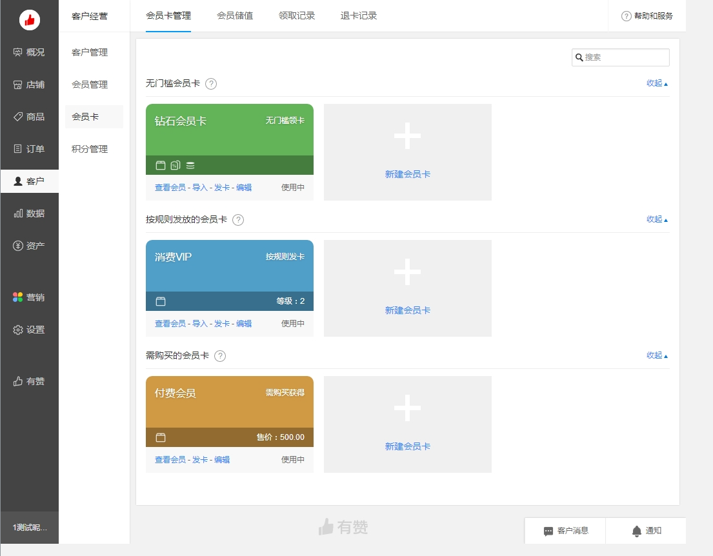

## 自定义Layout

①②③④⑤⑥⑦⑧⑨

希望做成下面的样子。


参考了




# 1 官方Layout

Pro 中默认会读取 `config/config.tsx` 中的 routes 配置作为 ProLayout 的菜单数据来生成菜单，并且配合 [`plugin-access`](https://umijs.org/plugins/plugin-access) 还可以很方便的进行菜单的权限管理。这个模式可以满足大部分需求，但是业务的复杂度总是在的，有些时候就需要一些高级的用法。


## 1.1 路由

路由必须全部定义吗？ 是不是可以动态的从服务器获取呢？

[看官方的文档，定义路由与约定路由](https://umijs.org/zh-CN/docs/routing)


## 1.2 菜单

有两种定义方式：


### ① 文件定义

`config.ts`来定义。


### ② 服务器定义

[看官方的说明](https://beta-pro.ant.design/docs/advanced-menu-cn)


## 1.3 默认Layout使用

在`app.tsx`初始化数据，

```tsx
export const layout = ({
  initialState,
}: {
  initialState: { settings?: LayoutSettings };
}): BasicLayoutProps => {
  return {
    rightContentRender: () => <RightContent />,
    footerRender: () => <Footer />,
    ...initialState?.settings,
  };
};
```


## 1.4 参考文档

* 官方文档
  * umi
    * [权限相关plugin-access](https://umijs.org/plugins/plugin-access) 
    * [路由](https://umijs.org/zh-CN/docs/routing)
  * Pro
    * [Pro菜单帮助文档](https://beta-pro.ant.design/docs/advanced-menu-cn)
    * [Pro常见问题关于menu的说明](https://beta-pro.ant.design/docs/faq-cn)
    * [Pro GitHub上的说明](https://github.com/ant-design/ant-design-pro/issues/6605)
  * ProComponents
    * [ProComponents关于菜单的定义](https://procomponents.ant.design/)


## 1.5 基本概念

路由+菜单+权限 是整个系统的核心。


突然有个奇怪的想法

```
路由必须要提前定义在config文件中或者是约定形式吗？ 能不能从服务器上取？
或者只定义一部分路由，另外一部分从服务器上取，然后实现动态路由？
```


我这个想法对吗？

```
为什么有这个想法，实际上想路由的过程中，又想到了权限，想如果不想让某些人访问某些路由怎么办？ 这实际上是一个权限问问，就没必要让路由解决了。

这个可以通过UMI的access来控制，另外这里的umi可能有安全漏洞(因为umi在前端，总觉得不保险)，所以后端的api接口，要做好第二层安全防护。

最后汇总一下：
把路由与权限搅和在一起了，实际上路由就是一个定义，例如你做静态页面，把不同文件放到不同文件夹中，到底能不能访问这些文件，那么要单独加一个权限控制。
```


我应该选择定义路由还是约定路由？

```
约定路由就是不用维护config文件了。
约定路由有以下不爽的：
1、指定个性化layout时，要在某个文件夹中约定一个_layout，
2、不能指定name,也就是要搭配menuRender来实现菜单的显示。

定义路由的好处：
1、可以随意定义了
2、坏处定义麻烦

我也没有用过约定路由，所以这种对比不客观，这个没有结论。
```


我选择了权限过滤，那么还用`menuDataRender`过滤菜单吗？

```
有两种可能性：
一种是过access滤掉了，那么还要menuDataRender有啥用？
一种是access没有过滤，就要用menuDataRender在过滤掉。

跟踪了antDesignPro的代码，在没有menuDataRender时，access会自动过滤掉菜单。

这里就要思考一个问题，都用access过滤了，为啥还要menuDataRender？
如果menuDataRender定义好了，access还会过滤掉吗？ 当然会了，这也是跟踪代码得到的

猜测一下antDesign为啥要用menuDataRender，可能基于以下原因：
你在config定义的菜单顺序时：菜单A  菜单B 菜单C . 实际上你想把菜单顺序改变成：菜单B 菜单A 菜单C。或者你使用的时约定式菜单，只能通过menuDataRender来处理。

那还有其他的功能吗？

```


menuDataRender怎么使用呢？ 假设是用默认的Layout，在app中使用。

下面有个例子，用来将菜单反转。当然实际情况下，这里要从服务器上获取。最好只获取一次，如果用户ID不变的话。不然又效率问题。

```tsx
export const layout = ({
  initialState,
}: {
  initialState: { settings?: LayoutSettings };
}): BasicLayoutProps => {
  return {
    rightContentRender: () => <RightContent />,
    footerRender: () => <Footer />,
    ...initialState?.settings,
    menuDataRender: (menuData: MenuDataItem[]) => {
      console.log(menuData);
      const aaa = menuData.reverse();
      console.log(aaa);
      return aaa;
    },
  };
};
```


使用menuDataRender与access，会不会每次URL改变都要刷新一次呢？ 会不会有效率问题。

```
access只会执行一次。这个会不会有bug，当切换用户的时候，会不会不会改变权限呢？

menuDataRender很烦，每次url变化都会执行，所以要做缓存处理。如果登录用户变化了，就做缓存。

```


上面那么多配置文件，有啥用途呢？

用途：

* 路由：config.ts文件
  * 配置path 、 access、对应的component
  * name、icon 用来做多语言或菜单
  *  其他的都是react routs的配置项了
* 路由：约定式
  * 如果配置access呢？
    * [官网有一个说明](https://umijs.org/zh-CN/docs/convention-routing)，没看懂，这样就与access无法关联，权限很难解决。
* 菜单：menuDataRender
  * 这里面没有配置权限的地方
* 权限：access.ts
  * 只返回一个map，是否包含某个权限。
  * 例如：{ admin:true, superadmin:false }


这几种配置文件，功能有重复的地方，到底怎么组合用呢？

汇总一下使用场景，结论是，config`与`access`就能解决大部分应用场景了。 约定路由有坑。

| 权限过滤 | 菜单顺序变化 | 约定路由 | 解决方案                                                     | 应用概率 |
| -------- | ------------ | -------- | ------------------------------------------------------------ | -------- |
| 无       | 无           | 无       | 方案1:<br>* config文件配置<br/>                              | 5%       |
| 有       | 无           | 无       | 方案2：<br>* config文件配置<br/>* access<br/>                | 85%      |
| 有       | 有           | 无       | 方案3:<br>* config文件配置<br/>* access<br/>* menuDataRender<br/> | 5%       |
| 有       | 有/无        | 有       | 方案4:<br>* access<br/>* menuDataRender<br/>                 | 5%       |
| 无       | 有/无        | 有       | 方案5:<br>* menuDataRender<br/>                              | 5%       |


config.ts文件是提前写死的，那么权限怎么做成活的呢？ 


所以config.ts文件只能标记成最小分割单元，例如下面代码示例，每个path一个权限单元。然后在后台可以添加不同的角色，然后定义某个角色对应的canShop。 当让这里也可以将 access:‘/shop’

```tsx
    // 新的一种布局
    {
      path: '/shop',
      layout: false,
      component: '@/layouts/nested',
      exact: false,
      icon: 'smile',
      access: 'canShop',     
      routes: [
        {
          name: 'overview',
          path: '/shop/overview',
          icon: 'HomeOutlined',
          access: 'canShopOverview', 
          routes: [
            {
              name: 'dashboard',
              path: '/shop/overview/dashboard',
              component: '@/pages/newLayout',
              access: 'canShopOverviewDashboard', 
            },
          ],
        },
    ............省略..................
```


这样做想名字，太麻烦了，另外一种操作是access与path名称相同。

```tsx
export default function (props: any) {
  console.log(
    '===================================================================',
  );
  console.log(props);
  return {
    '/shop/overview/dashboard': true,
    '/shop/overview': false,
    '/admin/user': false,
  };
}

```


就像方程式一样，又回归到最原始了的阶段，只有`path` 对应最小单元的权限，才能在服务器后台做权限分配。


既然大部分情况下，config.ts中的path与access相同，为什么access默认不是path呢？ 这样就能简化很多。


回到原点，如果 UMI的路由，启动一部分是可以动态定义的，那么就没有这么多问题了，因为config.ts文件是写死的，所以这个写死的文件，只能作为最小的权限单元，这样在后台才能动态分组。 如果config.ts中的路由是动态的，就好操作多了。


**结论： 路由必须要提前定义在config文件中或者是约定形式吗？ 能不能从服务器上取？**
**或者只定义一部分路由，另外一部分从服务器上取，然后实现动态路由？**


##  1.6 方案描述


### ① 访问权限

[UMI官方文档]

权限一直时 Pro 的弱项，在 Pro 中我们自研了一个权限组件但是表现不尽如人意。趁着这次机会我们升级了权限组件，无论使用方式和 API 都变得更加的简单，并且和我们的插件结合的更加完美。光商业吹捧是没有意义的，我们来看看代码。

```ts
// src/access.ts
export default function (initialState: { currentUser?: API.CurrentUser | undefined }) {
  const { currentUser } = initialState || {};
  return {
    canAdmin: currentUser && currentUser.access === 'admin',
    canDeleteFoo: (foo) => {
      return foo.ownerId === currentUser.userId;
    },
  };
}
```

我们可以看到这个是非常简单的，`initialState` 是一个默认的 `model` , 每次  `initialState` 的改变都会触发权限的重新计算，我们可以像 setState 一样触发它。在使用上我们使用了 umi@3 的能力让我们用起来更加的简单，只要在 root 中做如下配置，对于不能访问的页面，插件会将其替换为 403 页面，而无需手动支持。

```tsx
export const routes = [
  {
    path: '/pageA',
    component: 'PageA',
    access: 'canAdmin', // 权限定义返回值的某个 key
  },
];
```

对于运行时的代码，我们提供了两个 API 来帮助我们自定义任何形态的 UI 和逻辑， 这里有个一看就懂的 demo。

```tsx
import React from 'react';
import { useAccess, Access } from 'umi';

const PageA = (props) => {
  const { foo } = props;
  const access = useAccess(); // access 的成员: canAdmin

  if (access.canReadFoo) {
    // 如果可以读取 Foo，则...
  }

  return (
    <div>
      <Access accessible={access.canAdmin} fallback={<div>Can not read foo content.</div>}>
        Foo content.
      </Access>
      <Access accessible={access.canDeleteFoo(foo)} fallback={<div>Can not delete foo.</div>}>
        Delete foo.
      </Access>
    </div>
  );
};
```


# 2 自定义Layout


## 2.1 修改config文件

`layout: false`  并设置 `component: '@/layouts/nested'`

```tsx
    // 新的一种布局
    {
      path: '/shop',
      layout: false,
      component: '@/layouts/nested',
      exact: false,
      icon: 'smile',
      routes: []
    }    
```


## 2.2 公用组件

可以引用ant Pro umi的一些组件。例如：

```tsx
//直接引用ProLayout的接口，今后紧跟Pro的规范
import { BasicLayoutProps, ProSettings } from '@ant-design/pro-layout';
import { MenuDataItem } from '@ant-design/pro-layout/lib/typings';

//ant-design的工具类

//根据route来得到menu:
//用法getMenuData(route?.routes || [], menu, formatMessage, menuDataRender)
import getMenuData from '@ant-design/pro-layout/lib/utils/getMenuData';


import useCurrentMenuLayoutProps from '@ant-design/pro-layout/lib/utils/useCurrentMenuLayoutProps';

import compatibleLayout from '@ant-design/pro-layout/lib/utils/compatibleLayout';

import { getBreadcrumbProps } from '@ant-design/pro-layout/lib/utils/getBreadcrumbProps';

//引入ant-design组件
import { Layout, ConfigProvider } from 'antd';
const { Header, Footer, Sider, Content } = Layout;
import { useDeepCompareEffect } from '@ant-design/pro-utils';

//引入umi组件
import { getMatchMenu } from '@umijs/route-utils';
import { useIntl } from 'umi';

//第三方组件
import { stringify } from 'use-json-comparison';
import Omit from 'omit.js';
import useMergedState from 'rc-util/lib/hooks/useMergedState';

//得到页面的大小
import useAntdMediaQuery from 'use-media-antd-query';

//常用工具#####
import { isUrl, isImg } from '@ant-design/pro-utils';

//根据名称，获取Icon的方法
import Icon from '@ant-design/icons';


//自己定义的组件
import MainSider from './MainSider';
import SubSider from './SubSider';
import HeadderContent from './HeaderContent';
import MyFooter from '@/components/Footer';
import RightContent from '@/components/RightContent';
```


 ## 2.3 功能

* 根据route，得到菜单、面包屑列表。
* 根据URL，得到当前选中的菜单列表
  * getMatchMenu matchMenus  matchMenuKeys
  * 

