# 路由

React使用`react-router-dom`进行页面之间的封装。

[TOC]


# 1. 快速开始


## 1.1 安装

```sh
npm install react-router-dom --save
//或
yarn add react-router-dom　　
```


## 1.2 参考文档

* 官方文档
  * 官网说明：https://reactrouter.com/
  * [官方案例](https://reactrouter.com/web/guides/quick-start?__cf_chl_captcha_tk__=f72a04c097f832ad54bf37d45b1098da7ae021cb-1598220378-0-AQaNEM1Fly8yUQr2XCTY4XVByIEV7QQJxQwXRKh9ABMtRII-YY7jQeQ53iyIlDzC76lZlxj_8kt3X5LnUkaVNo8AuspHdeFPUdx7jPQf8eY8o-6lzsW0P9jZcA5NV3SbO7DbsiAW7pgD870EMdcaAr0TcNceiYoRe_CDhxeCYqObgInqbLPh-gC3zUJEf30z7bJUvsI2yXQU0eALON6zM0RYjZSaXRtRIZsyOuITM7C8KcgsVQ3GF_y0EGNIHckiFy_IcQDH5RUbJPdfi_RvCkGgUSS9MoJH6H364c8Kd7wKMTE8MbEI-elLxpVjxN3QUJ3QOiwhIPhy9Bz0NA3tHU2AzmXzaD7-W3z-ingiZ_39quv4TgIBFoHSWB7FNzvMLbBGov2K4zg2AypTEYSkYnzVtMTHRgNmDTA8gn8QrzgJltvwYEZdVY_gKZbDlvu6EcOAu_96fzN6SJh8dWgJaC2VNCmWv4HGjBfpuBF4eEYxNJZm0OOcDdtZcKf-eBUYaSzSdbxhRVdq6WqNa_nW_GM)
* 其他参考文档
  * [React全家桶（四）Router 4.0路由实战演练](https://www.cnblogs.com/huiguniang/p/11875850.html)
  * [React-router5.x 路由的使用及配置](https://www.cnblogs.com/cckui/p/11490372.html)


## 1.3 基本概念


> 主要概念

react-router-dom：基于浏览器的路由（包含react-router），提供了BrowerRouter，HashRouter，Route，Link，NavLink。提供了一些router的核心api，包括Router，Route，Switch等


###   ① Hash与Browser

1. HashRouter

   `http://localhost:3000/#/admin/buttons　　`

2. BrowserRouter

   `http://localhost:3000/admin/buttons`


### ② 主要组件

* 标签
  * BrowserRouter as Router,
  * Switch,
  * Route,
  * Link,
  * Redirect,
* 钩子
  * useRouteMatch,

  * useParams
  * useHistory,
  * useLocation


# 2. 基本用法


## 2.1 标签

最外围用`Router`包裹。

`Link` 实现导航菜单功能，`to`要跳转的页面。

点击后，由后面的`Switch`拦截，其中`Route` 用来配置path


```jsx
<Router>
	<Link to="/">Home</Link>
	<Link to="/about">About</Link>
	
	<Switch>
		<Route exact path="/">
            <Home />
        </Route>
	</Switch>
</Router>
```

### ①  Router

> basename

可以追加一个域名前缀

```jsx
<BrowserRouter basename="/calendar">
    <Link to="/today"/> // renders <a href="/calendar/today">
    <Link to="/tomorrow"/> // renders <a href="/calendar/tomorrow">
    ...
</BrowserRouter>
```


### ② Link

可以添加不同的参数

```jsx
<Link to="/about">About</Link>
<Link to="/courses?sort=name" />

<Link
  to={{
    pathname: "/courses",
    search: "?sort=name",
    hash: "#the-hash",
    state: { fromDashboard: true }
  }}
/>

<Link to={location => ({ ...location, pathname: "/courses" })} />
```


### ③ Switch

> location: object

可以看4.14章节，通过Switch的location来进行弹出层的配置。


### ④ Route


> exact: bool  是否精确匹配

|  path  | location.pathname |  exact  | matches? |
| :----: | :---------------: | :-----: | :------: |
| `/one` |    `/one/two`     | `true`  |    no    |
| `/one` |    `/one/two`     | `false` |   yes    |


> 默认参数

默认会向子组件传递三个参数

* match

* location

* history


> 刷新方法

有三种方法，可以有不同的写法

* `<Route component>`
* `<Route render>`
* `<Route children>` function


component

```jsx
function User(props) {
  return <h1>Hello {props.match.params.username}!</h1>;
}
<Route path="/user/:username" component={User} />

//普通的做法
<Route path="/home" render={() => <div>Home</div>} />
```


render

```jsx
//自己组建
// wrapping/composing
// You can spread routeProps to make them available to your rendered Component
function FadingRoute({ component: Component, ...rest }) {
  return (
    <Route
      {...rest}
      render={routeProps => (
        <FadeIn>
          <Component {...routeProps} />
        </FadeIn>
      )}
    />
  );
}

//如何使用
<Router>
    <FadingRoute path="/cool" component={Something} />
</Router>
```


children: 可以传递一些参数

```jsx
<Route
      path={to}
      children={({ match }) => (
        <li className={match ? "active" : ""}>
          <Link to={to} {...rest} />
        </li>
      )}
    />
```


## 2.2 钩子


###   ①  useRouteMatch

```jsx
//path 对应:<Route exact path="/">中的path，有可能是通配符
//url是一个链接
let { path, url } = useRouteMatch();
```


### ② useParams

`useParams` 返回URL参数总的 key/value Ojbect. 用来 `match.params` 当前的 `<Route>`.

```jsx
function BlogPost() {
  let { slug } = useParams();
  return <div>Now showing post {slug}</div>;
}

ReactDOM.render(
  <Router>
    <Switch>
      <Route exact path="/">
        <HomePage />
      </Route>
      <Route path="/blog/:slug">
        <BlogPost />
      </Route>
    </Switch>
  </Router>,
);
```


### ③ useHistory

```jsx
let history = useHistory();
console.log(history)

function handleClick() {
    history.push("/02-advance/01-dragList");
    //history.goBack();
}
```


### ④ useLocation

用来在页面跳转之间传递数据。


# 3. 常见需求


## 3.1 如何打开新页面？

### ①  弹出新页面

在`Link`中添加`target="_blank"`

### ②  Js跳转方法

```
history.push('/download')
```

跳转到外链：

```
window.location.href = 'https://你的url'
```

### ③ 当前页面嵌套

在`Swith`中拦截


### ④ 刷新当前页面

有一个专有的页面，这个页面没有`Link`，只有`Switch Route`来显示页面。


### ⑤ Redirect跳转

`Redirect`的用法

```jsx
<Switch>
  <Redirect from='/old-path' to='/new-path' />
  <Route path='/new-path'>
    <Place />
  </Route>
</Switch>
```

`to` 的复杂用法

```jsx
<Redirect
  to={{
    pathname: "/login",
    search: "?utm=your+face",
    state: { referrer: currentLocation }
  }}
/>
```


## 3.2 如何传递参数？


### ①  URL参数

```jsx
<Switch>
    <Route path="/:id" children={<Child />} />
</Switch>
....................................

let { id } = useParams();
```


### ② Query 参数

```jsx
<Link to="/account?name=yahoo">Yahoo</Link>
//或者
<Link to={{
        pathname:"/account",
        search: "name=yahoo122&age=12",
    }}>Yahoo</Link>

......................................
//自定义钩子
function useQuery() {
  return new URLSearchParams(useLocation().search);
}
......................................

//使用
let query = useQuery();
{query.get("name")}

```


## 3.3 404跳转页面？

通过Route来实现

* 根目录`/` 通过 exact 来匹配
* 放在最后，通过`<Route path="*">`匹配到404
* 如果想强行跳转，通过`<Redirect to="/will-match" />`


## 3.4 如何返回上一页？

通过useHistory来实现。

```jsx
let history = useHistory();
history.goBack();

//也可以跳转到另外一个页面

history.push("/home");
```


## 3.5 如何定义菜单？

### ① 样式调整

可以通过CSS来去掉颜色与下划线，下面给出了要给例子

```css
.headerLink{
    color:rgba(255,255,255,.95);
    text-decoration:none;
    margin-left: 35px;
    cursor:pointer;
}
```


### ② 封装Link

> 封装一个用来标记选中的Link

主要使用`useRouteMatch`，判断是否与当前的链接匹配

```jsx
let match = useRouteMatch({
  path: to,
  exact: activeOnlyWhenExact
});

{match && "> "}
```


## 3.6 如何做权限校验？

[参考代码](https://reactrouter.com/web/example/auth-workflow)

### ①  第一步：定义一个标签

将这个标签放到`Switch`中

```jsx
        <Switch>
          <Route path="/public">
            <PublicPage />
          </Route>
          <Route path="/login">
            <LoginPage />
          </Route>
          <PrivateRoute path="/protected">
            <ProtectedPage />
          </PrivateRoute>
        </Switch>
```


### ②  第二步：实现标签

在标签中判断，如果登陆了，就跳转到指定的页面，否则跳转到login页面

在跳转到login页面前，通过location将当前页面设置过去，这样login后可以返回。


### ③ 第三步：实现login

在login中得到从那个页面来，并且调用登陆函数，如果登陆成功，就跳转到那个页面。这里使用了`history.replace(from);`


```jsx
function LoginPage() {
  let history = useHistory();
  let location = useLocation();

  let { from } = location.state || { from: { pathname: "/" } };
  let login = () => {
    fakeAuth.authenticate(() => {
      history.replace(from);
    });
  };

  return (
    <div>
      <p>You must log in to view the page at {from.pathname}</p>
      <button onClick={login}>Log in</button>
    </div>
  );
}
```


## 3.7 Route渲染的方法

### ①  children

```jsx
<Route path="/:id" children={<Child />} />
```


### ②  component

```jsx
<Route path="/:id" component={Child} />
```


### ③ render

```jsx
function PrivateRoute({ children, ...rest }) {
  return (
    <Route
      {...rest}
      render={({ location }) =>
        fakeAuth.isAuthenticated ? (
          children
        ) : (
          <Redirect
            to={{
              pathname: "/login",
              state: { from: location }
            }}
          />
        )
      }
    />
  );
}
```


# 4. 官方案例


## 4.1 基本用法

有三个链接，点击后，分别显示出对应的组件。

使用了：`<Router>`   ,  `<Link>`,    `<Switch>` , `<Rout>`

[参考代码](https://reactrouter.com/web/example/basic)

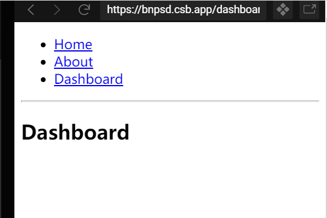


### -关键点：`Router Link Switch Rout`


## 4.2 Url参数

点击下面的链接，会将url后面的内容，作为参数传递。

使用了下面的新功能：

* `<Route path="/:id" children={<Child />} />`   Route中带有一个`:`
  * 也可以使用component,   `<Route path="/:id" component={Child} />`
* `let { id } = useParams()`  使用了`useParams`


[参考代码](https://reactrouter.com/web/example/url-params)

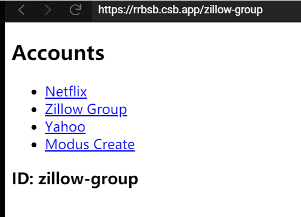


### -关键点：`useParams  :id`


## 4.3 嵌套使用

点击第一层菜单后，出现下面的内容。 点击`Topics`页面中的链接后，出现详细的信息。

* 第一层中使用了基本的用法。
* 第二层`Topics`中用到了以下特殊用法：
  * `let { path, url } = useRouteMatch();`
    * 这里的path与url，用来撰写子`Link Switch Route`
* 第三层与`Url参数`章节的写法一样，通过参数得到了信息。


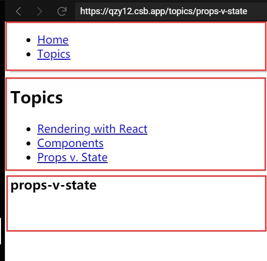


### -关键点：`useRouteMatch`


## 4.4 安全校验

点击`Public Page`可以访问，但是点击`Protected Page`需要登陆后才可以访问。

[相关代码](https://reactrouter.com/web/example/auth-workflow)

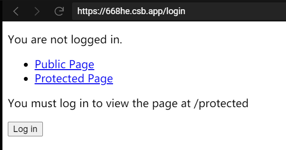


### ① 模拟登陆

定义一个全局变量`isAuthenticated`，模拟登陆

```jsx
const fakeAuth = {
  isAuthenticated: false,
  authenticate(cb) {
    fakeAuth.isAuthenticated = true;
    setTimeout(cb, 100); // fake async
  },
  signout(cb) {
    fakeAuth.isAuthenticated = false;
    setTimeout(cb, 100);
  }
};
```


### ②  安全标签

> 功能描述

如果发现没有登陆，那么就跳转到登陆页面，同时将从那里来传递给登陆页面。


> 实现方法

这里定义了一个`<PrivateRoute>`标签。使用了下面的功能

* `<Route>` 中的`render`
  * render: func 。 与`component`的区别是不用新创建一个对象，直接输出。
* 如果没有登陆，使用了`Redirect`，跳转到登陆页面。
  * 这里设置了一个中间变量`state`

```jsx
function PrivateRoute({ children, ...rest }) {
  return (
    <Route
      {...rest}
      render={({ location }) =>
        fakeAuth.isAuthenticated ? (
          children
        ) : (
          <Redirect
            to={{
              pathname: "/login",
              state: { from: location }
            }}
          />
        )
      }
    />
  );
}
```


`Redirect`的用法

```jsx
<Switch>
  <Redirect from='/old-path' to='/new-path' />
  <Route path='/new-path'>
    <Place />
  </Route>
</Switch>
```

`to` 的复杂用法

```jsx
<Redirect
  to={{
    pathname: "/login",
    search: "?utm=your+face",
    state: { referrer: currentLocation }
  }}
/>
```


### ③ 登陆逻辑


使用了`history`来跳转到要去的页面。

使用`location`得到上一个页面传递过来的数据。

```jsx
function LoginPage() {
  let history = useHistory();
  let location = useLocation();

  let { from } = location.state || { from: { pathname: "/" } };
  let login = () => {
    fakeAuth.authenticate(() => {
      history.replace(from);
    });
  };

  return (
    <div>
      <p>You must log in to view the page at {from.pathname}</p>
      <button onClick={login}>Log in</button>
    </div>
  );
}
```


### -关键点：`useHistory useLocation Redirect`


## 4.5 自定义Link标签

[相关代码](https://reactrouter.com/web/example/custom-link) ，自己可以定义标签的样式。

当点击某个标签后，可以显示一个`>`

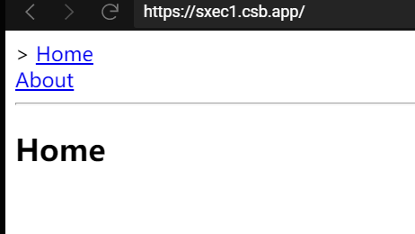


> 实现原理

使用了`useRouteMatch`来判断是否选中，如果选中，那么就显示`>`

```jsx
function OldSchoolMenuLink({ label, to, activeOnlyWhenExact }) {
  let match = useRouteMatch({
    path: to,
    exact: activeOnlyWhenExact
  });

  return (
    <div className={match ? "active" : ""}>
      {match && "> "}
      <Link to={to}>{label}</Link>
    </div>
  );
}
```

### -关键点：`useRouteMatch`


## 4.6 离开提醒

在`form`中，如果在text中输入内容，不点击`Submit to stop blocking`,点击 其他链接，那么就弹出框，提示是否要离开。[代码](https://reactrouter.com/web/example/preventing-transitions)

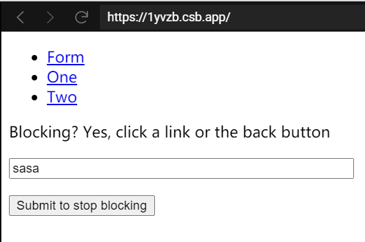


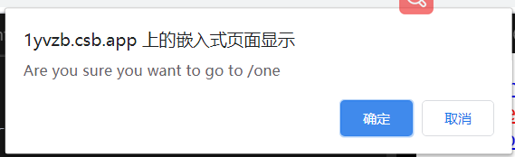


通过`useState` 来设置`isBlocking`

```jsx
<Prompt
    when={isBlocking}
    message={location =>
    `Are you sure you want to go to ${location.pathname}`
            }
/>
```

### -关键点：`<Prompt>`


## 4.7 404页面

如果点击后两个，就显示404页面，并显示要跳转的链接。[详细代码](https://reactrouter.com/web/example/no-match)


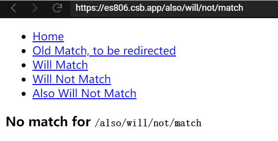

> 几个关键点

在一个`Route` 可以嵌套`Redirect`，来跳转到相应的页面。

```jsx
<Route path="/old-match">
    <Redirect to="/will-match" />
</Route>
```


把这段代码放在最后，然后显示404页面。

```jsx
<Route path="*">
    <NoMatch />
</Route>
```


使用`let location = useLocation();`  然后通过`location.pathname`得到要访问的页面。

```jsx
function NoMatch() {
  let location = useLocation();
  return (
    <div>
      <h3>
        No match for <code>{location.pathname}</code>
      </h3>
    </div>
  );
}
```


### -关键点：`<Redirect>  <Route path="*">  useLocation()`


## 4.8 循环菜单

[相关代码](https://reactrouter.com/web/example/recursive-paths). 点击第一个标签后，会显示下一个人的好友，还可以继续点击。

实现的主要原理是：在不同的标签里面再撰写`<Link> <Switch> <Route> `


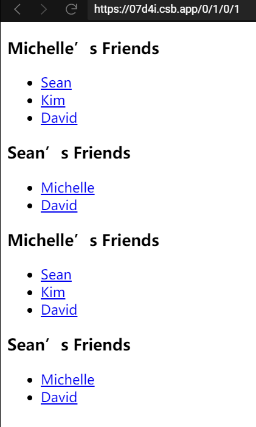


## 4.9 左侧菜单

左侧的菜单，可以控制下面两个区域。

其实很简单，就是在这个页面中，添加两个`Switch`区域。 [详细代码见](https://reactrouter.com/web/example/sidebar)

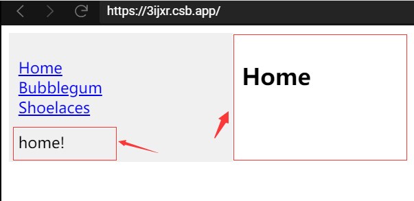


## 4.11 可配置菜单

把整个菜单配置到一个常量中，[详细代码点击这里](https://reactrouter.com/web/example/route-config)

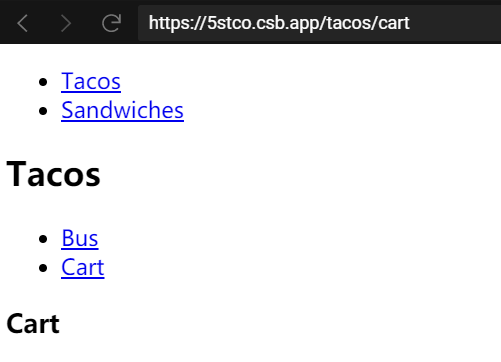


核心是定义了一个标签，这个标签可以循环显示子菜单。

### ①  定义配置项

这里面有`component`很重要。

```jsx
const routes = [
  {
    path: "/sandwiches",
    component: Sandwiches
  },
  {
    path: "/tacos",
    component: Tacos,
    routes: [
      {
        path: "/tacos/bus",
        component: Bus
      },
      {
        path: "/tacos/cart",
        component: Cart
      }
    ]
  }
];
```


### ②  定义循环标签

`<route.component {...props} routes={route.routes} />`  其中 `route.component`是定义在配置文件中的显示组件。

```jsx
function RouteWithSubRoutes(route) {
  return (
    <Route
      path={route.path}
      render={props => (
        // pass the sub-routes down to keep nesting
        <route.component {...props} routes={route.routes} />
      )}
    />
  );
}
```


在主窗口中，将菜单全部循环出来，用`RouteWithSubRoutes`显示，并将参数传递到子组件。

```jsx
        <Switch>
          {routes.map((route, i) => (
            <RouteWithSubRoutes key={i} {...route} />
          ))}
        </Switch>
```


### ③ 子组件得到参数

`function Tacos({ routes }) ` 中通过`routes`得到上面传入的参数。

```jsx
function Tacos({ routes }) {
  return (
    <div>
      <h2>Tacos</h2>
      <ul>
        <li>
          <Link to="/tacos/bus">Bus</Link>
        </li>
        <li>
          <Link to="/tacos/cart">Cart</Link>
        </li>
      </ul>

      <Switch>
        {routes.map((route, i) => (
          <RouteWithSubRoutes key={i} {...route} />
        ))}
      </Switch>
    </div>
  );
}
```


## 4.12 两页面复用

点击不同的链接，切换到不同的页面中。[详细代码](https://reactrouter.com/web/example/modal-gallery)


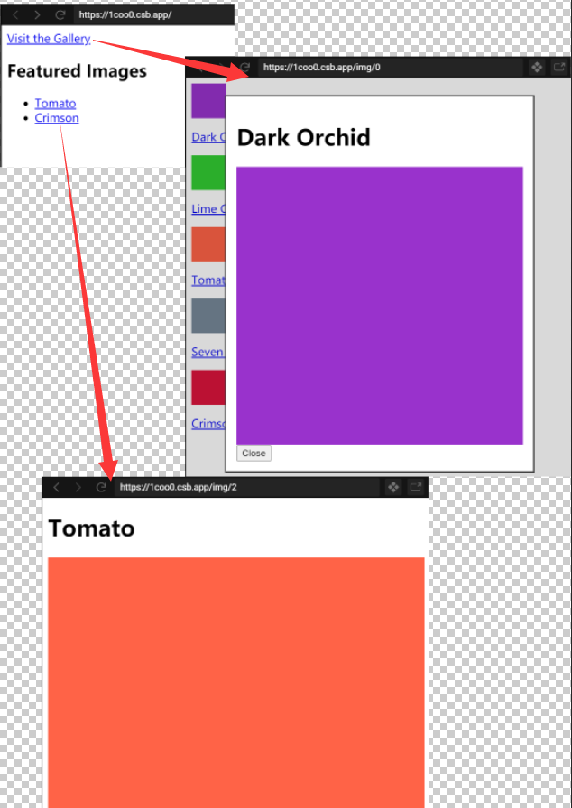


### ①  如何切换页面？

其实很简单，就是在`default`页面中没有`<Link>` ，而在其中的一个页面中有相关的`<Link>`


### ② 如何重用页面？

看下一个，如何在弹出层中，还能重用页面。

### ③  如何弹出层？

> 第一步：在弹出层的Link中设置location

把当前页面的location,作为`background`

```jsx
        <Link
          key={i.id}
          to={{
            pathname: `/img/${i.id}`,
            // This is the trick! This link sets
            // the `background` in location state.
            state: { background: location }
          }}
        >
```


> 第二步：Switch中设置 location，并在Switch以外追加<Route>

```jsx
  return (
    <div>
      <Switch location={background || location}>
        <Route exact path="/" children={<Home />} />
        <Route path="/gallery" children={<Gallery />} />
        <Route path="/img/:id" children={<ImageView />} />
      </Switch>

      {/* Show the modal when a background page is set */}
      {background && <Route path="/img/:id" children={<Modal />} />}
    </div>
  );
```


> 第三步：修改弹出层的样式

做了两个框，其中一个框是透明的。 而另外一个有边框，不透明。

```jsx
  return (
    <div
      onClick={back}
      style={{
        position: "absolute",
        top: 0,
        left: 0,
        bottom: 0,
        right: 0,
        background: "rgba(0, 0, 0, 0.15)"
      }}
    >
      <div
        className="modal"
        style={{
          position: "absolute",
          background: "#fff",
          top: 25,
          left: "10%",
          right: "10%",
          padding: 15,
          border: "2px solid #444"
        }}
      >
        <h1>{image.title}</h1>
        <Image color={image.color} />
        <button type="button" onClick={back}>
          Close
        </button>
      </div>
    </div>
  );
```


### -关键点：`<Switch location={...}>`


## 4.13 静态StaticRouter

这在服务器端渲染场景中非常有用，因为用户实际上没有点击，所以位置实际上并未发生变化。因此，名称是（静态的）。当你只需要插入一个位置，并在渲染输出上作出断言以便进行简单测试时，它也很有用。

[参考代码](https://reactrouter.com/web/example/static-router)

实际上没有看明白这个的用途


## 4.14 获取检索参数

得到`https://mfh8p.csb.app/account?name=netflix&age=10` 后面的参数：`name`  ,`age`

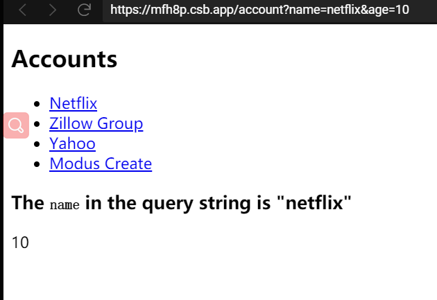


### ①  Link中传递参数

```
<Link to="/account?name=modus-create&age=10">Modus Create</Link>
```


### ② 创建钩子捕获参数

```jsx
function useQuery() {
  return new URLSearchParams(useLocation().search);
}
```


### ③  在页面中使用

```jsx
  let query = useQuery();
  console.log(query.get("age"))
```


### -关键点：`URLSearchParams useLocation().search`


# 5. 思考与实践


## 5.1 动态加载文件

自己写一个测试页面，每次都要修改index.js来加载，很麻烦，能不能动态加载某个目录下的页面呢？

[详细代码参考这里吧](https://github.com/kyjm/react-hooks-example/blob/master/src/App.js)


### ①  便利目录下文件

```jsx
function getLeftMenu(path){
    const req=require.context(`./03-reactrouter`, false, /\.js$/);;
    let ren= req.keys().map(key=>{
        const prts = key.replace(/js/g, '').split(/[./]/).filter(x => x)
        const fullpath = path + '/' + prts.join('/')
        const fileName = prts[0]
        return {
            fileName,
            path:fullpath,
            component : req(key).default
        };
    });
    return ren;
}
```


### ②  动态载入文件

> 仅载入一个文件

使用require(XXX)，可以载入一个文件

```jsx
let req1=require(`.${url}`);
<Route key={url} component={req1.default} path={url} />
```


> 批量载入整个目录的文件

例如上节的`component : req(key).default`

```jsx
// routers == getLeftMenu得到

{routers.map((x, i) => {
    return <Route key={x.path} component={x.component} path={x.path} />
})}
```


## 5.2 脚手架

当然通过上面的知识，自己也可以封装一个路由，但并不建议用。

因为现在有很多类似的脚手架，使用一个更新速度较快，大家比骄推荐的脚手架就可以了。

由于要用到antDesign，这里推荐看一下UMI