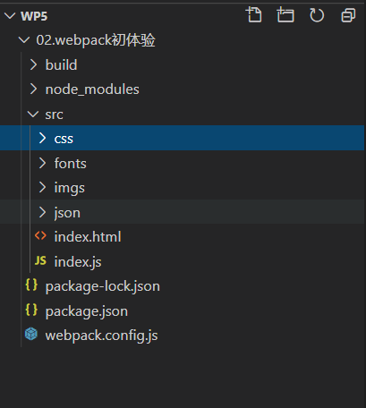
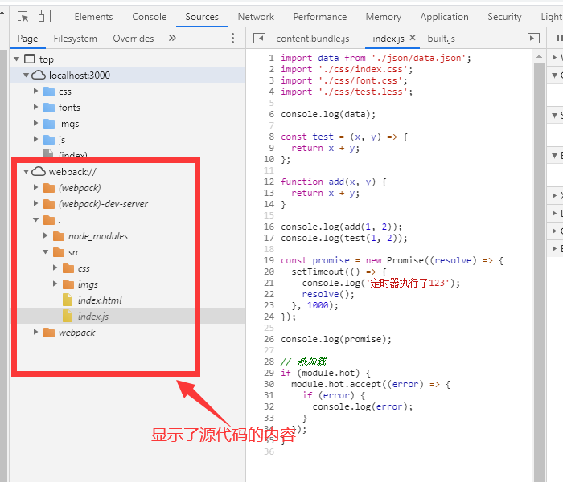

# webpack


参考网址：

* https://www.webpackjs.com/
* https://blog.csdn.net/z591391960/article/details/105612471
* [尚硅谷视频教程](https://www.bilibili.com/video/BV1e7411j7T5)
* [深入浅出 Webpack](http://www.xbhub.com/wiki/webpack/)


# 1. 快速开始


## 1.1 前提条件

在开始之前，请确保安装了 [Node.js](https://nodejs.org/en/) 的最新版本。


## 1.2 安装

```shell
mkdir webpack-demo && cd webpack-demo
npm init -y
npm install webpack webpack-cli webpack-dev-server --save-dev
```


## 1.3 创建工程

**project**

```diff
  webpack-demo
  |- package.json
+ |- index.html
+ |- /src
+   |- index.js
```

**src/index.js**

```js
document.write("入口js is loaded");
```

**index.hmtl**

```html
<!DOCTYPE html>
<html lang="en">
  <head>
    <meta charset="UTF-8" />
    <meta name="viewport" content="width=device-width, initial-scale=1.0" />
    <title>Document</title>
  </head>
  <body>
    <script src="/dist/main.js"></script>
  </body>
</html>
```


## 1.4 打包

```shell
npx webpack
```

也可以使用

```shell
npx webpack-dev-server
```


## 1.5 其他


```shell
npm install css-loader --save-dev
npm install style-loader --save-dev
```


# 2. 入门案例


## 2.1 规划

具体功能如下：

* 需要引入 react 和 react-dom包
* 打包识别特殊组件
  * 识别react的jsx文件
  * 将es6代码打包
  * 将Html文件打包
* 启动预览服务
* 可以进行热加载
* 可以进行缓存

## 2.2 安装组件

```shell
# 建立目录
mkdir wp-react

# 初始化工程
npm init -y

# 引入react包
npm install react react-dom

# 引入webpack包 
npm install webpack webpack-cli webpack-dev-server --save-dev

# 引入babel babel是一个node命令行工具，它的作用是对我们源代码进行转码
npm install --save-dev @babel/core
npm install --save-dev @babel/cli

# preset-env es6=>es5   preset-react react 
npm install --save-dev @babel/preset-env @babel/preset-react

# babel-loader 模块转换器，也就是将模块的内容按照需求装换成新内容，而且每个Loader的职责都是单一，只会完成一种转换，所以我们一般对源文件的处理，也是由多个Loader以链式顺序执行的方式来进行多次装换，然后得到我们要的结果。
npm install --save-dev babel-loader

# html-webpack-plugin 的作用是：当使用 webpack打包时，创建一个 html 文件，并把 webpack 打包后的静态文件自动插入到这个 html 文件当中。
npm install --save-dev html-webpack-plugin

#性能优化速度
npm install --save-dev  webpack-bundle-analyzer 
```


还有其他常用的babel组件

- [@babel/preset-env](https://babeljs.io/docs/en/babel-preset-env)
- [@babel/preset-flow](https://babeljs.io/docs/en/babel-preset-flow)
- [@babel/preset-react](https://babeljs.io/docs/en/babel-preset-react)
- [@babel/preset-typescript](https://babeljs.io/docs/en/babel-preset-typescript)


```shell
npx webpack
npx webpack-dev-server --open
```


也可以在`package.json` 中配置


## 2.3 配置`package.json`

主要是可以在命令行下使用`npm build`

```json
  "scripts": {
    "test": "echo \"Error: no test specified\" && exit 1",
    "build": "npx webpack --mode production",
    "start": "npx webpack-dev-server --modle development --open"
  },
```


## 2.4 追加项目文件

scr 下追加下面的文件

* App.jsx
* index.html
* index.jsx


### ① index.html

会自动将js追加到这个文件中的。

```html
<!DOCTYPE html>
<html lang="en">
  <head>
    <meta charset="UTF-8" />
    <meta name="viewport" content="width=device-width, initial-scale=1.0" />
    <title>Document</title>
  </head>
  <body>
    <div id="app"></div>
  </body>
</html>
```


### ② index.jsx

入口文件

```jsx
import App from "./App";

// 热加载
if (module.hot) {
  module.hot.accept((error) => {
    if (error) {
      console.log(error);
    }
  });
}
```


### ③ App.jsx

典型的一个react文件

```jsx
import React from "react";
import ReactDom from "react-dom";

const App = () => {
  return (
    <div>
      <h1>你哈sss dkdkd</h1>
    </div>
  );
};

export default App;
ReactDom.render(<App />, document.getElementById("app"));
```


## 2.5 打包配置

新建并配置：`webpack.config.js`

```js
const HtmlWebPackPlugin = require("html-webpack-plugin");
const path = require("path");
const webpack = require("webpack");

module.exports = {
  // 在进行require时，不用带文件的后缀
  resolve: {
    extensions: [".wasm", ".mjs", ".js", ".jsx", ".json"],
  },
  // 得到入口文件路径
  entry: path.resolve(__dirname, "src/index.jsx"),

  //配置内容
  module: {
    rules: [
      {
        //配置jsx文件
        test: /\.jsx?/,
        //忽略掉库文件
        exclude: /node_modules/,
        use: {
          loader: "babel-loader",
          options: {
            babelrc: false,
            presets: [
              require.resolve("@babel/preset-react"),
              [require.resolve("@babel/preset-env", { module: false })],
            ],
            cacheDirectory: true,
          },
        },
      },
    ],
  },

  //插件
  plugins: [
    //js添加到html中的插件
    new HtmlWebPackPlugin({
      template: path.resolve(__dirname, "src/index.html"),
      filename: "index.html",
    }),
    //热更新插件
    new webpack.HotModuleReplacementPlugin(),
  ],

  //配置预览server
  devServer: {
    //预览server可以热更新
    hot: true,
  },
};

```


## 2.6 运行程序

执行下面命令，可以打开浏览器。变更App.jsx中的内容，可以在浏览器中实时看到结果。

```powershell
npm start
```


## 2.7 性能优化

* 打包优化
* 执行优化


> 优化思路

* 减少干活总量
  * 使用缓存
  * 压缩代码
    * 去掉类库
    * 去掉调试代码
* 增加干活的人
  * 多线程


# 3. 深入理解


 ## 3.1 核心概念

* Entry
* Output
* Loader
* Plugins
* Mode
  * development 开发模式
  * production 生产模式


## 3.2 初体验


### 3.2.1 打包Js与Json

1. webpack能 处理js/json资源，不能处理css/ img等其他资源
2. 生产环境和开发环境将ES6模块化编译成浏览器能识别的模块化~
3. 生产环境比开发环境多一个压缩js代码。


```shell
npm init 
npm i webpack webpack-cli --save-dev

mkdir src, build

cd src
new-item index.js
new-item data.js
```


> index.js

```js
import data from "./data.json";

import "./index.css";

console.log(data);

function add(x, y) {
  return x + y;
}

console.log(add(1, 2));
```


> html

在build下建立index.html

```html
<!DOCTYPE html>
<html lang="en">
  <head>
    <meta charset="UTF-8" />
    <meta name="viewport" content="width=device-width, initial-scale=1.0" />
    <title>Document</title>
  </head>
  <body>
    <script src="./built.js"></script>
  </body>
</html>

```


> 运行html可以看到输出结果


### 3.2.2 打包资源文件

要使用loader来进行翻译。

`npm run-script build`


#### ① CSS 文件

安装loader

```
npm i --save-dev style-loader css-loader
```


配置webpack.config.js

```js
const { resolve } = require("path");

module.exports = {
  entry: "./src/index.js",
  output: {
    filename: "built.js",
    path: resolve(__dirname, "build"),
  },

  module: {
    rules: [
      {
        test: /\.css$/,
        use: [
          //创建style标签，添加到html head
          "style-loader",
          //将css文件变成commonjs
          "css-loader",
        ],
      },
    ],
  },
  plugins: [],
  mode: "development",
};

```


#### ② Less文件

安装loader，假设上一步已经完成了。

```
npm i --save-dev less less-loader
```


在webpack.config.js中，追加一个解析less的rules

```js
      {
        test: /\.less$/,
        use: [
          //创建style标签，添加到html head
          "style-loader",
          //将css文件变成commonjs
          "css-loader",
          //将less转成css
          "less-loader",
        ],
      },
```


#### ③ html文件

这里要引用plugin，分成三步：下载、引用、使用

```
npm i --save-dev html-webpack-plugin
```


在webpack.config.js 中，添加引用，以及plugin

```js
 //引用
const HtmlWebpackPlugin = require("html-webpack-plugin"); 

......................

 plugins: [
    //功能:默认会创建- -个空的HTML，自动引入打包输出的所有资源(JS/CSS)
    //template 指定要复制的html文件
    new HtmlWebpackPlugin({
      template: "./src/index.html",
    }),
  ],
```


#### ④ 图片文件

下载

```
npm i --save-dev url-loader file-loader  html-loader
```


在webpack.config.js中添加loader

```js
      //处理css中的图片文件
      {
        test: /\.jpg|png|gif$/,
        loader: "url-loader",

        options: {
          //图片小于8kb，就会处理成base64
          limit: 8 * 1024,
          //避免与下面html中的img冲突
          esModule: false,
        },
      },
      //处理html中的图片文件
      {
        test: /\.html$/,
        loader: "html-loader",
      },
```

如果只有一个，用`loader`，如果有多个，用`use`. 图片名称都会被改变的。


#### ⑤ 其他资源文件

其他资源文件，使用到了`file-loader`，这个已经下载了，就不用下载了。

> 下载资源文件放入 fonts目录中


> 在css目录中，建立font.css文件


> 在index.js 中引入 font.css文件

```js
import "./css/font.css";
```


> 在html 文件中添加图标

```html
 <span class="icon-cheveron-down"></span>
```


> 在webpack.config.js中进行配置

```js
      //打包其他文件
      {
        //排除其他文件
        exclude: /\.html|jpg|png|gif|less|css|js|jsx$/,
        loader: "file-loader",
      },
```


> 生成代码

```shell
npm run-script build
```


## 3.3 实时预览

### ① 安装

```shell
npm i --save-dev webpack-dev-server
```


### ② 配置

```js
  //实时预览,只在内储存中输出
  devServer: {
    contentBase: resolve(__dirname, "build"),
    //启动压缩
    compress: true,
    //端口
    port: 3000,
  },
```


### ③ 启动

```shell
npx webpack-dev-server --open
```


## 3.4 代码汇总

目录结构




webpack.config.js

```js
const { resolve } = require("path");
//引用
const HtmlWebpackPlugin = require("html-webpack-plugin");

module.exports = {
  entry: "./src/index.js",
  output: {
    filename: "built.js",
    path: resolve(__dirname, "build"),
  },

  module: {
    rules: [
      {
        test: /\.css$/,
        use: [
          //创建style标签，添加到html head
          "style-loader",
          //将css文件变成commonjs
          "css-loader",
        ],
      },
      {
        test: /\.less$/,
        use: [
          //创建style标签，添加到html head
          "style-loader",
          //将css文件变成commonjs
          "css-loader",
          //将less转成css
          "less-loader",
        ],
      },
      //处理css中的图片文件
      {
        test: /\.jpg|png|gif$/,
        loader: "url-loader",

        options: {
          //图片小于8kb，就会处理成base64
          limit: 8 * 1024,
          //避免与下面html中的img冲突
          esModule: false,
        },
      },
      //处理html中的图片文件
      {
        test: /\.html$/,
        loader: "html-loader",
      },
      //打包其他文件
      {
        //排除其他文件
        exclude: /\.html|jpg|png|gif|less|css|js|jsx$/,
        loader: "file-loader",
      },
    ],
  },
  plugins: [
    //功能:默认会创建- -个空的HTML，自动引入打包输出的所有资源(JS/CSS)
    //template 指定要复制的html文件
    new HtmlWebpackPlugin({
      template: "./src/index.html",
    }),
  ],
  mode: "development",
  //实时预览,只在内储存中输出
  devServer: {
    contentBase: resolve(__dirname, "build"),
    //启动压缩
    compress: true,
    //端口
    port: 3000,
  },
};

```


## 3.5 打包子目录

现在打包都生成一个文件，那么有没有可能将下面分解成目录

* js
* imgs
* fonts
* css ?
  * css没有自己的目录，因为被放到了js目录中。


webpack.config.js 中添加了下面的代码

```diff
const { resolve } = require("path");
//引用
const HtmlWebpackPlugin = require("html-webpack-plugin");

module.exports = {
  entry: "./src/index.js",
  output: {
+    filename: "js/built.js",
    path: resolve(__dirname, "build"),
  },

  module: {
    rules: [
      {
        test: /\.css$/,
        use: [
          //创建style标签，添加到html head
          "style-loader",
          //将css文件变成commonjs
          "css-loader",
        ],
      },
      {
        test: /\.less$/,
        use: [
          //创建style标签，添加到html head
          "style-loader",
          //将css文件变成commonjs
          "css-loader",
          //将less转成css
          "less-loader",
        ],
      },
      //处理css中的图片文件
      {
        test: /\.jpg|png|gif$/,
        loader: "url-loader",

        options: {
          //图片小于8kb，就会处理成base64
          limit: 8 * 1024,
          //避免与下面html中的img冲突
          esModule: false,
+          outputPath: "imgs",
        },
      },
      //处理html中的图片文件
      {
        test: /\.html$/,
        loader: "html-loader",
      },
      //打包其他文件
      {
        //排除其他文件
        exclude: /\.html|jpg|png|gif|less|css|js|jsx$/,
        loader: "file-loader",
        options: {
+          outputPath: "fonts",
        },
      },
    ],
  },
  plugins: [
    //功能:默认会创建- -个空的HTML，自动引入打包输出的所有资源(JS/CSS)
    //template 指定要复制的html文件
    new HtmlWebpackPlugin({
      template: "./src/index.html",
    }),
  ],
  mode: "development",
  //实时预览,只在内储存中输出
  devServer: {
    contentBase: resolve(__dirname, "build"),
    //启动压缩
    compress: true,
    //端口
    port: 3000,
  },
};

```


# 4. 生产环境打包

在生产环境中，要进行一些性能的处理，这样会比开发环境浪费点时间来进行编译。


## 4.1 CSS


### ① 单独提取CSS

> 安装组件

```shell
npm i --save-dev mini-css-extract-plugin
```


> 配置 webpack.config.js

* 去掉以前的style
* 单独的放入到CSS目录中

```js
//引用css单独提取插件
const MiniCssExtractPlugin = require("mini-css-extract-plugin");

.....................
      {
        test: /\.css$/,
        use: [
          //创建style标签，添加到html head
          //"style-loader",
          // 替换上面那个。提取成单独的文件
          {
            loader: MiniCssExtractPlugin.loader,
            options: {
              publicPath: "../",
            },
          },
          //将css文件变成commonjs
          "css-loader",
        ],
      },
      {
        test: /\.less$/,
        use: [
          //创建style标签，添加到html head
          //"style-loader",
          // 替换上面那个。提取成单独的文件
          {
            loader: MiniCssExtractPlugin.loader,
            options: {
              publicPath: "../",
            },
          },
          //将css文件变成commonjs
          "css-loader",
          //将less转成css
          "less-loader",
        ],
      },
    
    ........................................
  plugins: [
    //css单独处理
    new MiniCssExtractPlugin({
      filename: "css/built.css",
    }),
  ],
    
```


### ② CSS兼容性处理

这个没有搞定，见视频：https://www.bilibili.com/video/BV1e7411j7T5?p=13

有必要兼容吗？ 反正要放弃IE了。

> 安装组件

```shell
npm i --save-dev postcss-loader postcss-preset-env
```


> 修改package.json

网上参考的案例:

https://github.com/browserslist/browserslist

```json
"browserslist": [
    "defaults",
    "not IE 11",
    "not IE_Mob 11",
    "maintained node versions"
  ]
```

```json
,
  "browserslist": {
    "development": [
      "last 1 chrome version",
      "last 1 firefox version",
      "last 1 safari version"
    ],
    "production": [
      ">0.2%",
      "not dead",
      "not op_mini all"
    ]
  }
```


```js
          // css 兼容性配置
          {
            loader: "postcss-loader",
            options: {
              ident: "postcss",
              plugins: () => {
                require("postcss-preset-env")();
              },
            },
          },
```


### ③  压缩CSS

安装插件

```js
npm i --save-dev optimize-css-assets-webpack-plugin
```


使用插件

```js
 const OptimizeCssAssetsPlugin = require("optimize-css-assets-webpack-plugin");

plugins: [
    new OptimizeCssAssetsPlugin(),
  ],
```


## 4.2 js


### ① prettier的冲突

prettier 的双引号与eslint有冲突。所以：

在根目录新增 `.prettierrc.json`文件，配置如下：

```json
{
  "singleQuote": true
}
```


### ② 语法检查

代码风格一致，常见的语法错误

安装插件，这个插件步包含react的语法检查，如果使用react，请下载相关的包。

```js
npm i --save-dev eslint-loader eslint  eslint-config-airbnb-base eslint-plugin-import
```


使用插件

```js
      //语法检查
      {
        test: /\.js$/,
        exclude: /node_modules/,
        loader: 'eslint-loader',
        options: {
          fix: true,
        },
      },
```


在package.json中追加

```json
  "eslintConfig": {
    "extends": "airbnb-base"
  }
```


如果有报错，而不是真正的错误，那么就使用注释

```js
// eslint-disable-next-line
```


### ③ 兼容性

安装插件

```js
npm i --save-dev babel-loader @babel/preset-env  @babel/core  @babel/polyfill core-js
```


只能转换基本语法，例如promise不能处理。

配置webpack.config.js

```js
      //js兼容性
      {
        test: /\.js$/,
        exclude: /node_modules/,
        loader: 'babel-loader',
        options: {
          presets: ['@babel/preset-env'],
        },
      },
```


> 完美解决兼容性

* 使用 @babel/polyfill 
  * 在js代码中，引入这个库
  * 暴力解决全部js兼容的问题，引入的库比较多。
* 使用core-js 按需解决js问题
  * 使用core-js


```js
      //js兼容性
      {
        test: /\.js$/,
        exclude: /node_modules/,
        loader: 'babel-loader',
        options: {
          presets: [
            [
              '@babel/preset-env',
              {
                useBuiltIns: 'usage',
                corejs: {
                  version: 3,
                },
                //指定具体兼容性
                targets: {
                  chrome: '60',
                  firefox: '60',
                  ie: '9',
                  safari: '10',
                },
              },
            ],
          ],
        },
      },
```


### ④ js与html压缩

js的压缩，需要修改webpack.config.js中的

```diff
-mode: 'development',
    
+mode: 'production',  
```


html的压缩需要修改plugin

```js
    new HtmlWebpackPlugin({
      template: './src/index.html',
      minify: {
        //移除空格
        collapseWhitespace: true,
        //移除注释
        removeComments: true,
      },
    }),
```


# 5. 优化

* 开发优化
  * 打包速度
    * HMR
  * 代码调试
    * sourceMap
* 生产优化
  * 打包速度
    * oneOf
    * babel缓存
  * 优化代码性能
    * 资源后缀名(contenthash)
    * tree shaking
    * 代码分割
      * 单入口 多入口
      * optiz   
    * 懒加载/预加载


## 5.1 打包速度


### ① 热加载

* 影响效率的问题

  * 修改样式等文件后，重新打包了。

    

解决方案：一个模块发生变化了，只更新这个模块。

在配置文件中添加`hot:true`

```js
  devServer: {
    contentBase: resolve(__dirname, 'build'),
    //启动压缩
    compress: true,
    //端口
    port: 3000,
    hot: true,
  },
```


> 注意事项

* 样式文件：
  * 使用style-loader
* 变更js会被刷新
  * 在index.js中添加代码
* 修改html不能热更新
  * 在entry中加入html


###  ② oneOf 

只执行一次，但是js有可能放到多个loader中，那么可以把其他中的一个放到外边。

### ③ 添加缓存

添加`cacheDirectory: true,`

```js
      //js兼容性
      {
        test: /\.js$/,
        exclude: /node_modules/,
        loader: 'babel-loader',
        options: {
          presets: [
            [
              '@babel/preset-env',
              {
                useBuiltIns: 'usage',
                corejs: {
                  version: 3,
                },
                //指定具体兼容性
                targets: {
                  chrome: '60',
                  firefox: '60',
                  ie: '9',
                  safari: '10',
                },
              },
            ],
          ],
          //开启babel缓存
          cacheDirectory: true,
        },
      },
```


### ④ 解决缓存bug

因为浏览器有缓存，当更新了css或者js后，不会刷新代码，这时候需要在后续文件加缓存值。

添加文件的后缀:`[contenthash:10]`

```js
  output: {
    filename: 'js/built.[contenthash:10].js',
    path: resolve(__dirname, 'build'),
  },
      
    //分离css成为单独文件
    new MiniCssExtractPlugin({
      filename: 'css/built.[contenthash:10].css',
    }),      
```


当然网上也有人说要进行图片等资源文件的缓存


### ⑤ 多线程打包

安装插件，这个插件步包含react的语法检查，如果使用react，请下载相关的包。

```js
npm i --save-dev thread-loader
```

一半给babel用，进程开始时有时间的，如果项目比较小，就不要用。

```js
//js兼容性
      {
        test: /\.js$/,
        exclude: /node_modules/,
        use: [
          'thread-loader',
          {
            loader: 'babel-loader',
            options: {
              presets: [
                [
                  '@babel/preset-env',
                  {
                    useBuiltIns: 'usage',
                    corejs: {
                      version: 3,
                    },
                    //指定具体兼容性
                    targets: {
                      chrome: '60',
                      firefox: '60',
                      ie: '9',
                      safari: '10',
                    },
                  },
                ],
              ],
              //开启babel缓存
              cacheDirectory: true,
            },
          },
        ],
      },
```


### 

> 


## 5.2 打包第三方库

下面以jquery为例子，有些第三方库，可以放在CND上，有些可以打包到本地。

这些库都不需要打包成一个JS文件。


### 5.2.1 cdn模式

有些公用的库，例如jquery，这些一般都要通过cdn来引入，所以不用打包到自己的代码中。

#### ①  修改webpack.config.js

```js
external:{
    //忽略 -- npm包名
    jquery: 'jQuery'
}
```

#### ② 中手工引用

修改后，一定要在html代码中，手工将jquery引入。

不要试图使用`AddAssetHtmlWebpackPlugin`，将一个http的文件，加入到html中。

### 5.2.2 dll模式

对某些第三方库，单独打包，放在dll文件夹中。

下面的例子可以模拟如何将jquery打包到dll文件中。

#### ① 模拟安装jquery

```shell
npm i jquery
```


#### ②  配置dll打包文件

新建立`webpack.dll.js`


```js
/*
使用d11技术，对某些库(第三方库: jquery、 react. vue...) 进行单独打包
*/
const { resolve } = require('path');
const webpack = require('webpack');

module.exports = {
  entry: {
    //最终打包生成的[name] --> jquery
    // ['jquery'] --> 要打包的库是jquery
    jquery: ['jquery'],
  },
  output: {
    filename: '[name].js',
    path: resolve(__dirname, 'dll'),
    //打包的库里面向外暴露出去的内容叫什么名字
    library: ' [name]_[hash]',
  },
  plugins: [
    //打包生成- -个manifest.json -->提供和jquery映射
    new webpack.DllPlugin({
      //映射库的暴露的内容名称
      name: '[name]_[hash]',
      //输出文件路径
      path: resolve(__dirname, 'dll/manifest.json'),
    }),
  ],
  mode: 'production',
};

```


#### ③ 生成dll库

会将代码生成到dll文件夹下。

```shell
npx webpack --config webpack.dll.js
```


#### ④  在index.js中使用

这一步用不用都行，不影响编译。

```js
import $ from 'jquery';
console.log($);
```


#### ⑤ 排除第三方包

修改 webpack.config.js

```js
   const webpack = require('webpack'); 

   //告诉webpack哪些库不参与打包，同时使用时的名称也得变~
    new webpack.DllReferencePlugin({
      manifest: resolve(__dirname, 'dll/manifest.json'),
    }),
```


#### ⑥ 自动将第三方包加入html

> 安装依赖

```shell
npm i --save-dev add-asset-html-webpack-plugin
```


> 修改plugins

```js
    //将某个文件打包输出去，并在html中自动引入该资源
    new AddAssetHtmlWebpackPlugin({
      filepath: resolve(__dirname, 'd11/jquery.js'),
    }),
```

会将jquery，复制一份到根目录下。


## 5.2 代码调试


source-map 提供源代码到构建代码的映射技术。

在webpack.config.js中添加

```js
devtool: 'source-map',
```

* 生产环境：速度快 调试友好
  * 可以使用：eval-source-map
* 开发环境：隐藏源代码   调试友好
  * 隐藏源代码
    * nosources-source-map 全部隐藏
    * hidden-source-map  隐藏源代码，只显示构建后的代码
  * 调试更加友好
    * source-map 推荐





> 有如下的参数，可以选择

* inline-source-map
* hidden-source-map
* eval-source-map


## 5.3 代码分割与导入


### ①  按需导入

tree shaking

去除没有使用的js或者css代码

>  前提条件：

* 1 必须使用ES6模块化

* 2 开启production环境


> 有的版本有问题

有些webpack版本中，会去掉css文件。

在package.json中配置

```json
  "sideEffects": [
    "*.css",
    "*.less"
  ]
```


### ② 代码分割-多入口

以前js都会被合并到一个代码中，现在可以把分割。

具体修改如下

```diff
entry:{
    index: './src/js/index.js',
    test:  './src/js/test.js',
}

-filename: 'js/built.[contenthash:10].js',
+filename: 'js/[name].[contenthash:10].js',


filename: 'css/built.[contenthash:10].css',
+filename: 'css/[name].[contenthash:10].css',
```


### ③ 公共Js分割

第三方软件单独打包

如果有公共依赖，那么打包成一个文件。

> 添加插件(用的比较少)

```js
optimization:{
    splitChunks:{
        chunks: 'all'
    },
}
```


> 常用的方法

下面是示例代码

```js
/*
通过js代码，让某个文件被单独打包成一个chunk
import动态导入语法:能将某个文件单独打包
*/
import (/* webpackChunkName: 'test' */' ./test')
 .then({ mul, count }) => {
	//文件加载成功~ .
	// eslint-disable-next-line
	console.1og(mul(2, 5));
	}
.catch(() => {
	// eslint-disable-next- line
	console. log('文件加载失败~' );
	});

// eslint-disable-next -line
console.1og(sum(1, 2, 3, 4));

```


### ④ 懒加载

[视频讲解](https://www.bilibili.com/video/BV1e7411j7T5?p=26)

前提：test被分割了

例如点击了某个按钮后，再加载用到的Js。

```js
document. getElementById( 'btn') gonclick = function( ){
//懒加载~
	import(/* webpackChunkNmae: 'test' */'./test').then(({ mul }) => {
		console.1og(mu1(4, 5));
	});
};

```


### ⑤ 预加载

兼容性不是太多，在PC端还可以，但是在移动端要慎用。

预加载可以并行加载，没有先后顺序

会提前加载: 添加`webpackPrefetch:true`

```js
document. getElementById( 'btn') gonclick = function( ){
//懒加载~
	import(/* webpackChunkNmae: 'test'，webpackPrefetch:true */'./test').then(({ mul }) => {
		console.1og(mu1(4, 5));
	});
};

```


### ⑥ PWA

https://www.bilibili.com/video/BV1e7411j7T5?p=27

让网站离线了也可以访问。

> 下载插件

使用了workbox --> workbox-webpack-plugin 技术

```shell
npm i --save-dev workbox-webpack-plugin
```


> 修改webpack.config.js

```js
const WorkboxWebpackPlugin = require(' workbox -webpack-plugin' );

//配置plugin
new WorkboxWebpackPlugin.GenerateSW(
    /*
    1.帮助serviceworker快速启动
    2.删除旧的serviceworker
    生成一个serviceworker 配置文件~
	*/
	clientsClaim: true,
	skipWaiting: true
)


```


> 入口文件做配置

,index.js，建议去官网下载代码

```js
//注册serviceworker
//处理兼容性问题
if ('serviceWorker' in navigator) {
	window.addEventListener( 'load', () => {
	navigator.serviceworker
		.register( ' /service-worker .js')
		. then(() => {
			console. log( 'sw注册成功了~');
		})
		.catch(() => {
			console. log('sw注册失败了~');
		});
});

```


> 修改package.json

知道浏览器中的`browser`配置

```json
  "eslintConfig": {
    "extends": "airbnb-base",
    "env": {
      "browser": true
    }
  },
```


> 验证

启动一个服务器，来模拟

```shell
npm i server -g
serve -s build 
```


①②③ ④ ⑤⑥⑦⑧⑨


# 6 官网说明

参考了官网的说明：https://webpack.docschina.org/guides/development/


## 6.1 基本配置

### ①  entry

* 配置入口文件

### ② output

* 基本设置

  * 配置文件名
    * 配置输出名字后缀：[contenthash:10]
  * 配置输出路径

### ③  plugin

* 配置Html模板

  * plugin:HtmlWebpackPlugin 

* 清空代码

  * CleanWebpackPlugin

### ④ module

  * 配置CSS
    * 放到css目录下
    * 使用style-loader(为了便于调试)
  * 配置Less
  * 配置html模板文件（同上,plugin）
  * 配置css中的img
  * 配置html中的img
  * 配置字体文件
  * 配置数据文件
    * Json
      * 默认import就可以
    * csv
      * 使用csv-loader
    * xml
      * 使用xml-loader


## 6.2 开发环境

*本指南中的工具***仅用于开发环境***，请***不要***在生产环境中使用它们！


### ① 设置mode

```js
mode: 'development',
```


### ②  设置代码跟踪

```js
devtool: 'inline-source-map',
```

使用 source map，便于跟踪


### ③  实时预览

* 使用 webpack-dev-server 
  * 配置webpack.config.js
  * package.json: `"start": "webpack-dev-server --open --config webpack.entry.js"`
  
  

### ④ 模块热替换

* [模块热替换](https://webpack.docschina.org/guides/hot-module-replacement/)
  * 不能使用`contenthash` 来给文件加后缀名
  * 修改html不变更
    * 解决方案：`entry: ['./src/index-entry.js', './src/index-detail.html'],`


## 6.3 代码分离

有很多种方法，一种是：入口起点(entry point) 添加分离文件， 这是迄今为止最简单直观的分离代码的方式。不过，这种方式手动配置较多，并有一些隐患，我们将会解决这些问题。